---
## Front matter
lang: ru-RU
title: Лабораторная работа №1
subtitle: Установка ОС Linux на виртуальную машину
author:
  - Мухин Тимофей
institute:
  - Российский университет дружбы народов, Москва, Россия
date: 25.02.2024

## i18n babel
babel-lang: russian
babel-otherlangs: english

## Formatting pdf
toc: false
toc-title: Содержание
slide_level: 2
aspectratio: 169
section-titles: true
theme: metropolis
header-includes:
 - \metroset{progressbar=frametitle,sectionpage=progressbar,numbering=fraction}
 - '\makeatletter'
 - '\beamer@ignorenonframefalse'
 - '\makeatother'
---

# Цель работы

## Цель работы

Целью данной работы является приобретение практических навыков установки операционной системы на виртуальную машину, настройки минимально необходимых для дальнейшей работы сервисов

# Выполнение работы

## Выполнение работы

 Создаем в каталог /var/tmp каталог для виртуальных машин

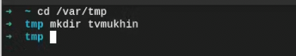{#fig:001 width=70%}

## Выполнение работы

В настройках virtualbox установим новое значение папки для виртуальных машин

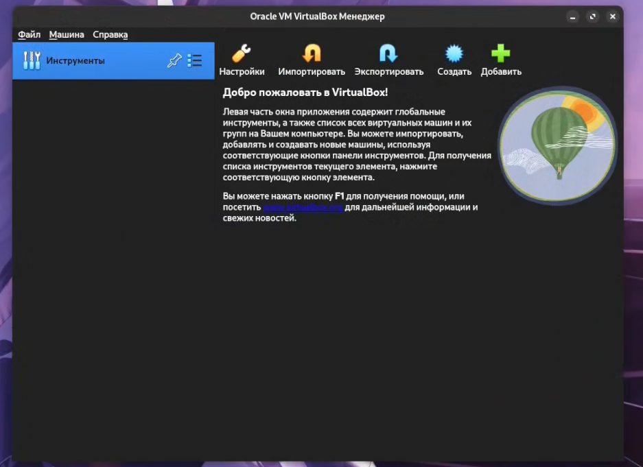{#fig:001 width=70%}

## Выполнение работы

Переносим установочный образ fedora sway.iso в этот каталог

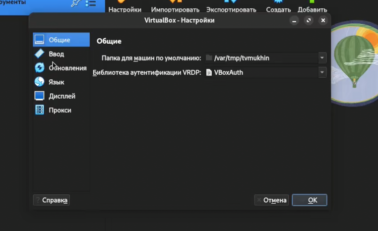{#fig:001 width=70%}

## Выполнение работы

Создаем виртуальную машину

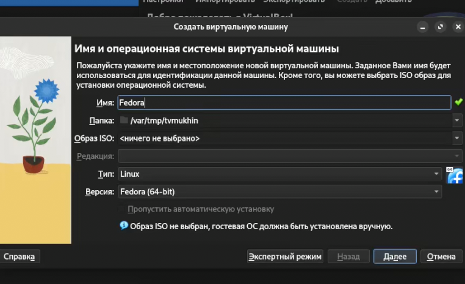{#fig:001 width=70%}

## Выполнение работы

Указываем размер памяти и другие параметры

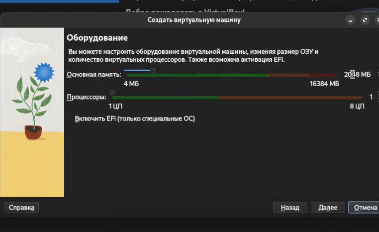{#fig:001 width=70%}

## Выполнение работы

Указываем размер памяти и другие параметры

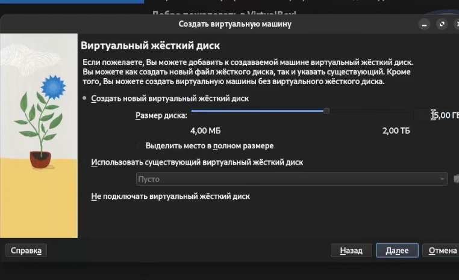{#fig:001 width=70%}

## Выполнение работы

Указываем размер памяти и другие параметры

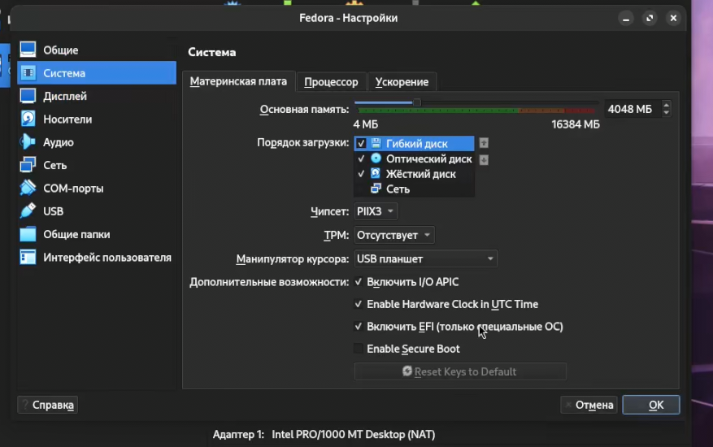{#fig:001 width=70%}

## Выполнение работы

Загружаем систему LIVE CD

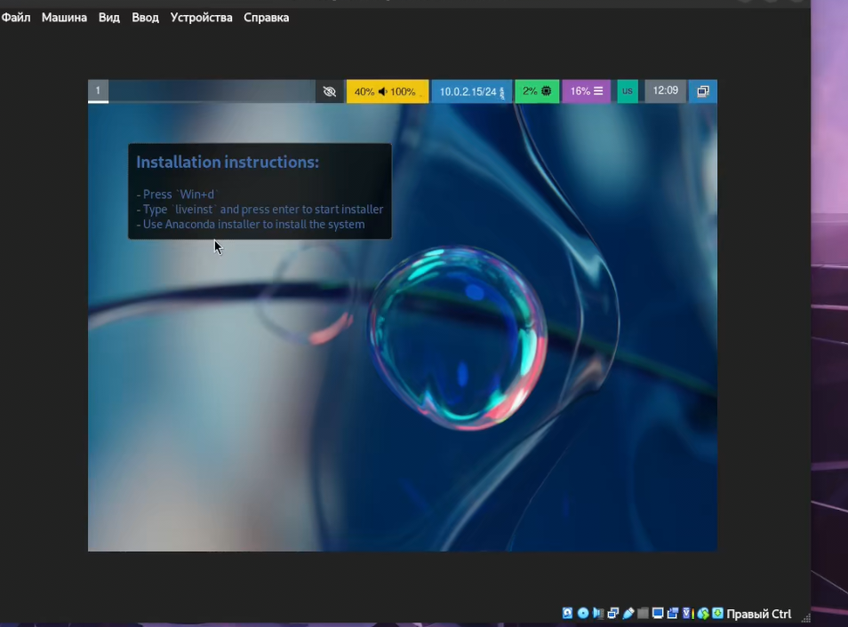{#fig:001 width=70%}

## Выполнение работы

Запускаем установщик

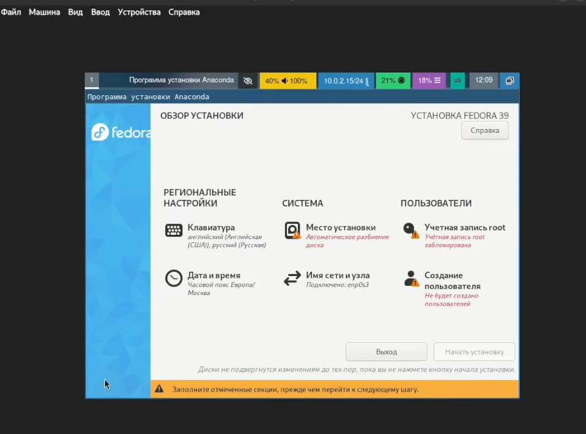{#fig:001 width=70%}

## Выполнение работы

Устанавливаем систему (дата, раскладка, язык, место установки, создаем пользователя)

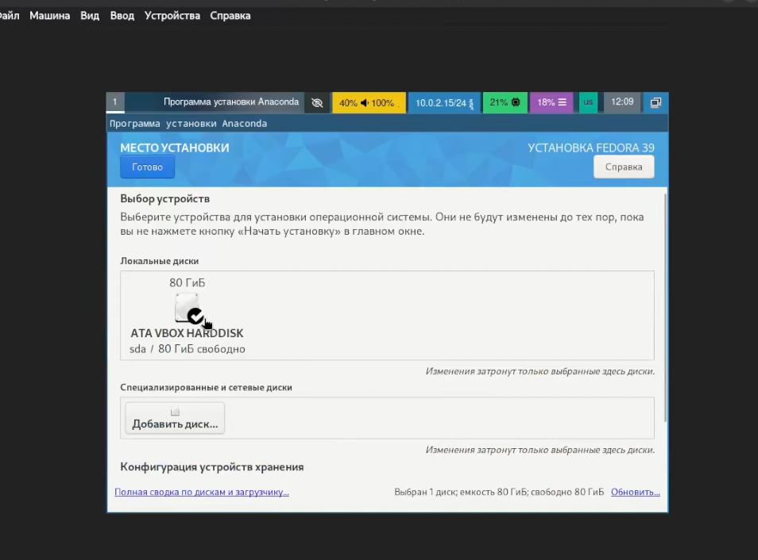{#fig:001 width=70%}

## Выполнение работы

Устанавливаем систему (дата, раскладка, язык, место установки, создаем пользователя)

{#fig:001 width=70%}

## Выполнение работы

Обновляем все пакеты

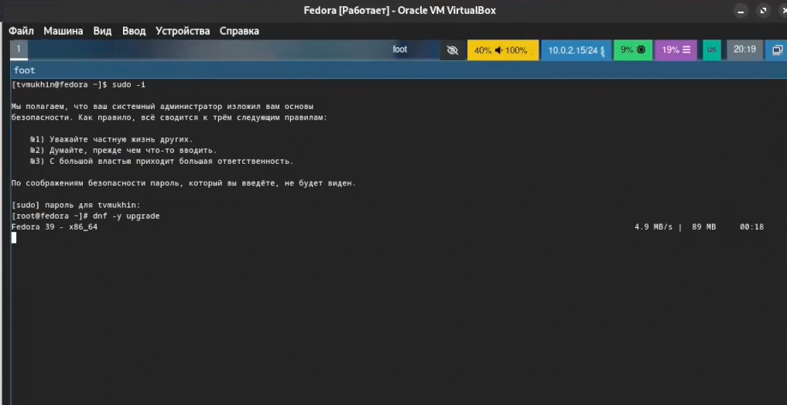{#fig:001 width=70%}

## Выполнение работы

Последующая настройка системы и установка минимально необходимого ПО

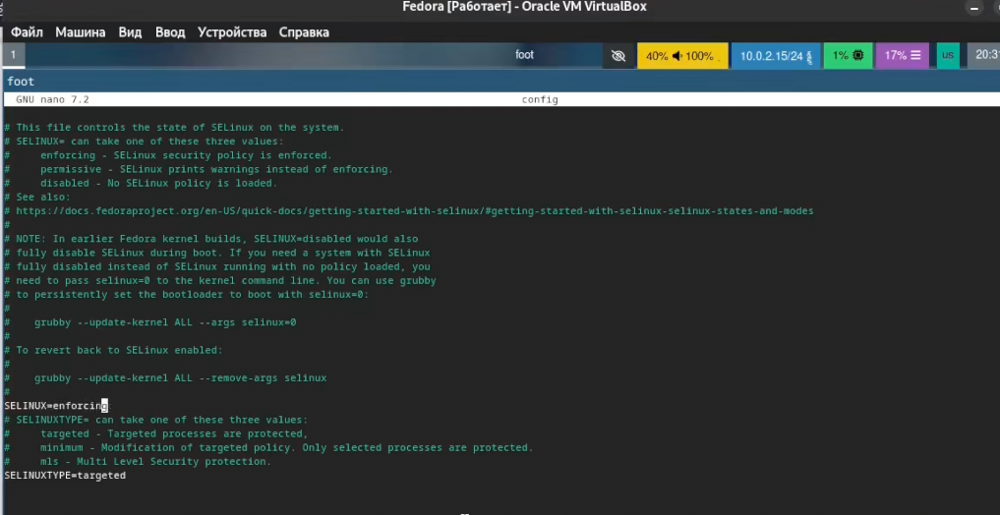{#fig:001 width=70%}

## Выполнение работы

Последующая настройка системы и установка минимально необходимого ПО

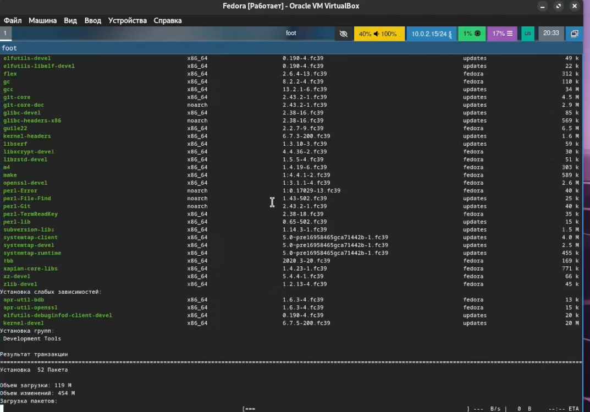{#fig:001 width=70%}

## Выполнение работы

Последующая настройка системы и установка минимально необходимого ПО

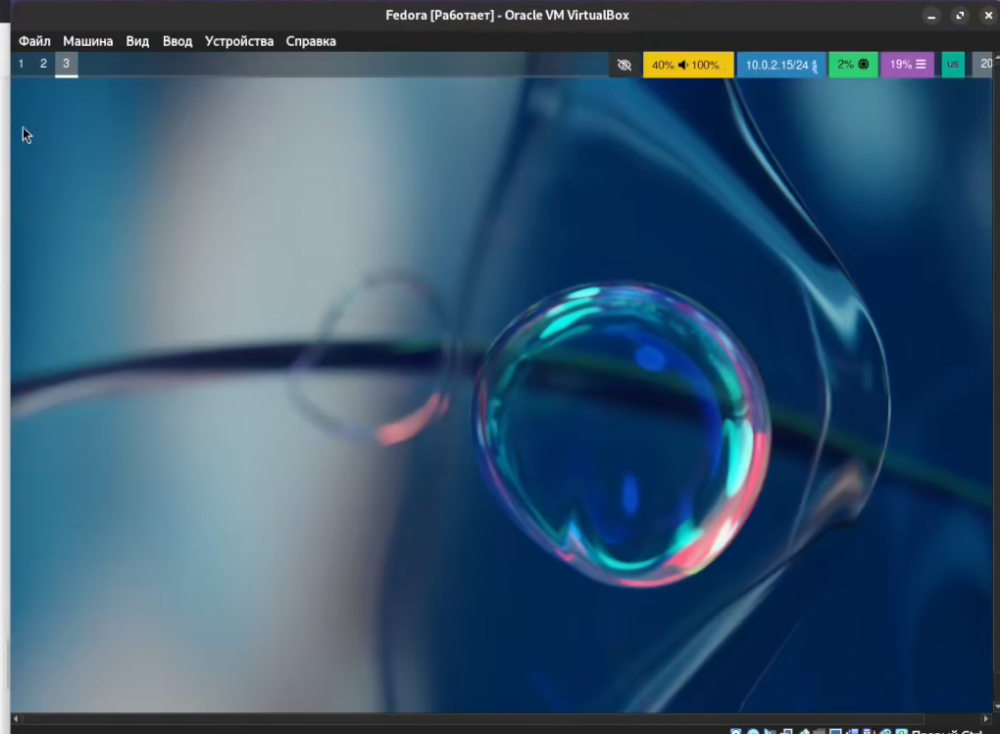{#fig:001 width=70%}

# Вывод

## Вывод

В ходе выполнения лабораторной работы ОС Fedora Sway была установлена на виртуальную машину и минимально настроена.

