---
## Front matter
lang: ru-RU
title: Лабораторная работа №2
subtitle: Первоначальная настройка git
author:
  - Мухин Тимофей
institute:
  - Российский университет дружбы народов, Москва, Россия
date: 02.03.2024

## i18n babel
babel-lang: russian
babel-otherlangs: english

## Formatting pdf
toc: false
toc-title: Содержание
slide_level: 2
aspectratio: 169
section-titles: true
theme: metropolis
header-includes:
 - \metroset{progressbar=frametitle,sectionpage=progressbar,numbering=fraction}
 - '\makeatletter'
 - '\beamer@ignorenonframefalse'
 - '\makeatother'
---

# Цель работы

## Цель работы

Изучить идеологию и применение средств контроля версий.
Освоить умения по работе с git

# Выполнение работы

## Выполнение работы

Установим git и gh из репозитория

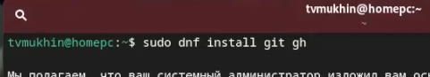{#fig:001 width=70%}

## Выполнение работы

Базовая настройка git. Зададим имя и email владельца репозитория

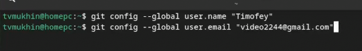{#fig:001 width=70%}
 
## Выполнение работы

Настроим верификацию и подписание комитов, зададим имя начальной ветки, параметры autocrlf и safecrlf

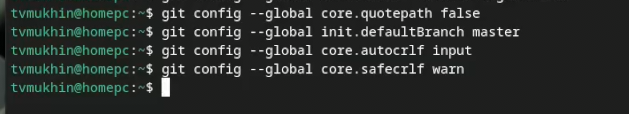{#fig:001 width=70%}

## Выполнение работы

Создаем ключи ssh rsa и ed25519

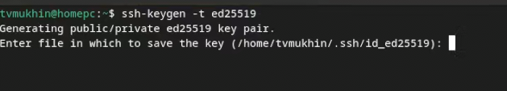{#fig:001 width=70%}

## Выполнение работы

Создаем ключи gpg и добавляем ключ в github

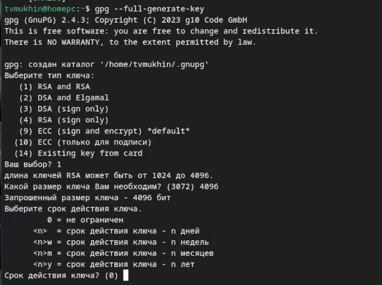{#fig:001 width=70%}

## Выполнение работы

Используя введёный email, укажем Git применять его при подписи коммитов

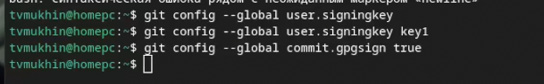{#fig:001 width=70%}

## Выполнение работы

Настройка gh. Авторизуемся.

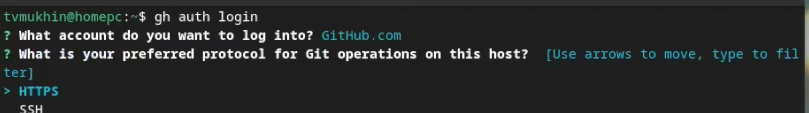{#fig:001 width=70%}

## Выполнение работы

Настройка gh. Авторизуемся.

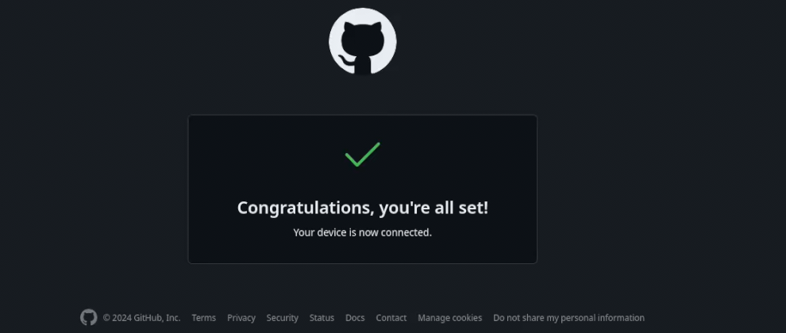{#fig:001 width=70%}

## Выполнение работы

Создание репозитория курса на основе шаблона. Создаем директорию.

{#fig:001 width=70%}

## Выполнение работы

Создание репозитория курса на основе шаблона. Создаем директорию.

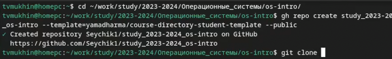{#fig:001 width=70%}

## Выполнение работы

Клонируем репозиторий на компьютер

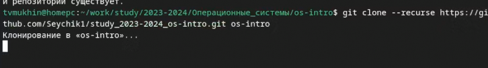{#fig:001 width=70%}

## Выполнение работы

Настройка каталога курса. Удаляем лишние файлы, создаем необходимые каталоги

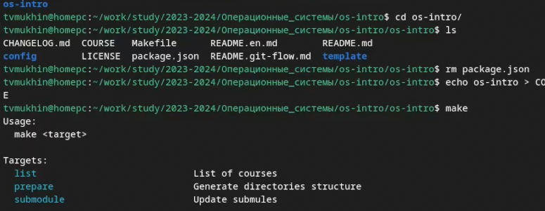{#fig:001 width=70%}

## Выполнение работы

Делаем коммит и отправляем данные на сервер
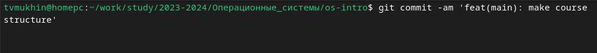{#fig:001 width=70%}

## Выполнение работы

Делаем коммит и отправляем данные на сервер

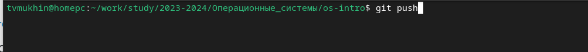{#fig:001 width=70%}

# Вывод

## Вывод

В ходе выполнения работы было изучено применение и работа системы контроля версий git

