---
## Front matter
lang: ru-RU
title: Лабораторная работа №4
subtitle: Продвинутое использование git
author:
  - Мухин Тимофей
institute:
  - Российский университет дружбы народов, Москва, Россия
date: 09.03.2024

## i18n babel
babel-lang: russian
babel-otherlangs: english

## Formatting pdf
toc: false
toc-title: Содержание
slide_level: 2
aspectratio: 169
section-titles: true
theme: metropolis
header-includes:
 - \metroset{progressbar=frametitle,sectionpage=progressbar,numbering=fraction}
 - '\makeatletter'
 - '\beamer@ignorenonframefalse'
 - '\makeatother'
---

# Цель работы

## Цель работы

Получение навыков правильной работы с репозиториями git

# Выполнение работы

## Выполнение работы

Установим gitflow, nodejs и pnpm

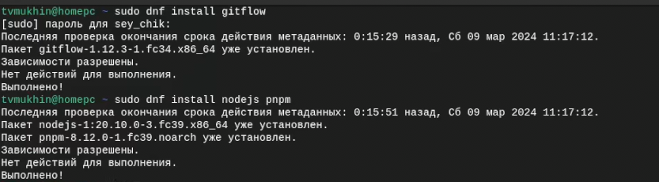{#fig:001 width=70%}

## Выполнение работы

Для работы с Node.js добавим каталог с исполняемыми файлами, устанавливаемыми yarn, в переменную PATH.

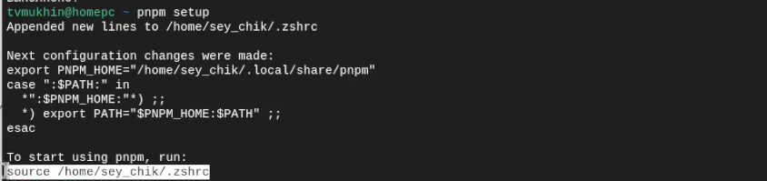{#fig:001 width=70%}
 
## Выполнение работы

Данная программа(commitizen) используется для помощи в форматировании коммитов

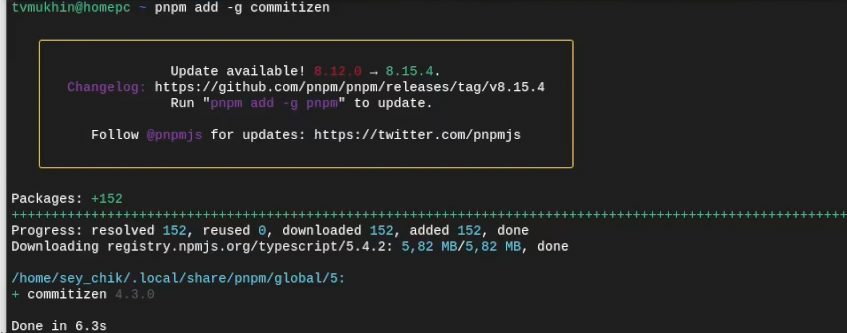{#fig:001 width=70%}

## Выполнение работы

Данная программа (standard-changelog) используется для помощи в создании логов

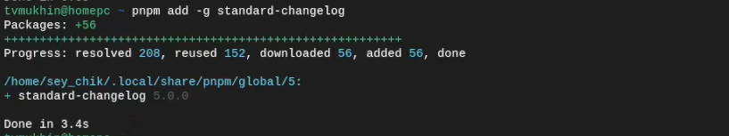{#fig:001 width=70%}

## Выполнение работы

Создание репозитория git-extended

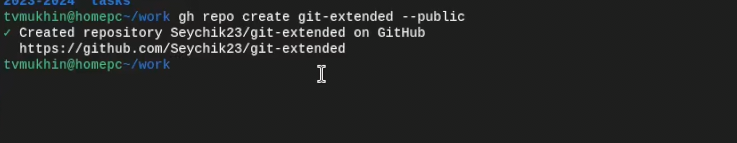{#fig:001 width=70%}

## Выполнение работы

Делаем первый коммит и выкладываем на github

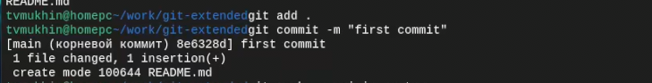{#fig:001 width=70%}

## Выполнение работы

Конфигурация общепринятых коммитов

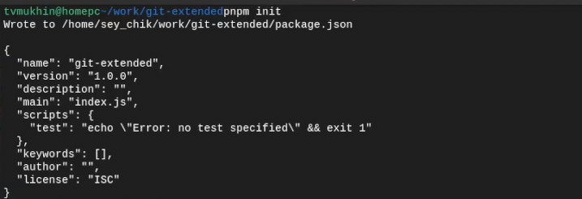{#fig:001 width=70%}

## Выполнение работы

Таким образом, файл package.json приобретает вид

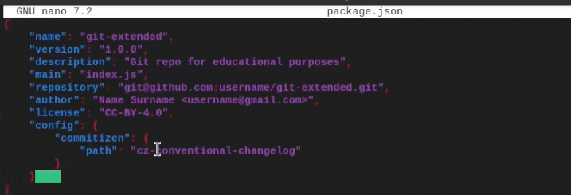{#fig:001 width=70%}

## Выполнение работы

Добавим новые файлы и выполним коммит

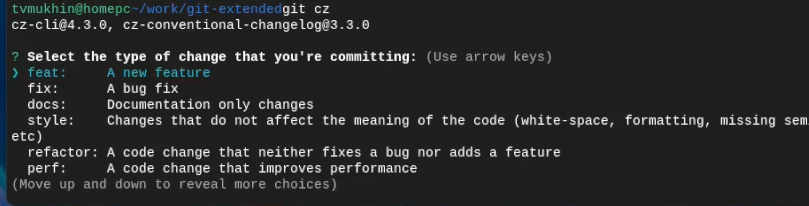{#fig:001 width=70%}

## Выполнение работы

Конфигурация git flow. Инициализируем

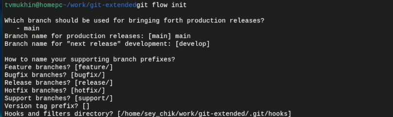{#fig:001 width=70%}

## Выполнение работы

Загрузим весь репозиторий в хранилище и установим внешнюю ветку как вышестоящую для этой ветки

{#fig:001 width=70%}

## Выполнение работы

Создадим релиз с версией 1.0.0

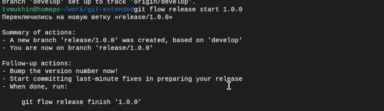{#fig:001 width=70%}

## Выполнение работы

Создадим журнал изменений, добавим журнал изменений в индекс

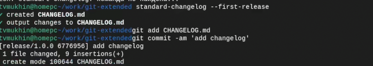{#fig:001 width=70%}

## Выполнение работы

Зальём релизную ветку в основную ветку

{#fig:001 width=70%}

## Выполнение работы

Отправим данные на github

{#fig:001 width=70%}

## Выполнение работы

Создадим релиз на github. Для этого будем использовать утилиты работы с github

{#fig:001 width=70%}

## Выполнение работы

Создадим ветку для новой функциональности

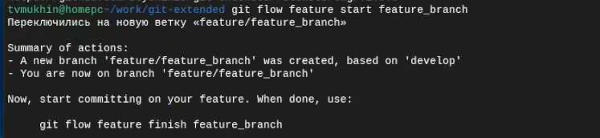{#fig:001 width=70%}

## Выполнение работы

По окончании разработки новой функциональности следующим шагом следует объединить ветку 

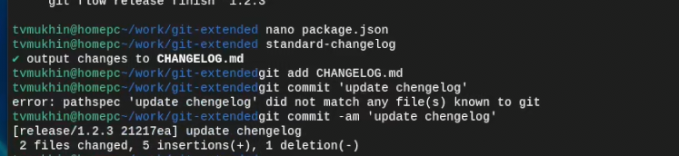{#fig:001 width=70%}

## Выполнение работы

Обновим номер версии в package.json, создадим журнал изменений, добавим в индекс и отправим данные на сервер

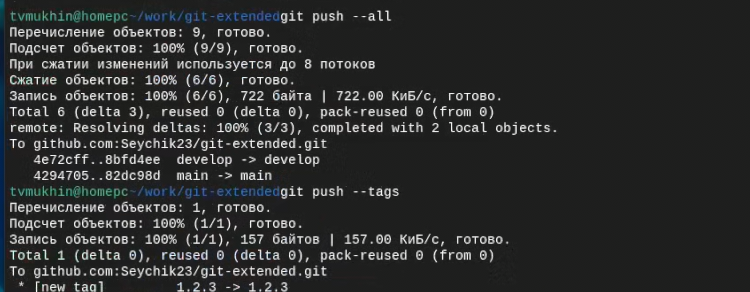{#fig:001 width=70%}

## Выполнение работы

Создадим релиз на github с комментарием из журнала изменений

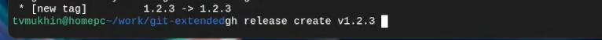{#fig:001 width=70%}

# Вывод

## Вывод

В ходе выполнения работы были изучены новые инструменты git

