---
## Front matter
title: "Лабораторная работа №4"
subtitle: "Продвинутое использование git"
author: "Мухин Тимофей Владимирович"

## Generic otions
lang: ru-RU
toc-title: "Содержание"

## Bibliography
bibliography: bib/cite.bib
csl: pandoc/csl/gost-r-7-0-5-2008-numeric.csl

## Pdf output format
toc: true # Table of contents
toc-depth: 2
fontsize: 12pt
linestretch: 1.5
papersize: a4
documentclass: scrreprt
## I18n polyglossia
polyglossia-lang:
  name: russian
  options:
	- spelling=modern
	- babelshorthands=true
polyglossia-otherlangs:
  name: english
## I18n babel
babel-lang: russian
babel-otherlangs: english
## Fonts
mainfont: PT Serif
romanfont: PT Serif
sansfont: PT Sans
monofont: PT Mono
mainfontoptions: Ligatures=TeX
romanfontoptions: Ligatures=TeX
sansfontoptions: Ligatures=TeX,Scale=MatchLowercase
monofontoptions: Scale=MatchLowercase,Scale=0.9
## Biblatex
biblatex: true
biblio-style: "gost-numeric"
biblatexoptions:
  - parentracker=true
  - backend=biber
  - hyperref=auto
  - language=auto
  - autolang=other*
  - citestyle=gost-numeric
## Pandoc-crossref LaTeX customization
figureTitle: "Рис."
tableTitle: "Таблица"
listingTitle: "Листинг"
lolTitle: "Листинги"
## Misc options
indent: true
header-includes:
  - \usepackage{indentfirst}
  - \usepackage{float} # keep figures where there are in the text
  - \floatplacement{figure}{H} # keep figures where there are in the text
---

# Цель работы

Получение навыков правильной работы с репозиториями git

# Выполнение лабораторной работы

1. Установим gitflow, nodejs и pnpm

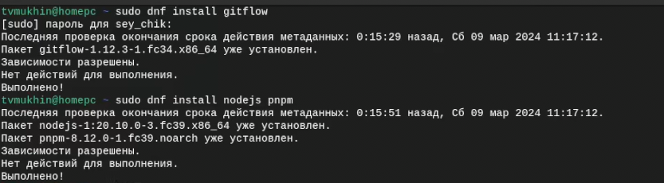{#fig:001 width=70%}

2. Для работы с Node.js добавим каталог с исполняемыми файлами, устанавливаемыми yarn, в переменную PATH.

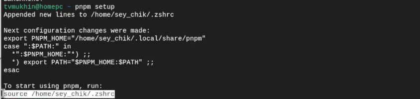{#fig:001 width=70%}

3. Данная программа(commitizen) используется для помощи в форматировании коммитов

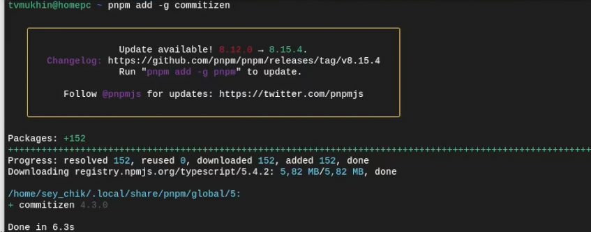{#fig:001 width=70%}

4. Данная программа (standard-changelog) используется для помощи в создании логов

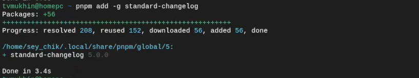{#fig:001 width=70%}

5. Создание репозитория git-extended

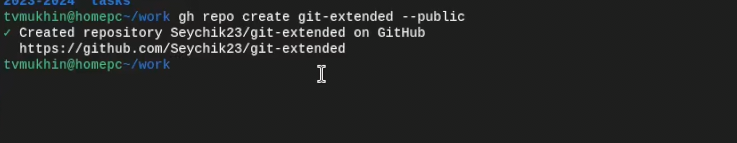{#fig:001 width=70%}

6. Делаем первый коммит и выкладываем на github

{#fig:001 width=70%}

7. Конфигурация общепринятых коммитов

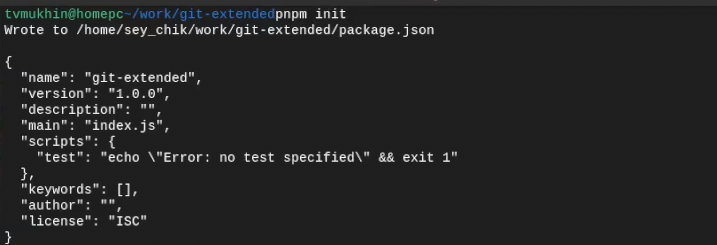{#fig:001 width=70%}

8. Таким образом, файл package.json приобретает вид

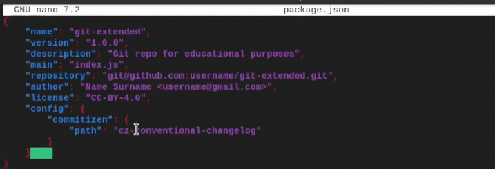{#fig:001 width=70%}

9. Добавим новые файлы и выполним коммит

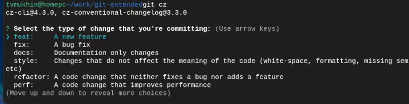{#fig:001 width=70%}

10. Конфигурация git flow. Инициализируем

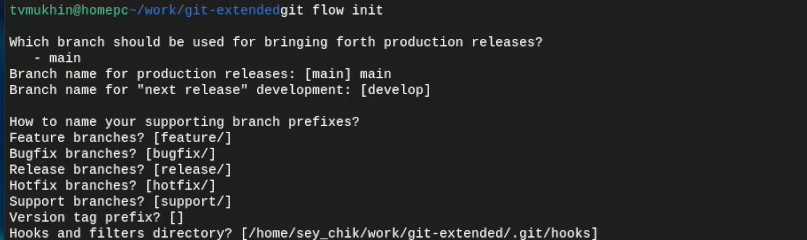{#fig:001 width=70%}

11. Загрузим весь репозиторий в хранилище и установим внешнюю ветку как вышестоящую для этой ветки

{#fig:001 width=70%}

12. Создадим релиз с версией 1.0.0

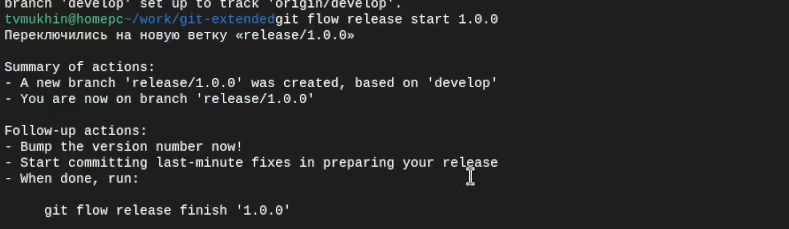{#fig:001 width=70%}

13. Создадим журнал изменений, добавим журнал изменений в индекс

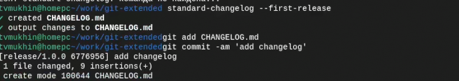{#fig:001 width=70%}

14. Зальём релизную ветку в основную ветку

{#fig:001 width=70%}

15. Отправим данные на github

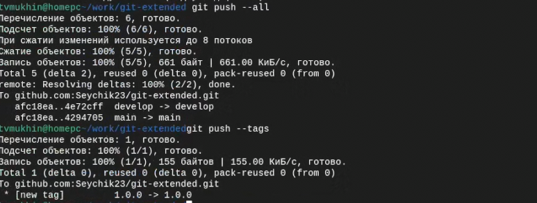{#fig:001 width=70%}

16. Создадим релиз на github. Для этого будем использовать утилиты работы с github

{#fig:001 width=70%}

17. Создадим ветку для новой функциональности

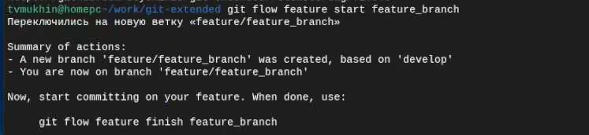{#fig:001 width=70%}

18. По окончании разработки новой функциональности следующим шагом следует объединить ветку 

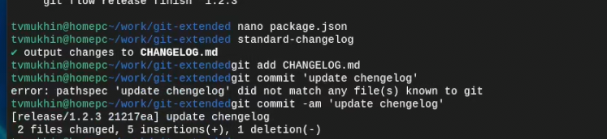{#fig:001 width=70%}

19. Обновим номер версии в package.json, создадим журнал изменений, добавим в индекс и отправим данные на сервер

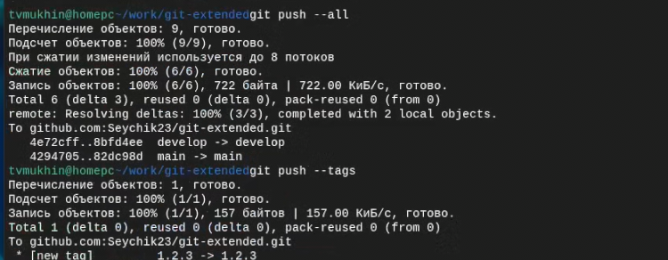{#fig:001 width=70%}

20. Создадим релиз на github с комментарием из журнала изменений

{#fig:001 width=70%}

# Выводы

В ходе выполнения работы были изучены новые инструменты git

