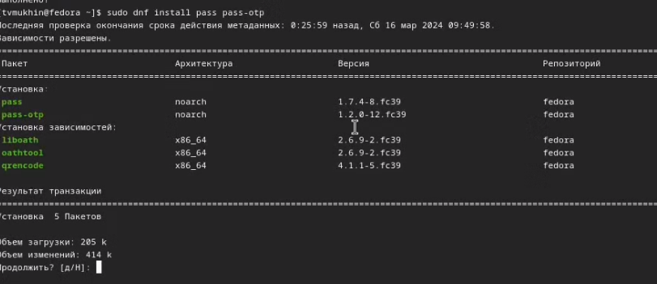
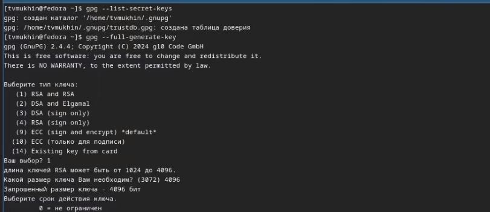
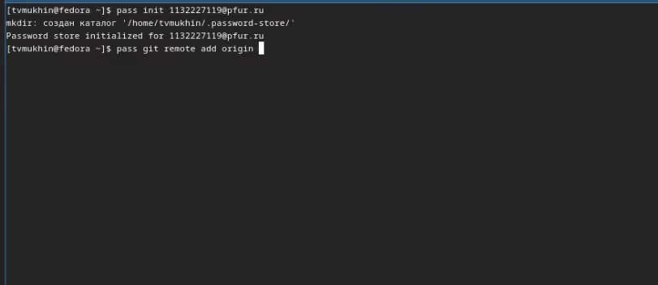
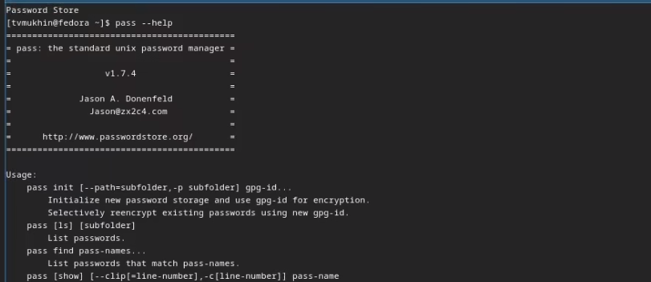
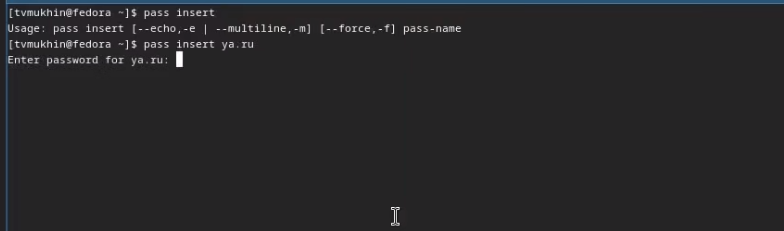
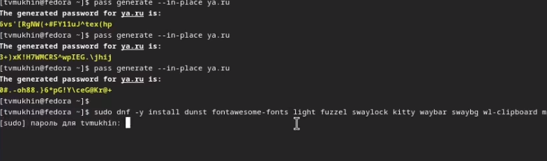
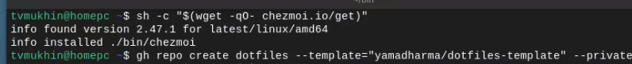
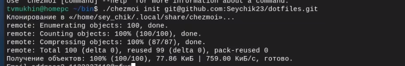

---
## Front matter
lang: ru-RU
title: Лабораторная работа №5
subtitle: Настройка рабочей среды
author:
  - Мухин Тимофей
institute:
  - Российский университет дружбы народов, Москва, Россия
date: 16.03.2024

## i18n babel
babel-lang: russian
babel-otherlangs: english

## Formatting pdf
toc: false
toc-title: Содержание
slide_level: 2
aspectratio: 169
section-titles: true
theme: metropolis
header-includes:
 - \metroset{progressbar=frametitle,sectionpage=progressbar,numbering=fraction}
 - '\makeatletter'
 - '\beamer@ignorenonframefalse'
 - '\makeatother'
---

# Цель работы

## Цель работы

Настройка рабочей среды. Установка менеджера паролей, шрифтов. Сохранение dotfiles.

# Выполнение работы

## Выполнение работы

Установка pass

{#fig:001 width=70%}

## Выполнение работы

Ключи GPG. Генерация нового

{#fig:001 width=70%}
 
## Выполнение работы

Инициализируем хранилище

{#fig:001 width=70%}

## Выполнение работы

Работа с Pass

{#fig:001 width=70%}

## Выполнение работы

Сохранение пароля

{#fig:001 width=70%}

## Выполнение работы

Генерация нового пароля

{#fig:001 width=70%}

## Выполнение работы

Установка chezmoi

{#fig:001 width=70%}

## Выполнение работы

Инициализируйте chezmoi с новым репозиторием dotfiles

{#fig:001 width=70%}

# Вывод

## Вывод

В ходе выполнения работы была настроена рабочая среда, установлен менеджер паролей pass, chezmoi и сохранены dotfiles.
