---
## Front matter
lang: ru-RU
title: 'Лабораторная работа №7'
subtitle: 'Анализ файловой системы Linux.
Команды для работы с файлами и каталогами'
author:
  - Мухин Тимофей
institute:
  - Российский университет дружбы народов, Москва, Россия
date: 23.03.2024

## i18n babel
babel-lang: russian
babel-otherlangs: english

## Formatting pdf
toc: false
toc-title: Содержание
slide_level: 2
aspectratio: 169
section-titles: true
theme: metropolis
header-includes:
 - \metroset{progressbar=frametitle,sectionpage=progressbar,numbering=fraction}
 - '\makeatletter'
 - '\beamer@ignorenonframefalse'
 - '\makeatother'
---

# Цель работы

## Цель работы

Ознакомление с файловой системой Linux, её структурой, именами и содержанием
каталогов. Приобретение практических навыков по применению команд для работы
с файлами и каталогами, по управлению процессами (и работами), по проверке исполь-
зования диска и обслуживанию файловой системы.

# Выполнение работы

## Подготовка к работе

Выполняем все примеры, приведённые в первой части описания лабораторной работы

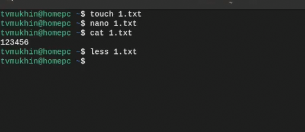{#fig:001 width=70%}

## Подготовка к работе

Выполняем все примеры, приведённые в первой части описания лабораторной работы

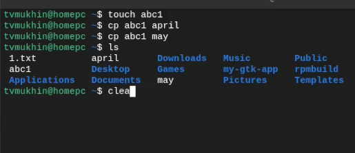{#fig:001 width=70%}
 
## Подготовка к работе

Выполняем все примеры, приведённые в первой части описания лабораторной работы

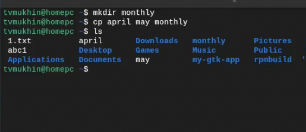{#fig:001 width=70%}

## Подготовка к работе

Выполняем все примеры, приведённые в первой части описания лабораторной работы

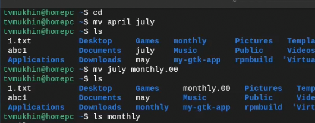{#fig:001 width=70%}

## Подготовка к работе

Выполняем все примеры, приведённые в первой части описания лабораторной работы

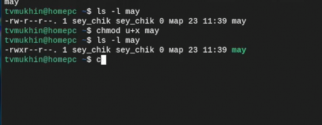{#fig:001 width=70%}

## Выполнение работы

Скопируем файл /usr/include/sys/io.h в домашний каталог и назовите его
equipment

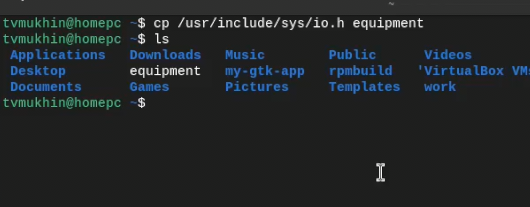{#fig:001 width=70%}

## Выполнение работы

Создаем директорию ski.places

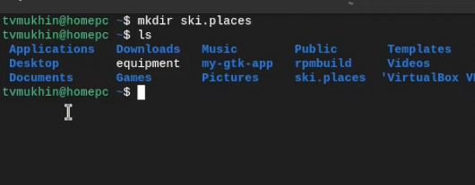{#fig:001 width=70%}

## Выполнение работы

Переместим файл equipment в каталог ~/ski.plases

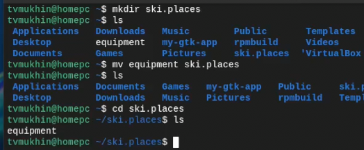{#fig:001 width=70%}

## Выполнение работы

Переименуем файл ~/ski.plases/equipment в ~/ski.plases/equiplist

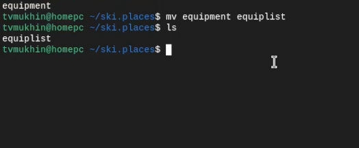{#fig:001 width=70%}

## Выполнение работы

Создаем в домашнем каталоге файл abc1 и скопируйте его в каталог
~/ski.plases, назовите его equiplist2

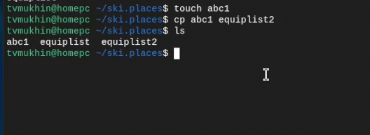{#fig:001 width=70%}

## Выполнение работы

Создаем каталог с именем equipment в каталоге ~/ski.plases.

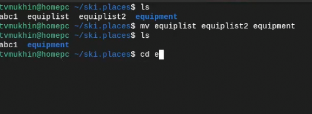{#fig:001 width=70%}

## Выполнение работы

Перемещаем файлы ~/ski.plases/equiplist и equiplist2 в каталог
~/ski.plases/equipment.

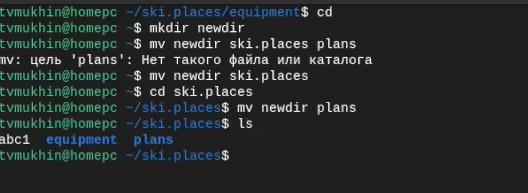{#fig:001 width=70%}

## Выполнение работы

Создаем и перемещаем каталог ~/newdir в каталог ~/ski.plases и называем
его plans

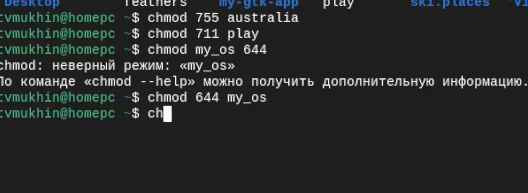{#fig:001 width=70%}

## Выполнение работы

Определяем опции команды chmod, необходимые для того, чтобы присвоить перечис-
ленным ниже файлам выделенные права доступа, считая, что в начале таких прав
нет:

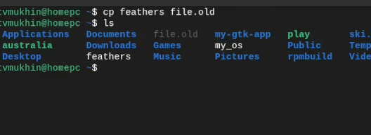{#fig:001 width=70%}

## Выполнение работы

Скопируем файл ~/feathers в файл ~/file.old.

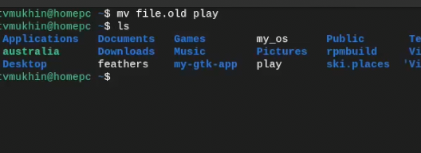{#fig:001 width=70%}

## Выполнение работы

Перемещаем файл ~/file.old в каталог ~/play.

{#fig:001 width=70%}

## Выполнение работы

Скопируйте каталог ~/play в каталог ~/fun.

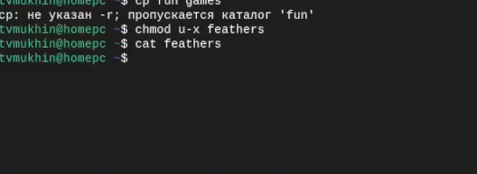{#fig:001 width=70%}

## Выполнение работы

Лишаем владельца файла ~/feathers права на чтение. Просмотреть не получится, но скопировать возможно

{#fig:001 width=70%}

## Выполнение работы

Лишаем владельца каталога ~/play права на выполнение. Перейти в каталог не получится, будет отказано
в доступе

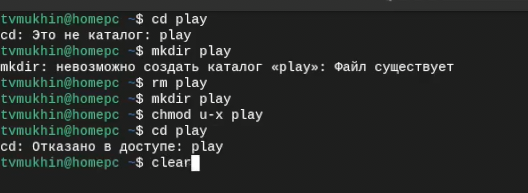{#fig:001 width=70%}

## Выполнение работы

Даем владельцу каталога ~/play права на выполнение

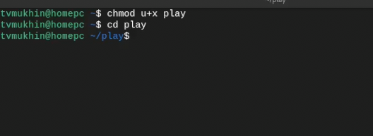{#fig:001 width=70%}

## Выполнение работы

Прочитаем man по командам  mount, fsck, mkfs, kill

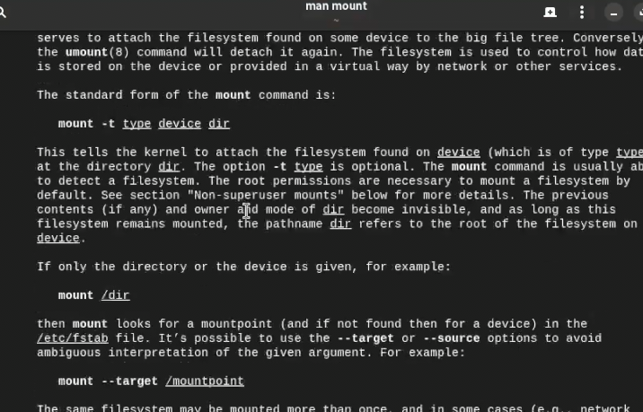{#fig:001 width=70%}

## Вывод

В ходе выполнения работы был проведен анализ файловой системы Linux и изучены
команды для работы с файлами и каталогами.
