---
## Front matter
title: "Лабораторная работа №7"
subtitle: "Анализ файловой системы Linux.
Команды для работы с файлами и каталогами."
author: "Мухин Тимофей Владимирович"

## Generic otions
lang: ru-RU
toc-title: "Содержание"

## Bibliography
bibliography: bib/cite.bib
csl: pandoc/csl/gost-r-7-0-5-2008-numeric.csl

## Pdf output format
toc: true # Table of contents
toc-depth: 2
fontsize: 12pt
linestretch: 1.5
papersize: a4
documentclass: scrreprt
## I18n polyglossia
polyglossia-lang:
  name: russian
  options:
	- spelling=modern
	- babelshorthands=true
polyglossia-otherlangs:
  name: english
## I18n babel
babel-lang: russian
babel-otherlangs: english
## Fonts
mainfont: PT Serif
romanfont: PT Serif
sansfont: PT Sans
monofont: PT Mono
mainfontoptions: Ligatures=TeX
romanfontoptions: Ligatures=TeX
sansfontoptions: Ligatures=TeX,Scale=MatchLowercase
monofontoptions: Scale=MatchLowercase,Scale=0.9
## Biblatex
biblatex: true
biblio-style: "gost-numeric"
biblatexoptions:
  - parentracker=true
  - backend=biber
  - hyperref=auto
  - language=auto
  - autolang=other*
  - citestyle=gost-numeric
## Pandoc-crossref LaTeX customization
figureTitle: "Рис."
tableTitle: "Таблица"
listingTitle: "Листинг"
lolTitle: "Листинги"
## Misc options
indent: true
header-includes:
  - \usepackage{indentfirst}
  - \usepackage{float} # keep figures where there are in the text
  - \floatplacement{figure}{H} # keep figures where there are in the text
---

# Цель работы

Ознакомление с файловой системой Linux, её структурой, именами и содержанием
каталогов. Приобретение практических навыков по применению команд для работы
с файлами и каталогами, по управлению процессами (и работами), по проверке исполь-
зования диска и обслуживанию файловой системы.

# Выполнение лабораторной работы

1. Выполняем все примеры, приведённые в первой части описания лабораторной работы

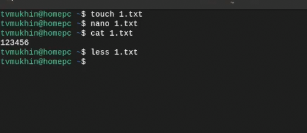{#fig:001 width=70%}

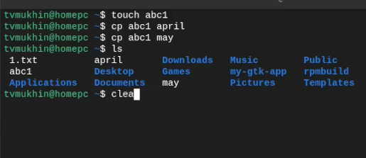{#fig:001 width=70%}

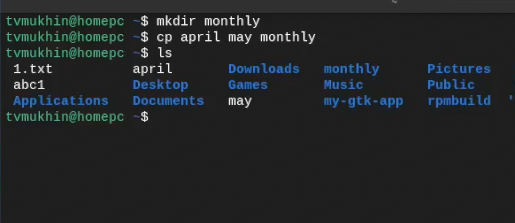{#fig:001 width=70%}

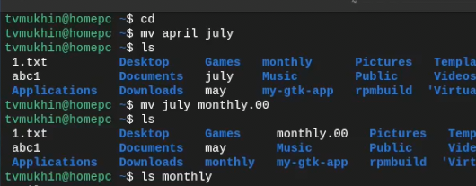{#fig:001 width=70%}

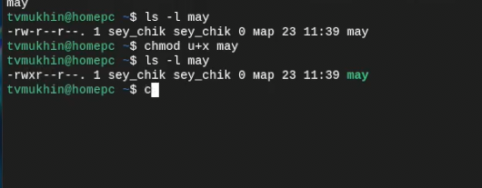{#fig:001 width=70%}

2. Скопируем файл /usr/include/sys/io.h в домашний каталог и назовите его
equipment

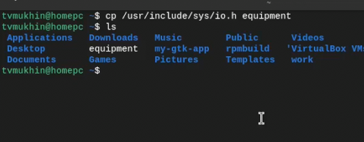{#fig:001 width=70%}

3. Создаем директорию ski.places

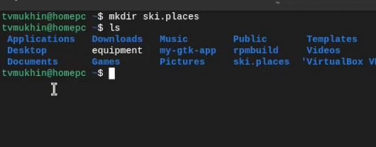{#fig:001 width=70%}

4. Переместим файл equipment в каталог ~/ski.plases

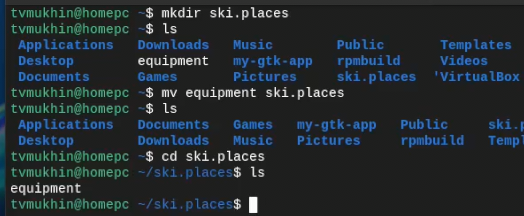{#fig:001 width=70%}

5. Переименуем файл ~/ski.plases/equipment в ~/ski.plases/equiplist

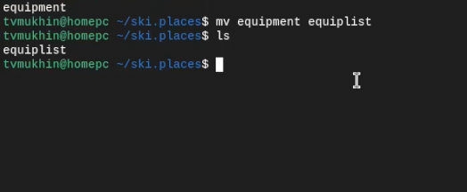{#fig:001 width=70%}

6. Создаем в домашнем каталоге файл abc1 и скопируйте его в каталог
~/ski.plases, назовите его equiplist2

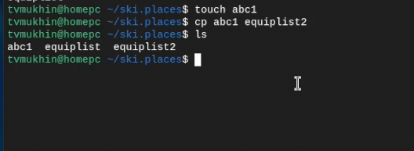{#fig:001 width=70%}

7. Создаем каталог с именем equipment в каталоге ~/ski.plases.

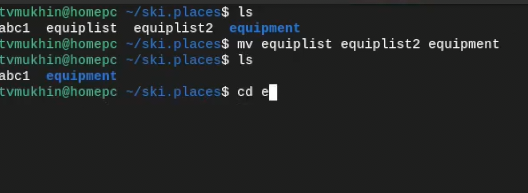{#fig:001 width=70%}

8. Перемещаем файлы ~/ski.plases/equiplist и equiplist2 в каталог
~/ski.plases/equipment.

{#fig:001 width=70%}

9. Создаем и перемещаем каталог ~/newdir в каталог ~/ski.plases и называем
его plans

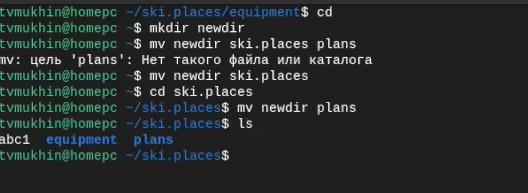{#fig:001 width=70%}

10. Определяем опции команды chmod, необходимые для того, чтобы присвоить перечис-
ленным ниже файлам выделенные права доступа, считая, что в начале таких прав
нет:

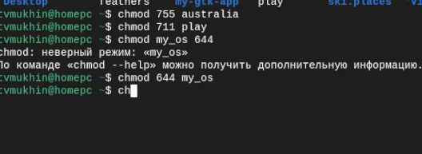{#fig:001 width=70%}

11. Скопируем файл ~/feathers в файл ~/file.old.

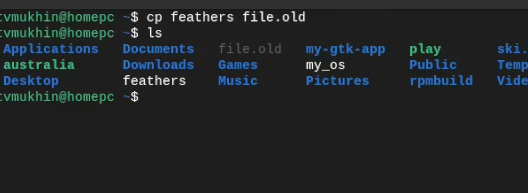{#fig:001 width=70%}

12. Перемещаем файл ~/file.old в каталог ~/play.

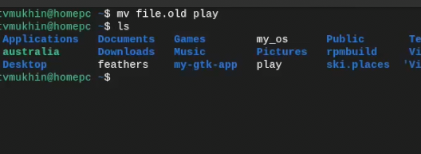{#fig:001 width=70%}

13. Скопируйте каталог ~/play в каталог ~/fun.

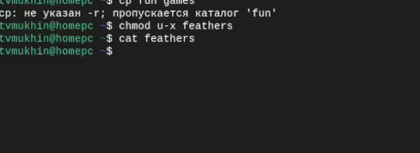{#fig:001 width=70%}

14. Лишаем владельца файла ~/feathers права на чтение. Просмотреть не получится, но скопировать возможно

{#fig:001 width=70%}

15. Лишаем владельца каталога ~/play права на выполнение. Перейти в каталог не получится, будет отказано
в доступе

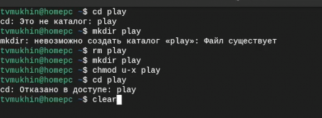{#fig:001 width=70%}

16. Даем владельцу каталога ~/play права на выполнение

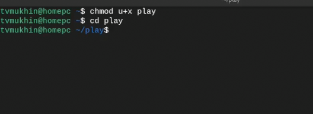{#fig:001 width=70%}

17. Прочитаем man по командам  mount, fsck, mkfs, kill

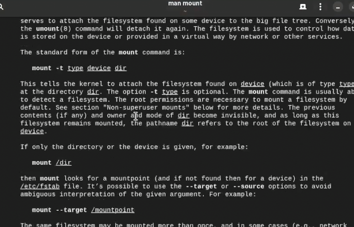{#fig:001 width=70%}

# Выводы

В ходе выполнения работы был проведен анализ файловой системы Linux и изучены
команды для работы с файлами и каталогами.

