---
## Front matter
lang: ru-RU
title: 'Лабораторная работа №8'
subtitle: 'Поиск файлов. Перенаправление
ввода-вывода. Просмотр запущенных процессов'
author:
  - Мухин Тимофей
institute:
  - Российский университет дружбы народов, Москва, Россия
date: 30.03.2024

## i18n babel
babel-lang: russian
babel-otherlangs: english

## Formatting pdf
toc: false
toc-title: Содержание
slide_level: 2
aspectratio: 169
section-titles: true
theme: metropolis
header-includes:
 - \metroset{progressbar=frametitle,sectionpage=progressbar,numbering=fraction}
 - '\makeatletter'
 - '\beamer@ignorenonframefalse'
 - '\makeatother'
---

# Цель работы

## Цель работы

Ознакомление с инструментами поиска файлов и фильтрации текстовых данных.
Приобретение практических навыков: по управлению процессами (и заданиями), по
проверке использования диска и обслуживанию файловых систем.

# Выполнение работы

## Выполнение работы

Записываем в файл file.txt названия файлов, содержащихся в каталоге /etc.

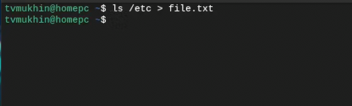{#fig:001 width=70% height=70%}

## Выполнение работы

Дописываем в этот же файл названия файлов, содержащихся в домашнем каталоге

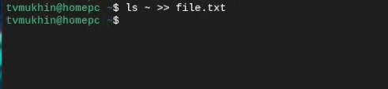{#fig:001 width=70%}

## Выполнение работы

Выводим имена всех файлов из file.txt, имеющих расширение .conf, после чего
записываем их в новый текстовой файл conf.txt

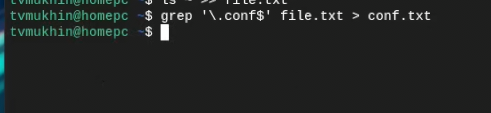{#fig:001 width=70%}

## Выполнение работы

Определяем, какие файлы в домашнем каталоге имеют имена, начинавшиеся
с символа c? 2 варианта 

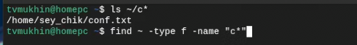{#fig:001 width=70%}

## Выполнение работы

Выводим на экран (по странично) имена файлов из каталога /etc, начинающиеся
с символа h.

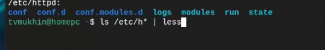{#fig:001 width=70%}

## Выполнение работы

Запускаем в фоновом режиме процесс, который будет записывать в файл ~/logfile
файлы, имена которых начинаются с log, затем удаляем файл logfile

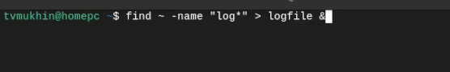{#fig:001 width=70%}

## Выполнение работы

Запускаем из консоли в фоновом режиме текстовый редактор gnome

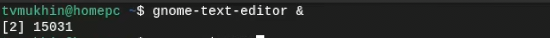{#fig:001 width=70%}

## Выполнение работы

Определяем идентификатор процесса gnome-text-editor используя команду ps, конвейер и фильтр
grep. Возможен также другой вариант определения PID.

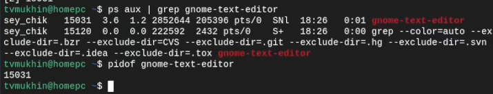{#fig:001 width=70%}

## Выполнение работы

Прочитаем man команды kill, после чего завершаем процесс gnome-text-editor.

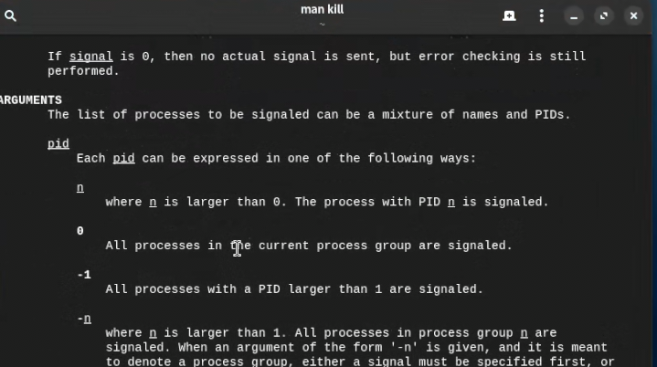{#fig:001 width=70%}

## Выполнение работы

Прочитаем man команды kill, после чего завершаем процесс gnome-text-editor.

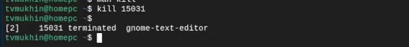{#fig:001 width=70%}

## Выполнение работы

Выполняем команды df и du, предварительно получив более подробную информацию в man.

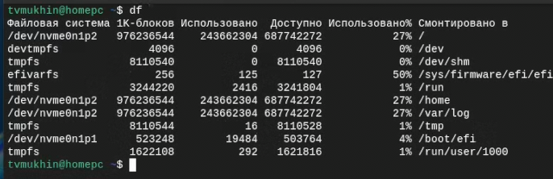{#fig:001 width=70%}

## Выполнение работы

Выполняем команды df и du, предварительно получив более подробную информацию в man.

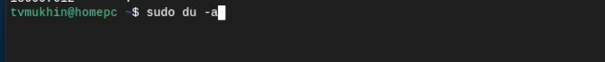{#fig:001 width=70%}

## Выполнение работы

Воспользовавшись справкой команды find, выводим имена всех директорий, имею-
щихся в домашнем каталоге.

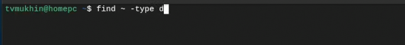{#fig:001 width=70%}

## Вывод

В ходе выполнения работы ознакомился с инструментами поиска файлов и фильтрации текстовых данных.
Приобрел практические навыки по управлению процессами (и заданиями), по
проверке использования диска и обслуживанию файловых систем

