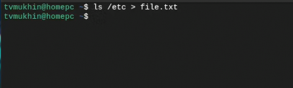
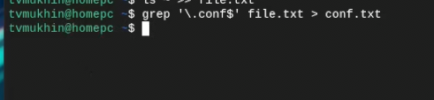
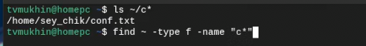
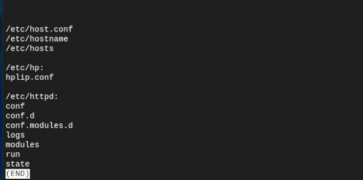
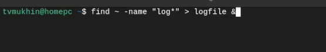
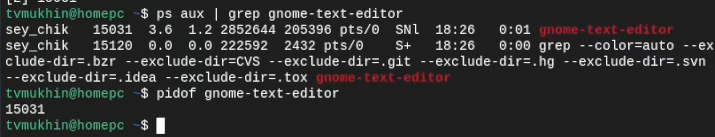
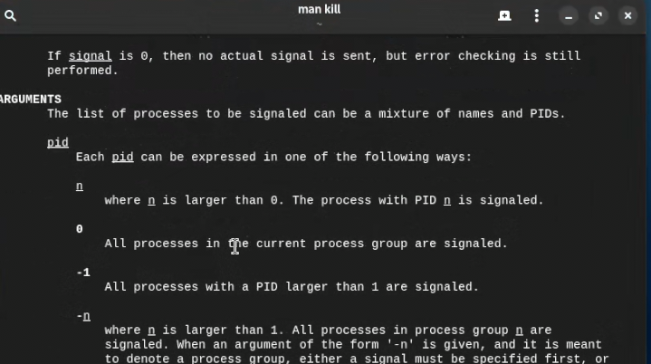
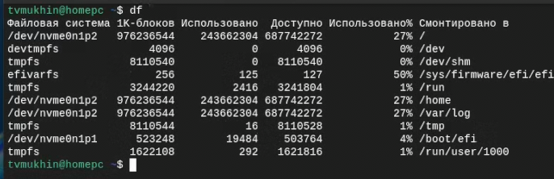
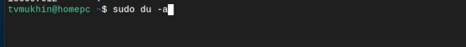
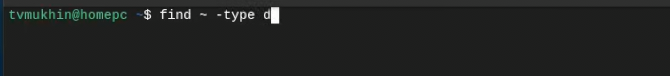

---
## Front matter
title: "Лабораторная работа №8"
subtitle: "Поиск файлов. Перенаправление
ввода-вывода. Просмотр запущенных процессов"
author: "Мухин Тимофей Владимирович"

## Generic otions
lang: ru-RU
toc-title: "Содержание"

## Bibliography
bibliography: bib/cite.bib
csl: pandoc/csl/gost-r-7-0-5-2008-numeric.csl

## Pdf output format
toc: true # Table of contents
toc-depth: 2
fontsize: 12pt
linestretch: 1.5
papersize: a4
documentclass: scrreprt
## I18n polyglossia
polyglossia-lang:
  name: russian
  options:
	- spelling=modern
	- babelshorthands=true
polyglossia-otherlangs:
  name: english
## I18n babel
babel-lang: russian
babel-otherlangs: english
## Fonts
mainfont: PT Serif
romanfont: PT Serif
sansfont: PT Sans
monofont: PT Mono
mainfontoptions: Ligatures=TeX
romanfontoptions: Ligatures=TeX
sansfontoptions: Ligatures=TeX,Scale=MatchLowercase
monofontoptions: Scale=MatchLowercase,Scale=0.9
## Biblatex
biblatex: true
biblio-style: "gost-numeric"
biblatexoptions:
  - parentracker=true
  - backend=biber
  - hyperref=auto
  - language=auto
  - autolang=other*
  - citestyle=gost-numeric
## Pandoc-crossref LaTeX customization
figureTitle: "Рис."
tableTitle: "Таблица"
listingTitle: "Листинг"
lolTitle: "Листинги"
## Misc options
indent: true
header-includes:
  - \usepackage{indentfirst}
  - \usepackage{float} # keep figures where there are in the text
  - \floatplacement{figure}{H} # keep figures where there are in the text
---

# Цель работы

Ознакомление с инструментами поиска файлов и фильтрации текстовых данных.
Приобретение практических навыков: по управлению процессами (и заданиями), по
проверке использования диска и обслуживанию файловых систем.

# Выполнение лабораторной работы

1. Записываем в файл file.txt названия файлов, содержащихся в каталоге /etc.

{#fig:001 width=70%}

2. Дописываем в этот же файл названия файлов, содержащихся в домашнем каталоге

{#fig:001 width=70%}

3. Выводим имена всех файлов из file.txt, имеющих расширение .conf, после чего
записываем их в новый текстовой файл conf.txt

{#fig:001 width=70%}

4. Определяем, какие файлы в домашнем каталоге имеют имена, начинавшиеся
с символа c? 2 варианта 

{#fig:001 width=70%}

5. Выводим на экран (по странично) имена файлов из каталога /etc, начинающиеся
с символа h.

{#fig:001 width=70%}

{#fig:001 width=70%}

6. Запускаем в фоновом режиме процесс, который будет записывать в файл ~/logfile
файлы, имена которых начинаются с log, затем удаляем файл logfile

{#fig:001 width=70%}

7. Запускаем из консоли в фоновом режиме текстовый редактор gnome

{#fig:001 width=70%}

8. Определяем идентификатор процесса gnome-text-editor используя команду ps, конвейер и фильтр
grep. Возможен также другой вариант определения PID.

{#fig:001 width=70%}

9. Прочитаем man команды kill, после чего завершаем процесс gnome-text-editor.

{#fig:001 width=70%}

{#fig:001 width=70%}

10. Выполняем команды df и du, предварительно получив более подробную информацию в man.

{#fig:001 width=70%}

{#fig:001 width=70%}

11. Воспользовавшись справкой команды find, выводим имена всех директорий, имею-
щихся в домашнем каталоге.

{#fig:001 width=70%}

# Контрольные вопросы

1. **Потоки ввода-вывода**:
   - Стандартный ввод (stdin), стандартный вывод (stdout), стандартный вывод ошибок (stderr).

2. **Разница между операциями > и >>**:
   - Операция `>` перенаправляет вывод в файл, перезаписывая файл, если он существует, в то время как `>>` добавляет вывод в конец файла, сохраняя его содержимое.

3. **Конвейер**:
   - Конвейер (pipeline) это механизм для передачи вывода одной команды как ввода следующей команде без сохранения на диск.

4. **Процесс и программа**:
   - Программа - исполняемый файл на диске, в то время как процесс - экземпляр программы, который запущен в операционной системе.

5. **PID и GID**:
   - PID (Process ID) - идентификатор процесса, GID (Group ID) - идентификатор группы.

6. **Задачи и управление ими**:
   - Задачи - это выполняющиеся процессы в системе. Команда `ps` позволяет управлять процессами.

7. **Утилиты top и htop**:
   - `top` показывает список процессов и их использование ресурсов, `htop` предоставляет интерактивный интерфейс для мониторинга процессов.

8. **Команда поиска файлов**:
   - Команда `find` используется для поиска файлов и директорий по различным критериям.
     Например: `find /home -name "*.txt"`.

9. **Поиск файла по контексту**:
   - Можно использовать команду `grep` для поиска текста в файлах и определения их контекста.

10. **Определение объема свободной памяти**:
    - Команда `df` показывает общий объем дискового пространства и свободное пространство на файловых системах.

11. **Определение объема домашнего каталога**:
    - Команда `du -sh ~/` покажет общий размер домашнего каталога.

12. **Удаление зависшего процесса**:
    - Найдите PID зависшего процесса с помощью `ps aux | grep <название_процесса>` и используйте команду `kill -9 <PID>` для его завершения.

# Выводы

В ходе выполнения работы ознакомился с инструментами поиска файлов и фильтрации текстовых данных.
Приобрел практические навыки по управлению процессами (и заданиями), по
проверке использования диска и обслуживанию файловых систем

