---
## Front matter
lang: ru-RU
title: 'Лабораторная работа №9'
subtitle: 'Командная оболочка Midnight Commander'
author:
  - Мухин Тимофей Владимирович, НБИбд-03-23
institute:
  - Российский университет дружбы народов, Москва, Россия
date: 05.04.2024

## i18n babel
babel-lang: russian
babel-otherlangs: english

## Formatting pdf
toc: false
toc-title: Содержание
slide_level: 2
aspectratio: 169
section-titles: true
theme: metropolis
header-includes:
 - \metroset{progressbar=frametitle,sectionpage=progressbar,numbering=fraction}
 - '\makeatletter'
 - '\beamer@ignorenonframefalse'
 - '\makeatother'
---

# Цель работы

## Цель работы

Освоение основных возможностей командной оболочки Midnight Commander. Приобретение навыков практической работы по просмотру каталогов и файлов; манипуляции с ними.

# Выполнение работы

## Выполнение работы

Изучаем информацию о mc, вызвав man mc

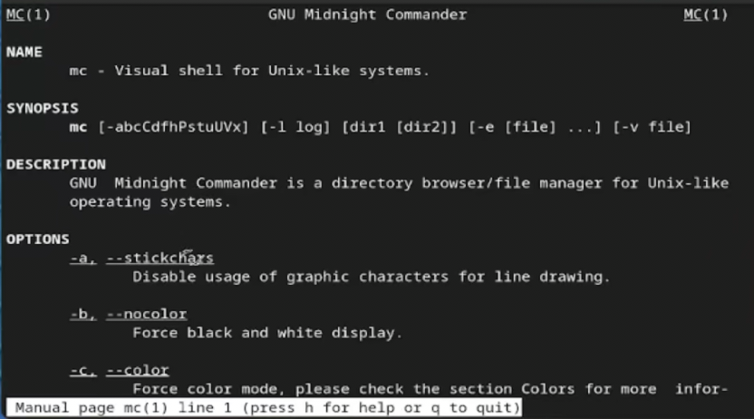{#fig:001 width=70% height=70%}

## Выполнение работы

Запускаем mc. Изучаем структуру и меню

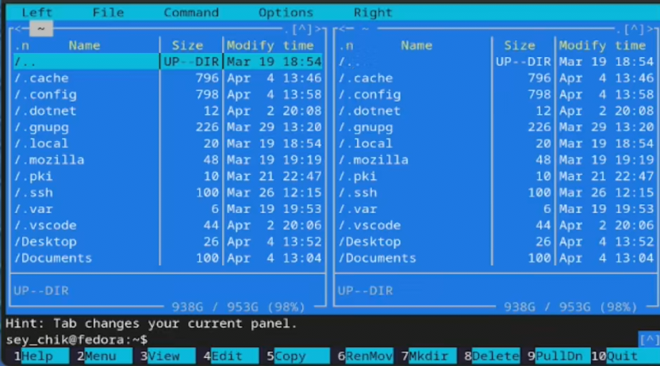{#fig:001 width=70%}

## Выполнение работы

Выполняем несколько операций в mc, используя управляющие клавиши (операции с панелями; выделение/отмена выделения файлов, копирование/перемещение файлов, получение информации о размере и правах доступа на файлы и/или каталоги)

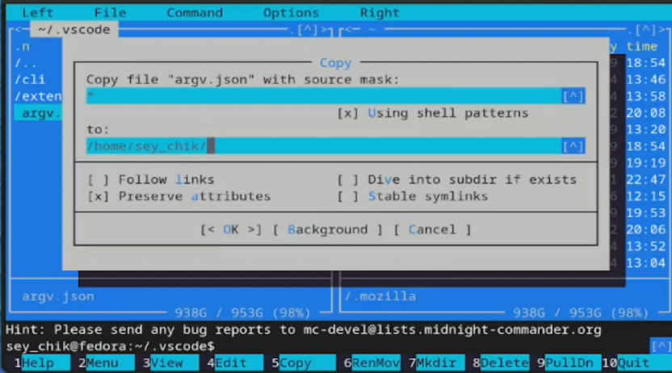{#fig:001 width=70%}

## Выполнение работы

Выполняем несколько операций в mc, используя управляющие клавиши (операции с панелями; выделение/отмена выделения файлов, копирование/перемещение файлов, получение информации о размере и правах доступа на файлы и/или каталоги)

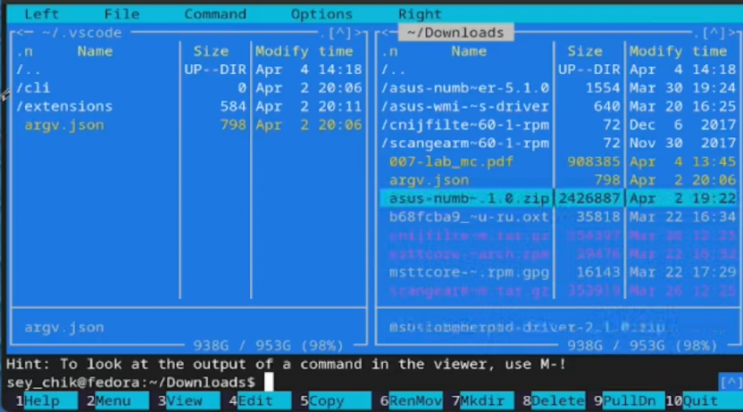{#fig:001 width=70%}

## Выполнение работы

Выполняем несколько операций в mc, используя управляющие клавиши (операции с панелями; выделение/отмена выделения файлов, копирование/перемещение файлов, получение информации о размере и правах доступа на файлы и/или каталоги)

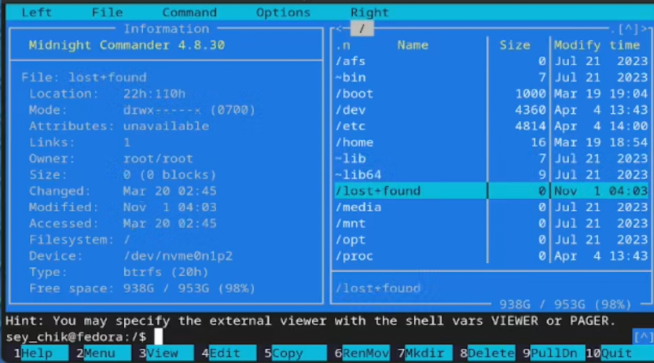{#fig:001 width=70%}

## Выполнение работы

Выполняем основные команды левой или правой панели

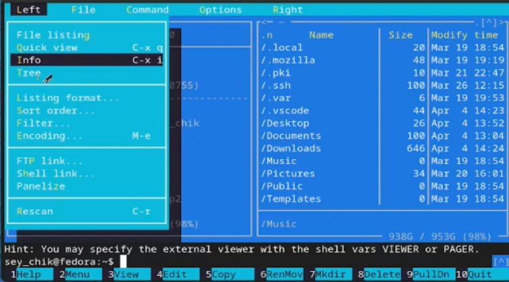{#fig:001 width=70%}

## Выполнение работы

Выполняем основные команды левой или правой панели

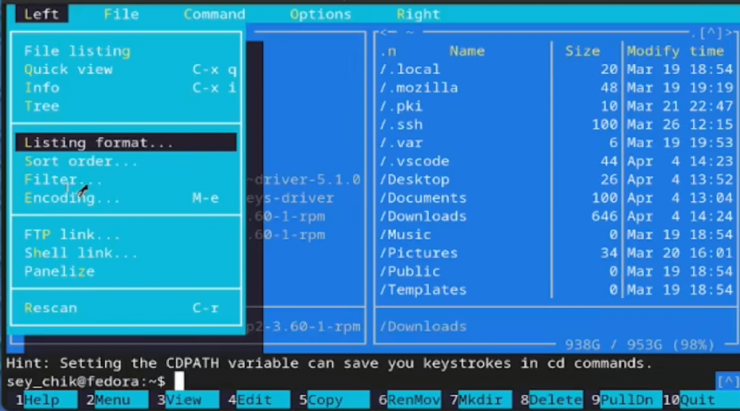{#fig:001 width=70%}

## Выполнение работы

Используя возможности подменю Файл выполняем:

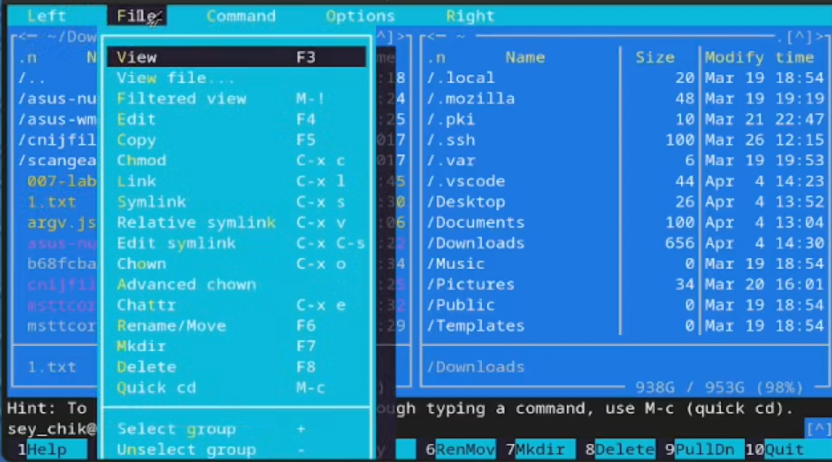{#fig:001 width=70%}

## Выполнение работы

Используя возможности подменю Файл выполняем просмотр содержимого текстового файла и его редактирование

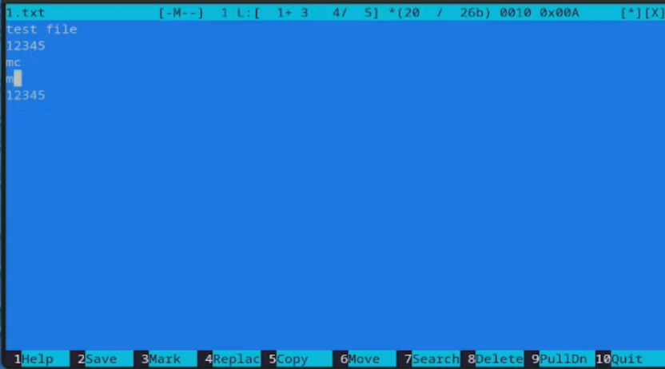{#fig:001 width=70%}

## Выполнение работы

Используя возможности подменю Файл выполняем создание каталога

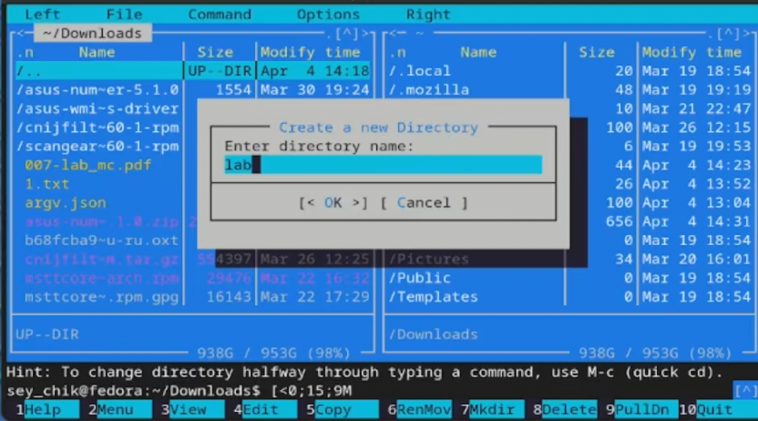{#fig:001 width=70%}

## Выполнение работы

Используя возможности подменю Файл выполняем копирование файлов в созданный каталог

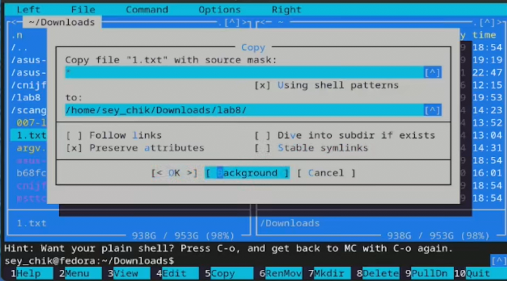{#fig:001 width=70%}

## Выполнение работы

С помощью подменю команда осуществляем поиск в файловой системе файла

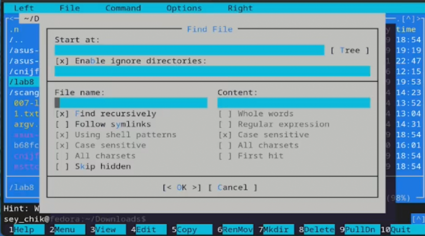{#fig:001 width=70%}

## Выполнение работы

С помощью подменю команда осуществляем поиск в файловой системе файла с заданными условиями

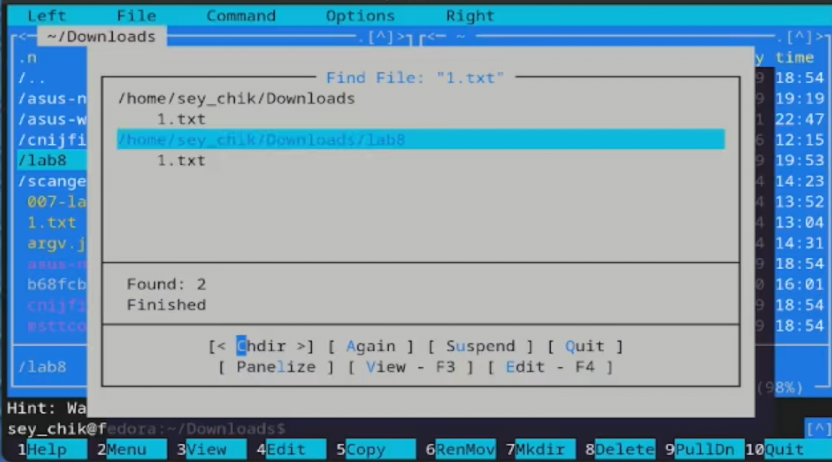{#fig:001 width=70%}

## Выполнение работы

С помощью подменю команда осуществляем анализ файла меню и файла расширений, опций

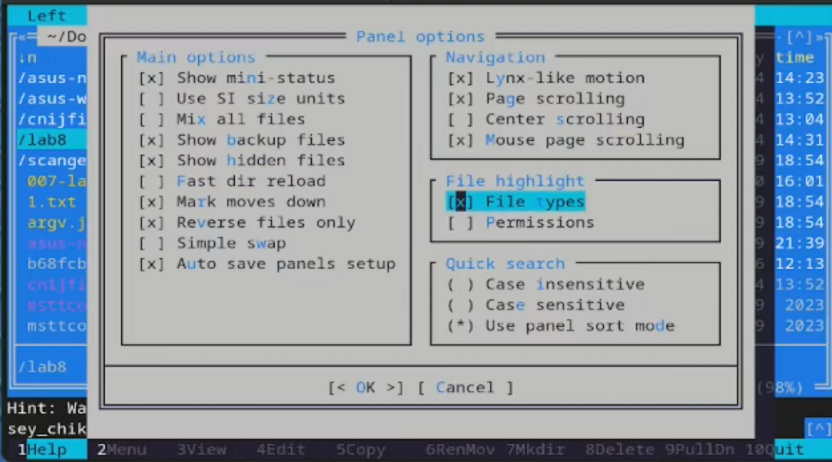{#fig:001 width=70%}

## Задание по встроенному редактору mc

Создаем текстовый файл и открываем его с помощью встроенного в mc редактора

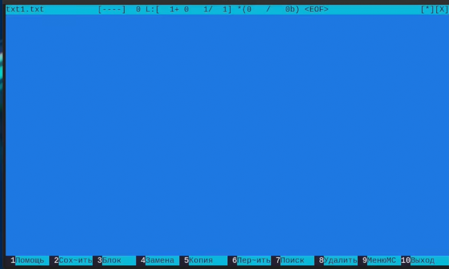{#fig:001 width=70%}

## Задание по встроенному редактору mc

Вставляем в открытый файл небольшой фрагмент текста, скопированный из любого другого файла

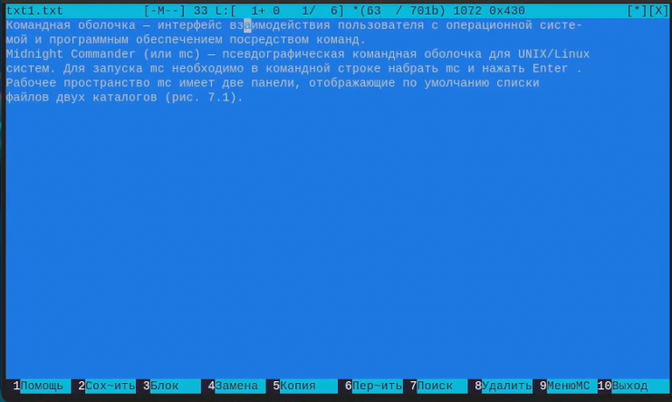{#fig:001 width=70%}

## Задание по встроенному редактору mc

Удаляем строку текста 

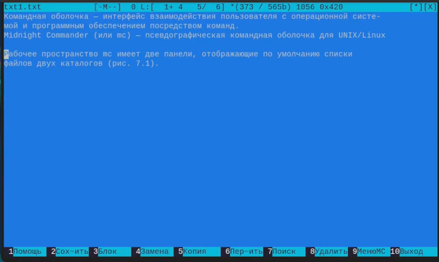{#fig:001 width=70%}

## Задание по встроенному редактору mc

Выделеяем фрагмент текста и копируем на новую строку

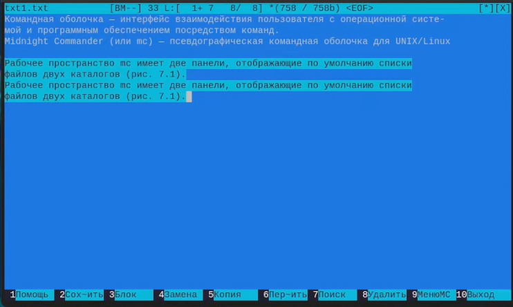{#fig:001 width=70%}

## Задание по встроенному редактору mc

Выделяем фрагмент текста и переносим на новую строку

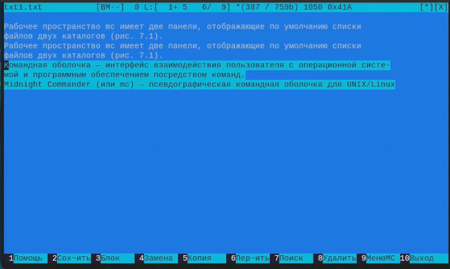{#fig:001 width=70%}

## Задание по встроенному редактору mc

Сохраняем файл

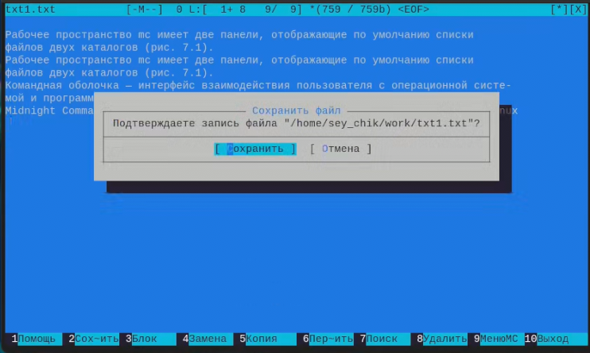{#fig:001 width=70%}

## Задание по встроенному редактору mc

Отменяем последнее действие

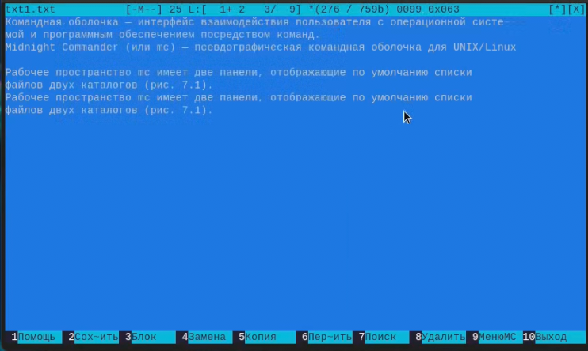{#fig:001 width=70%}

## Задание по встроенному редактору mc

Переходим в конец файла, в начало файла и добавляем текст

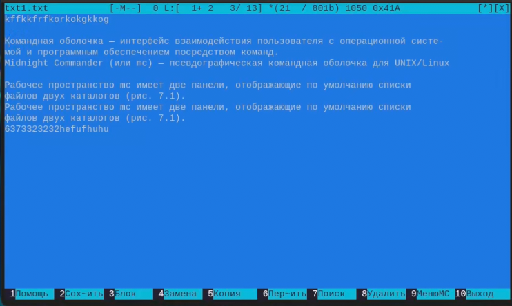{#fig:001 width=70%}

## Задание по встроенному редактору mc

Открываем файл с исходным текстом на языке C/C++, включаем подсветку синтаксиса

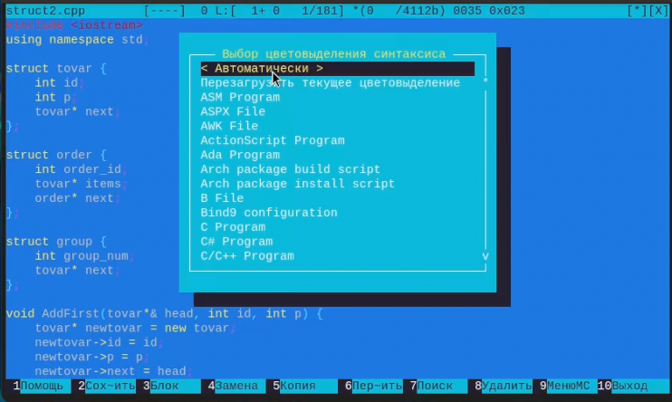{#fig:001 width=70%}

## Вывод

В ходе выполнения работы освоил основные возможности командной оболочки Midnight Commander.
