---
## Front matter
title: "Лабораторная работа №9"
subtitle: "Командная оболочка Midnight Commander"
author: "Мухин Тимофей Владимирович"

## Generic otions
lang: ru-RU
toc-title: "Содержание"

## Bibliography
bibliography: bib/cite.bib
csl: pandoc/csl/gost-r-7-0-5-2008-numeric.csl

## Pdf output format
toc: true
toc-depth: 2
fontsize: 12pt
linestretch: 1.5
papersize: a4
documentclass: scrreprt

## I18n polyglossia
polyglossia-lang:
  name: russian
  options:
    - spelling=modern
    - babelshorthands=true
polyglossia-otherlangs:
  name: english

## I18n babel
babel-lang: russian
babel-otherlangs: english

## Fonts
mainfont: PT Serif
romanfont: PT Serif
sansfont: PT Sans
monofont: PT Mono
mainfontoptions: Ligatures=TeX
romanfontoptions: Ligatures=TeX
sansfontoptions: Ligatures=TeX,Scale=MatchLowercase
monofontoptions: Scale=MatchLowercase,Scale=0.9

## Biblatex
biblatex: true
biblio-style: "gost-numeric"
biblatexoptions:
  - parentracker=true
  - backend=biber
  - hyperref=auto
  - language=auto
  - autolang=other*
  - citestyle=gost-numeric
figureTitle: "Рис."
tableTitle: "Таблица"
listingTitle: "Листинг"
lolTitle: "Листинги"

## Pandoc-crossref LaTeX customization
indent: true
header-includes:
  - \usepackage{indentfirst}
  - \usepackage{float}
  - \floatplacement{figure}{H}
---

# Цель работы

Освоение основных возможностей командной оболочки Midnight Commander. Приобретение навыков практической работы по просмотру каталогов и файлов; манипуляции с ними.

# Выполнение лабораторной работы

1. Изучаем информацию о mc, вызвав man mc

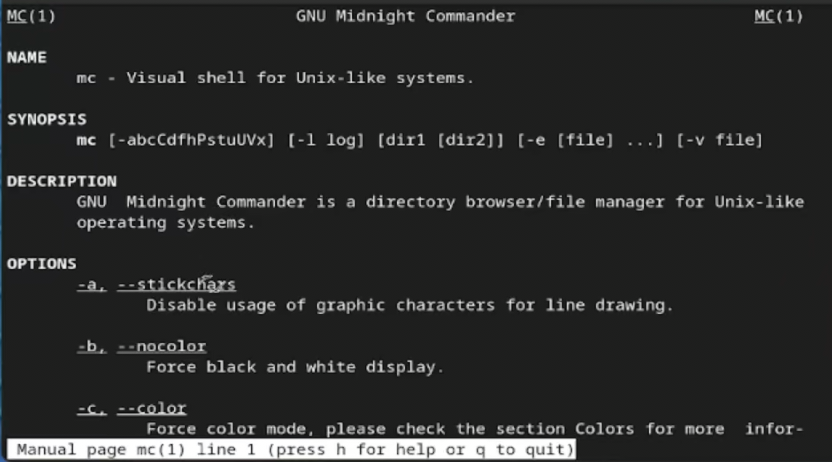{#fig:001 width=70%}

2. Запускаем mc. Изучаем структуру и меню

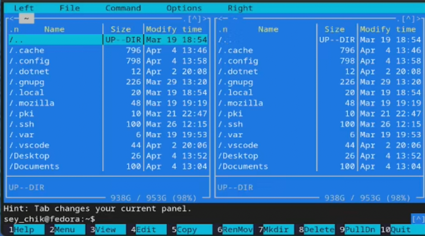{#fig:002 width=70%}

3. Выполняем несколько операций в mc, используя управляющие клавиши (операции с панелями; выделение/отмена выделения файлов, копирование/перемещение файлов, получение информации о размере и правах доступа на файлы и/или каталоги)

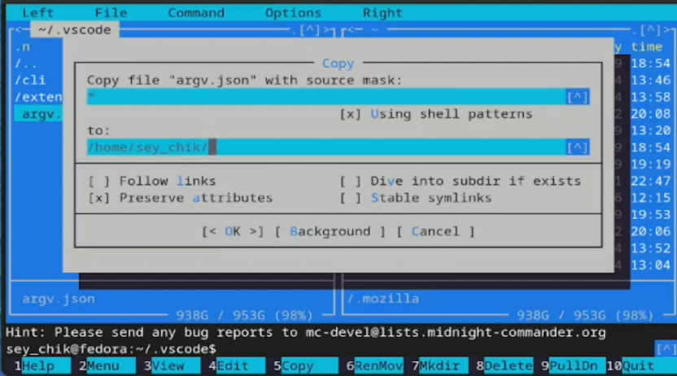{#fig:003 width=70%}

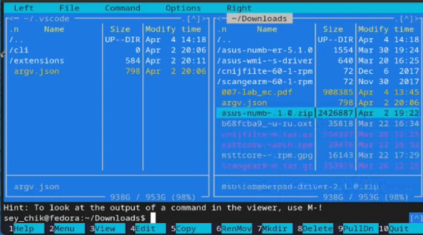{#fig:004 width=70%}

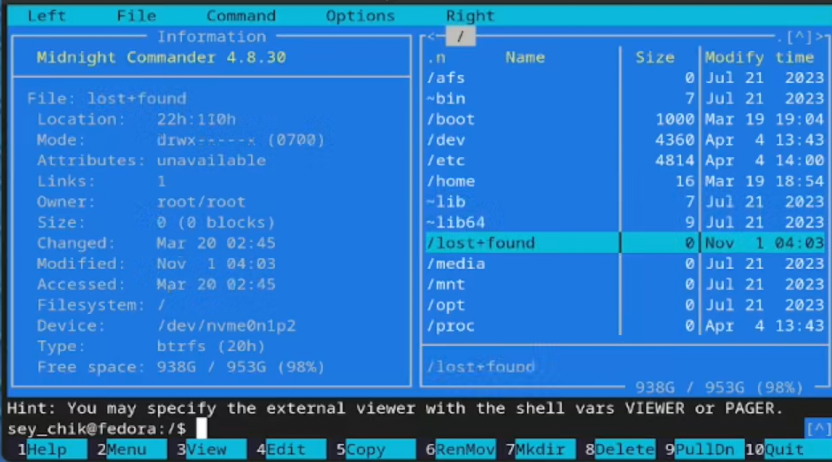{#fig:005 width=70%}

4. Выполняем основные команды левой или правой панели

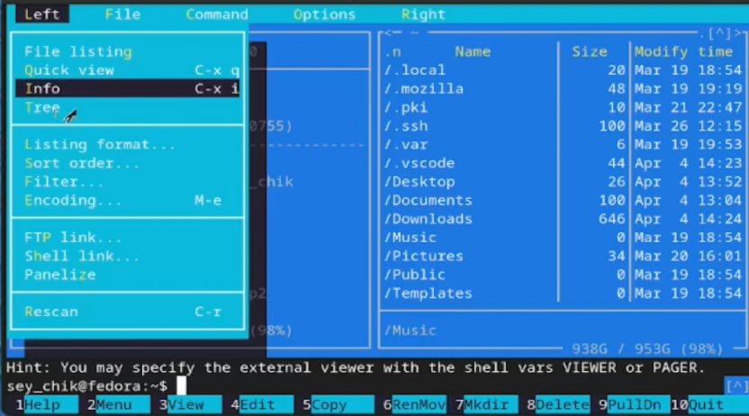{#fig:006 width=70%}

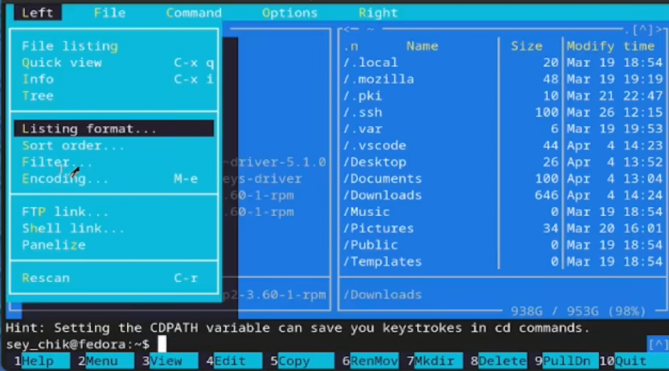{#fig:007 width=70%}

5. Используя возможности подменю Файл выполняем:

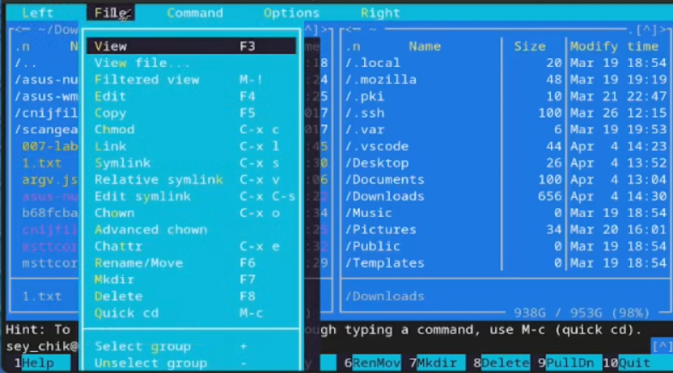{#fig:008 width=70%}

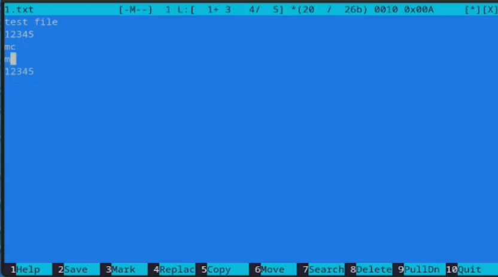{#fig:009 width=70%}

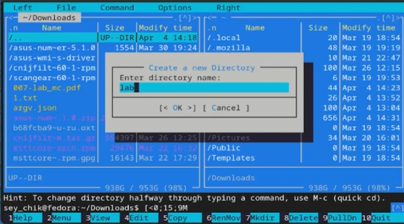{#fig:010 width=70%}

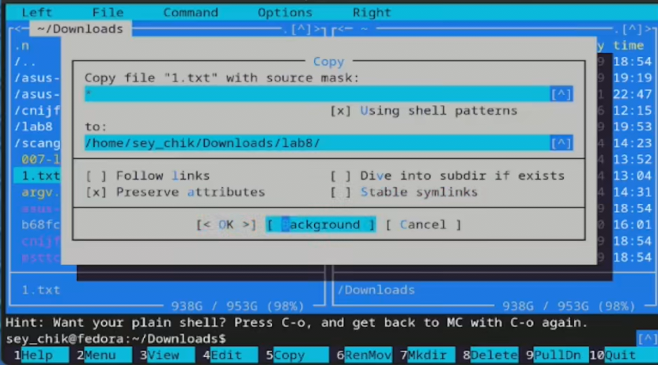{#fig:011 width=70%}

6. С помощью подменю команда осуществляем:

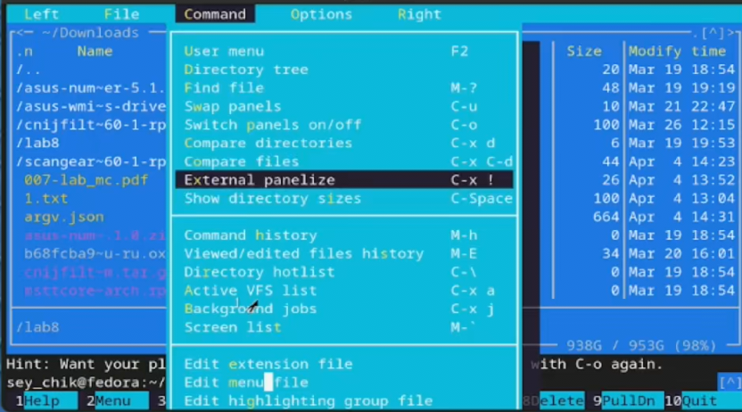{#fig:012 width=70%}

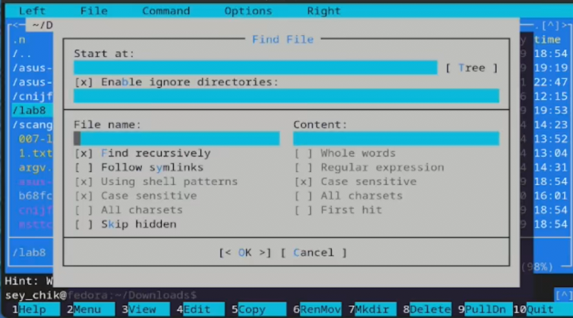{#fig:013 width=70%}

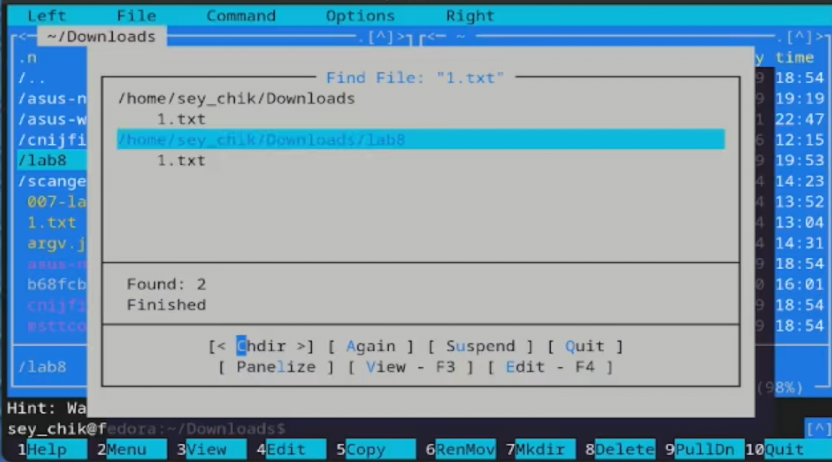{#fig:014 width=70%}

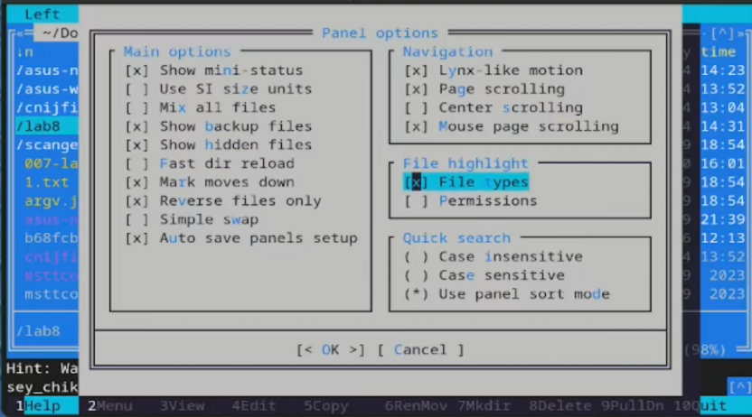{#fig:015 width=70%}

# Задание по встроенному редактору mc

1. Создаем текстовый файл и открываем его с помощью встроенного в mc редактора

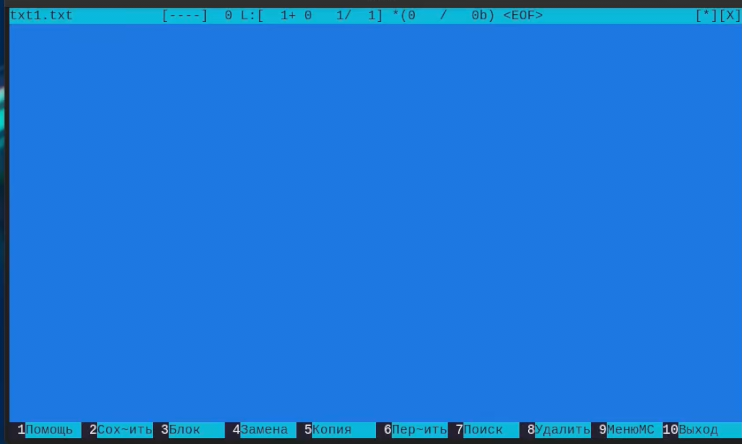{#fig:016 width=70%}

2. Вставляем в открытый файл небольшой фрагмент текста, скопированный из любого другого файла

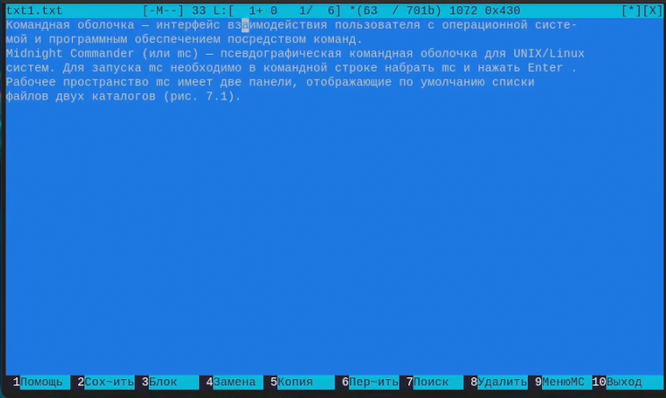{#fig:017 width=70%}

3. Делаем с текстом следующие манипуляции:

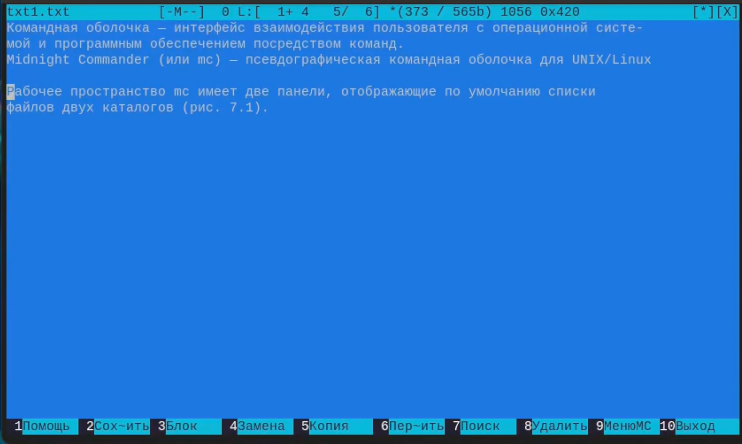{#fig:018 width=70%}

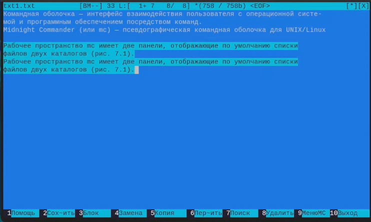{#fig:019 width=70%}

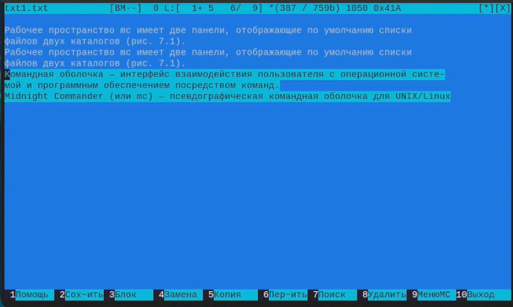{#fig:020 width=70%}

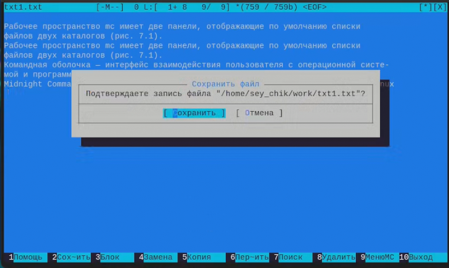{#fig:021 width=70%}

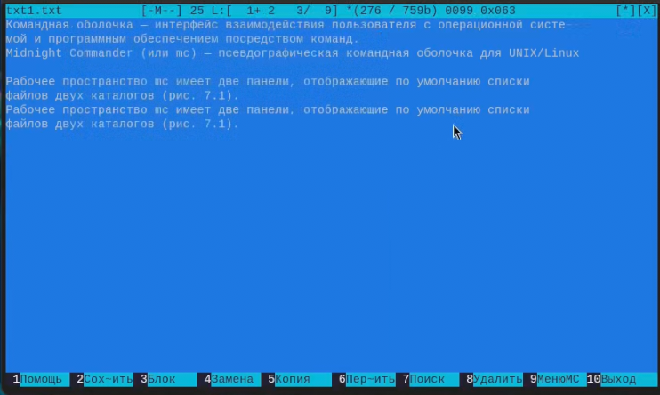{#fig:022 width=70%}

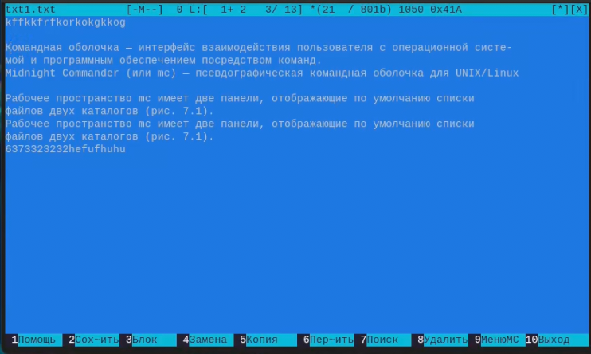{#fig:023 width=70%}

4. Открываем файл с исходным текстом на языке C/C++, включаем подсветку синтаксиса

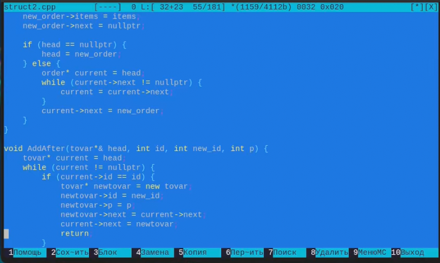{#fig:024 width=70%}

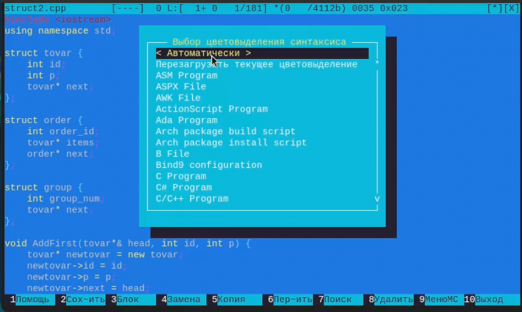{#fig:025 width=70%}

# Контрольные вопросы

Давайте ответим на каждый из вопросов по Midnight Commander (mc):

1. **Режимы работы в mc**:
   - **Панельный режим**: Позволяет просматривать содержимое каталогов и выполнять операции с файлами в двух панелях одновременно.
   - **Режим командной строки**: Позволяет вводить команды непосредственно в командной строке mc.

2. **Операции с файлами**:
   - **Shell/Командная строка**: Создание, удаление, переименование файлов и директорий, изменение прав доступа и другие операции.
   - **Меню mc (комбинации клавиш)**: Аналогичные операции, доступные через горячие клавиши, такие как создание файла (F4), удаление файла (F8), переименование файла (F6) и т. д.

3. **Структура меню левой (или правой) панели**:
   - **Файлы/Директории**: Просмотр содержимого текущего каталога.
   - **Команды**: Выполнение команд и операций над файлами.
   - **Настройки**: Настройка параметров mc и внешнего вида.

4. **Структура меню "Файл" mc**:
   - **Открыть**: Открытие файла во встроенном или внешнем редакторе.
   - **Скопировать/Переместить/Удалить**: Операции над файлами.
   - **Создать**: Создание нового файла или директории.
   - **Архивация/Распаковка**: Работа с архивами.
   - **Свойства**: Просмотр и изменение свойств файла или директории.

5. **Структура меню "Команда" mc**:
   - **Ввод команды**: Ввод и выполнение произвольной команды.
   - **Команды панели**: Выполнение команд, связанных с текущим файлом или директорией.

6. **Структура меню "Настройки" mc**:
   - **Опции панелей**: Настройка внешнего вида и поведения панелей.
   - **Опции обзора**: Настройка режима просмотра файлов.
   - **Опции редактора**: Настройка параметров встроенного редактора.

7. **Встроенные команды mc**:
   - **cd**: Смена текущего каталога.
   - **mkdir**: Создание новой директории.
   - **rm**: Удаление файлов и директорий.
   - **mv**: Перемещение или переименование файлов.
   - **chmod**: Изменение прав доступа к файлам.

8. **Команды встроенного редактора mc**:
   - **F2**: Сохранение файла.
   - **F3**: Просмотр файла.
   - **F4**: Редактирование файла.

9. **Средства mc для создания пользовательских меню**:
   - Встроенные возможности mc позволяют создавать пользовательские меню и назначать им команды для выполнения определенных действий.

10. **Средства mc для выполнения действий, определяемых пользователем**:
    - Встроенные команды позволяют пользователю выполнять различные операции с файлами и директориями в соответствии с их потребностями и предпочтениями.

# Выводы

В ходе выполнения работы освоил основные возможности командной оболочки Midnight Commander.

