---
## Front matter
lang: ru-RU
title: 'Лабораторная работа №10'
subtitle: 'Текстовый редактор vi'
author:
  - Мухин Тимофей Владимирович, НБИбд-03-23
institute:
  - Российский университет дружбы народов, Москва, Россия
date: 13.04.2024

## i18n babel
babel-lang: russian
babel-otherlangs: english

## Formatting pdf
toc: false
toc-title: Содержание
slide_level: 2
aspectratio: 169
section-titles: true
theme: metropolis
header-includes:
 - \metroset{progressbar=frametitle,sectionpage=progressbar,numbering=fraction}
 - '\makeatletter'
 - '\beamer@ignorenonframefalse'
 - '\makeatother'
---

# Цель работы

## Цель работы

Познакомиться с операционной системой Linux. Получить практические навыки рабо-
ты с редактором vi, установленным по умолчанию практически во всех дистрибутивах.

# Выполнение работы. Задание 1. 

## Выполнение работы

Создаем каталог с именем  ~/work/os/lab06. Вызываем vi и создаем файл hello.sh

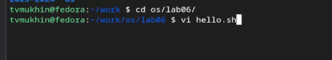{#fig:001 width=70% height=70%}

## Выполнение работы

Создаем каталог с именем  ~/work/os/lab06. Вызываем vi и создаем файл hello.sh

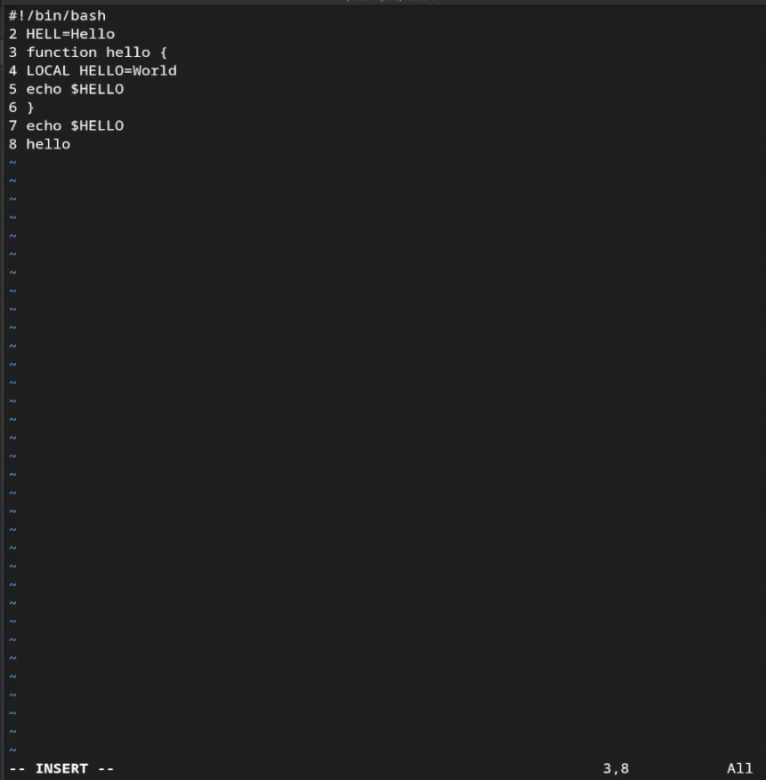{#fig:001 width=70%}

## Выполнение работы

Нажимаем esc для перехода в командный режим

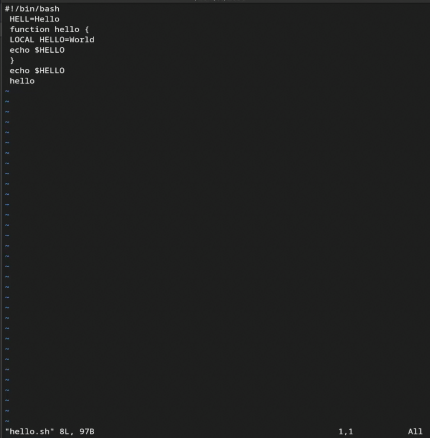{#fig:001 width=70%}

## Выполнение работы

Нажимаем :, вводим wq (записываем файл и выходим из редактора)

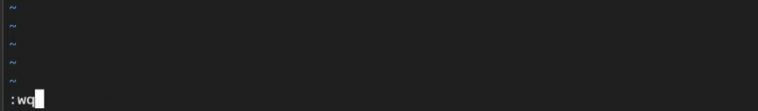{#fig:001 width=70%}

## Выполнение работы

Сделаем файл исполняем 

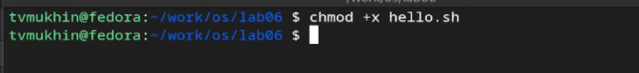{#fig:001 width=70%}

# Выполнение работы. Задание 2

## Выполнение работы

Вызываем vi на редактирование файл

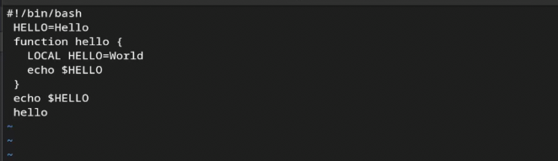{#fig:001 width=70%}

## Выполнение работы

Устанавливаем курсор в конец слова HELL второй строки.

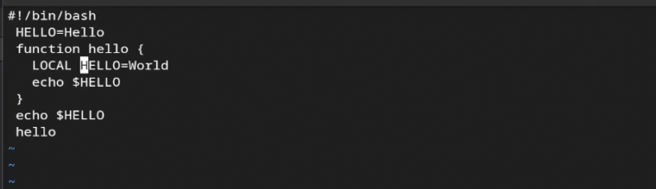{#fig:001 width=70%}

## Выполнение работы

Переходим в режим вставки и заменяем на HELLO. Esc для возврата в командный
режим.

{#fig:001 width=70%}

## Выполнение работы

Устанавливаем курсор на 4 строку и стираем LOCAL. Набираем local в режиме вставки.

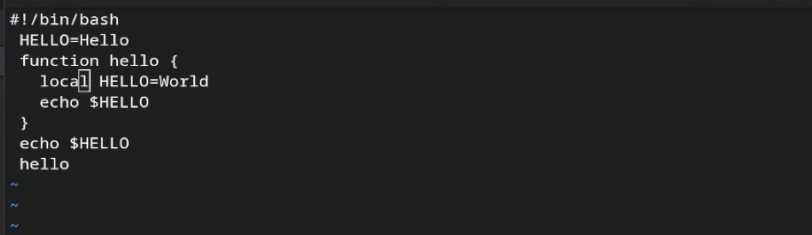{#fig:001 width=70%}

## Выполнение работы

Устанавливаем курсор на последней строке файла. Вставляем после неё строку, содержащую
следующий текст: echo $HELLO

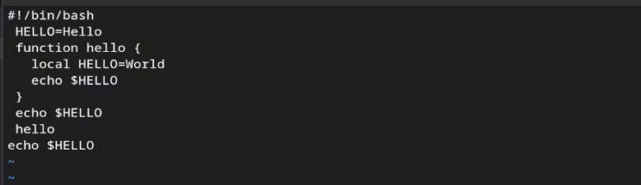{#fig:001 width=70%}

## Выполнение работы

Переходим в командный режим и удаляем последнюю строку

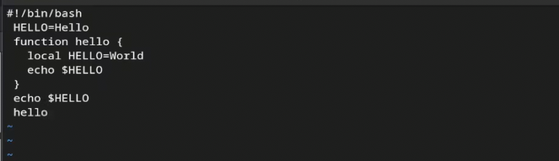{#fig:001 width=70%}

## Выполнение работы

Отменяем изменения при помощи u

{#fig:001 width=70%}

## Выполнение работы

Записываем изменения и выходим из vi.

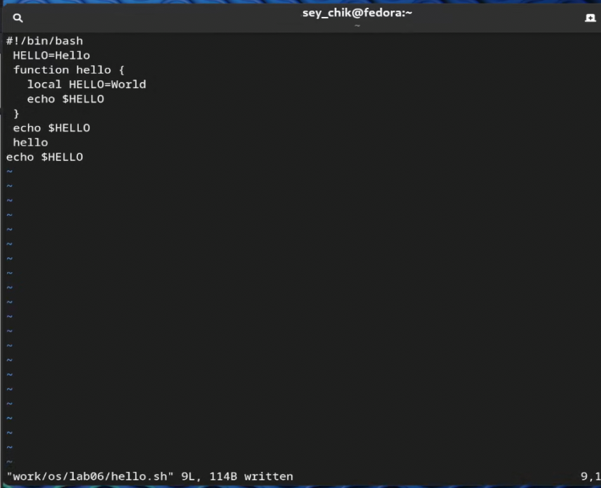{#fig:001 width=70%}

## Вывод

В ходе выполнения работы я получил практические навыки по работе с редактором vi.
