---
## Front matter
title: "Лабораторная работа №10"
subtitle: "Текстовый редактор vi"
author: "Мухин Тимофей Владимирович"

## Generic otions
lang: ru-RU
toc-title: "Содержание"

## Bibliography
bibliography: bib/cite.bib
csl: pandoc/csl/gost-r-7-0-5-2008-numeric.csl

## Pdf output format
toc: true
toc-depth: 2
fontsize: 12pt
linestretch: 1.5
papersize: a4
documentclass: scrreprt

## I18n polyglossia
polyglossia-lang:
  name: russian
  options:
    - spelling=modern
    - babelshorthands=true
polyglossia-otherlangs:
  name: english

## I18n babel
babel-lang: russian
babel-otherlangs: english

## Fonts
mainfont: PT Serif
romanfont: PT Serif
sansfont: PT Sans
monofont: PT Mono
mainfontoptions: Ligatures=TeX
romanfontoptions: Ligatures=TeX
sansfontoptions: Ligatures=TeX,Scale=MatchLowercase
monofontoptions: Scale=MatchLowercase,Scale=0.9

## Biblatex
biblatex: true
biblio-style: "gost-numeric"
biblatexoptions:
  - parentracker=true
  - backend=biber
  - hyperref=auto
  - language=auto
  - autolang=other*
  - citestyle=gost-numeric
figureTitle: "Рис."
tableTitle: "Таблица"
listingTitle: "Листинг"
lolTitle: "Листинги"

## Pandoc-crossref LaTeX customization
indent: true
header-includes:
  - \usepackage{indentfirst}
  - \usepackage{float}
  - \floatplacement{figure}{H}
---

# Цель работы

Познакомиться с операционной системой Linux. Получить практические навыки рабо-
ты с редактором vi, установленным по умолчанию практически во всех дистрибутивах.

# Выполнение лабораторной работы. Задание 1

1. Создаем каталог с именем  ~/work/os/lab06. Вызываем vi и создаем файл hello.sh

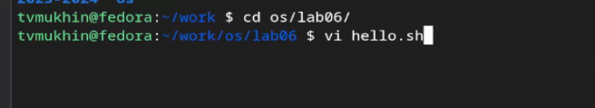{#fig:001 width=70%}

2. Нажимаем клавишу i и вводим текст

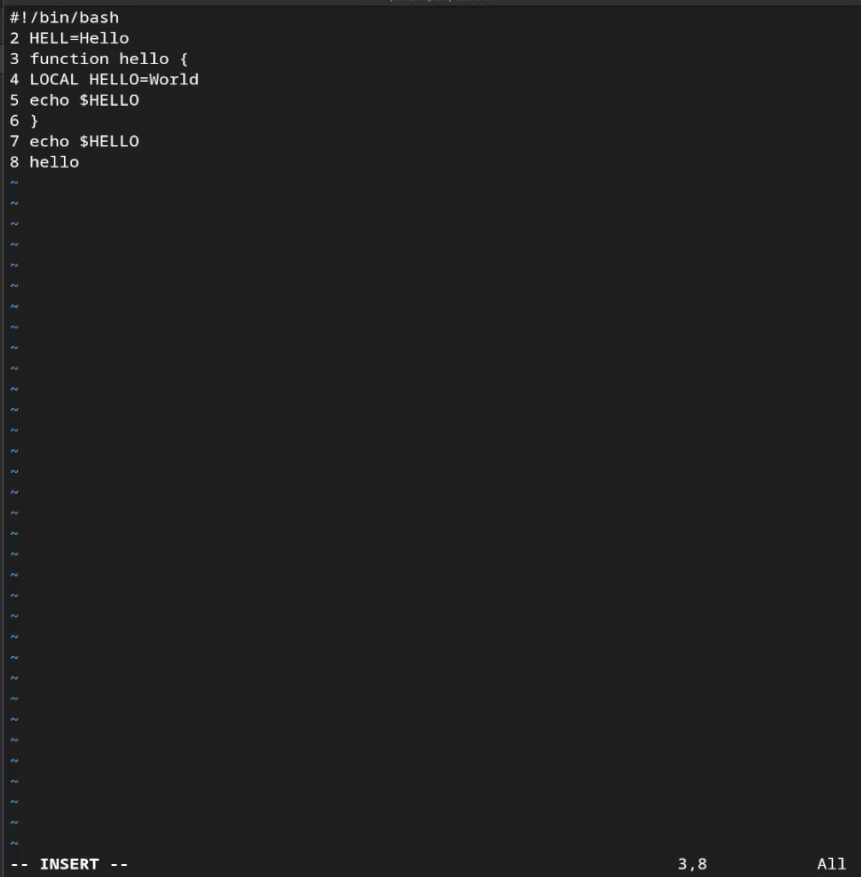{#fig:002 width=70%} 

3. Нажимаем esc для перехода в командный режим

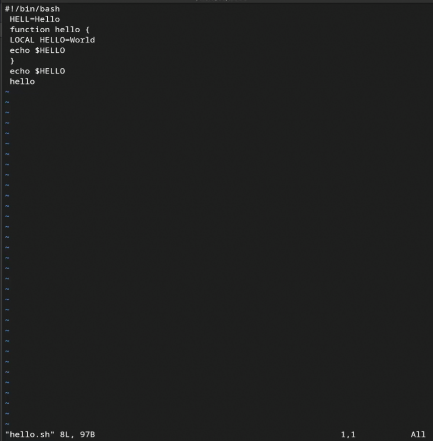{#fig:003 width=70%} 

4. Нажимаем :, вводим wq (записываем файл и выходим из редактора)

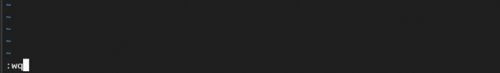{#fig:004 width=70%} 

5. Сделаем файл исполняем 

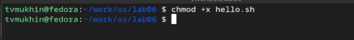{#fig:005 width=70%}

# Выполнение лабораторной работы. Задание 2

1. Вызываем vi на редактирование файл

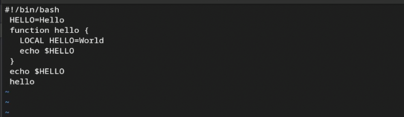{#fig:006 width=70%} 

2. Устанавливаем курсор в конец слова HELL второй строки.

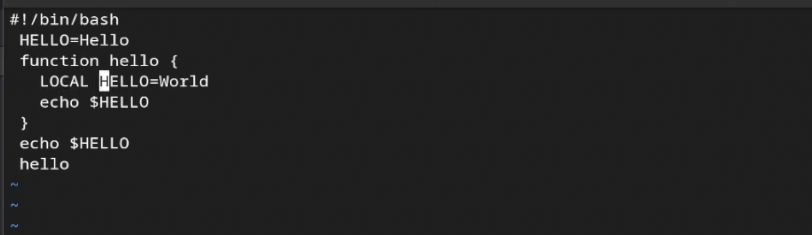{#fig:007 width=70%} 

3. Переходим в режим вставки и заменяем на HELLO. Esc для возврата в командный
режим.

{#fig:012 width=70%} 

4. Устанавливаем курсор на 4 строку и стираем LOCAL. Набираем local в режиме вставки.

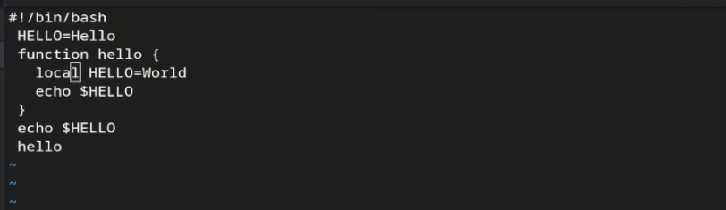{#fig:008 width=70%} 

5. Устанавливаем курсор на последней строке файла. Вставляем после неё строку, содержащую
следующий текст: echo $HELLO

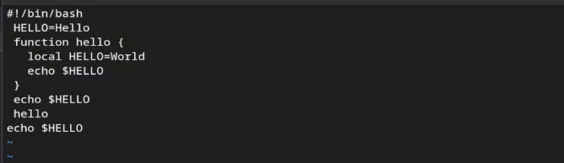{#fig:009 width=70%} 

6. Переходим в командный режим и удаляем последнюю строку

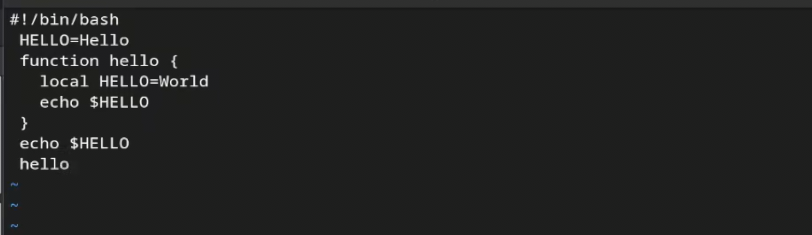{#fig:010 width=70%} 

7.  Отменяем изменения при помощи u

{#fig:015 width=70%} 

8. Записываем изменения и выходим из vi.

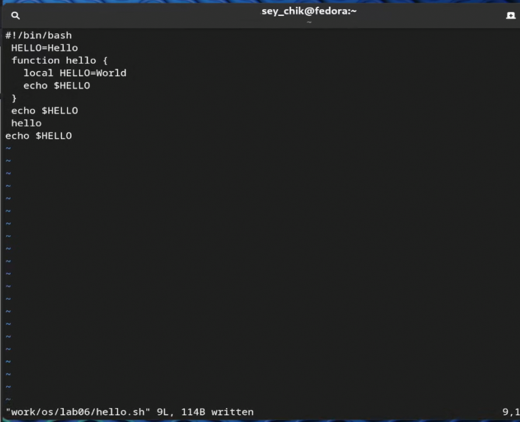{#fig:011 width=70%} 

# Контрольные вопросы

1. Режимы работы редактора vi:

   - **Командный режим (Command mode)**: В этом режиме пользователь может выполнять команды для перемещения по тексту, поиска, удаления, копирования и других операций без изменения текста.
   
   - **Режим вставки (Insert mode)**: В этом режиме пользователь может вводить текст прямо в документ. Добавление нового текста или изменение существующего.
   
   - **Режим замены (Replace mode)**: В этом режиме символы, вводимые пользователем, заменяют существующие символы в тексте.
   
   - **Режим последней строки (Last line mode)**: Это режим, в котором пользователь может вводить команды для сохранения файла, выхода из vi, поиска и замены, а также других действий, которые можно выполнить через командную строку внизу экрана.

2. Для выхода из редактора vi, не сохраняя произведенные изменения, нужно выполнить команду `:q!`.

3. Команды позиционирования:

   - `h` - перемещение курсора влево.
   - `j` - перемещение курсора вниз.
   - `k` - перемещение курсора вверх.
   - `l` - перемещение курсора вправо.
   - `0` - перемещение курсора в начало строки.
   - `$` - перемещение курсора в конец строки.
   - `G` - перемещение курсора в конец файла.
   - `gg` - перемещение курсора в начало файла.

4. Для редактора vi словом является последовательность символов, разделенных пробелами или символами переноса строки.

5. Для перемещения в начало файла используется команда `gg`, а для перемещения в конец файла - команда `G`.

6. Основные группы команд редактирования включают в себя команды для вставки текста, удаления текста, копирования текста, поиска и замены текста, а также команды отмены действий и повтора действий.

7. Для заполнения строки символами `$` нужно перейти в режим вставки и нажать `$` столько раз, сколько требуется.

8. Для отмены некорректного действия, связанного с процессом редактирования, используется команда `u`.

9. Основные группы команд режима последней строки включают команды для сохранения файла (`:w`), выхода из vi (`:q`), сохранения и выхода (`:wq`), поиска и замены текста (`:s`), а также другие команды для управления редактором и файлом.

10. Для определения позиции, в которой заканчивается строка без перемещения курсора, можно использовать команду `$`.

11. Опции редактора vi могут быть изучены в документации к программе или в онлайн-ресурсах. Обычно они предоставляют пользователю возможность настройки внешнего вида и поведения редактора.

12. Режим работы редактора vi можно определить по виду курсора или по названию режима, отображаемому в нижней части экрана.

13. Граф взаимосвязи режимов работы редактора vi:

   - **Командный режим** - начальный и основной режим, в который редактор входит по умолчанию и из которого можно перейти в другие режимы.
   - **Режим вставки** - режим, в который переходит пользователь для ввода или изменения текста.
   - **Режим замены** - режим, в котором символы заменяют существующие символы в тексте.
   - **Режим последней строки** - режим, в котором пользователь может вводить команды для сохранения, выхода и других действий через командную строку.

# Выводы

В ходе выполнения работы я получил практические навыки по работе с редактором vi.

