---
## Front matter
lang: ru-RU
title: 'Лабораторная работа №11'
subtitle: 'Текстовый редактор emacs'
author:
  - Мухин Тимофей Владимирович, НБИбд-03-23
institute:
  - Российский университет дружбы народов, Москва, Россия
date: 20.04.2024

## i18n babel
babel-lang: russian
babel-otherlangs: english

## Formatting pdf
toc: false
toc-title: Содержание
slide_level: 2
aspectratio: 169
section-titles: true
theme: metropolis
header-includes:
 - \metroset{progressbar=frametitle,sectionpage=progressbar,numbering=fraction}
 - '\makeatletter'
 - '\beamer@ignorenonframefalse'
 - '\makeatother'
---

# Цель работы

## Цель работы

Познакомиться с операционной системой Linux. Получить практические навыки работы с редактором Emacs.

# Выполнение работы. 

## Выполнение работы

Открываем emacs

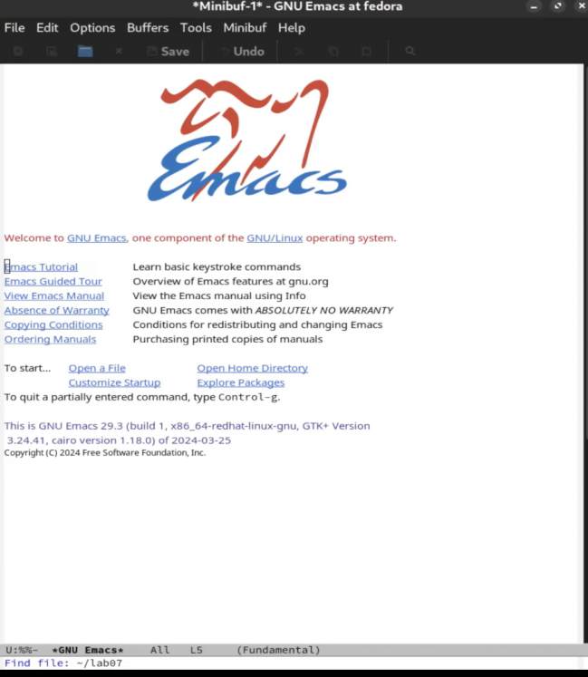{#fig:001 width=70% height=70%}

## Выполнение работы

Создаем файл lab07.sh с помощью комбинации (C-x C-f).

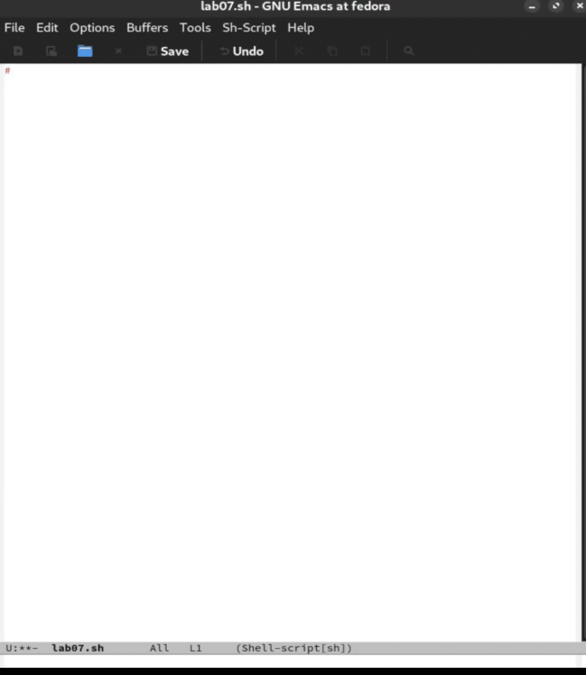{#fig:001 width=70%}

## Выполнение работы

Набираем текст

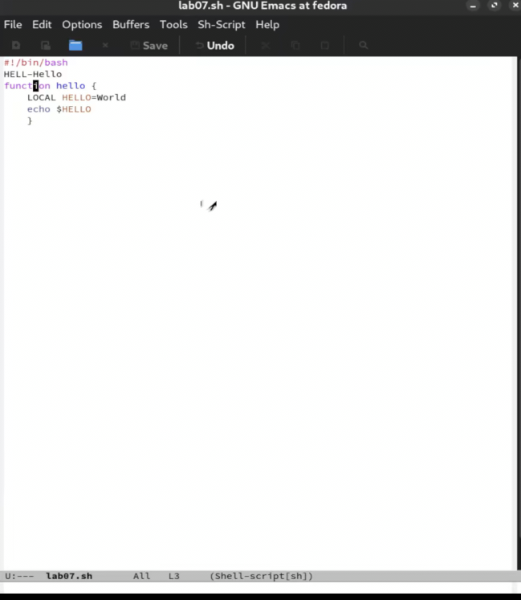{#fig:001 width=70%}

## Выполнение работы

Сохраняем файл

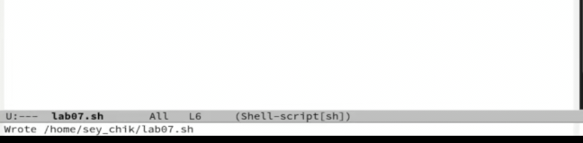{#fig:001 width=70%}

## Выполнение работы

Проделаем с текстом стандартные процедуры редактирования, каждое действие должно осуществляться комбинацией клавиш: 

## Выполнение работы 

Вырезать одной командой целую строку (С-k)

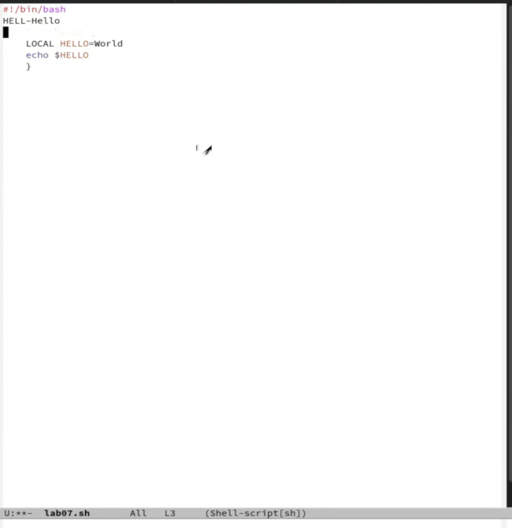{#fig:001 width=70%}

## Выполнение работы

Вставить эту строку в конец файла (C-y)

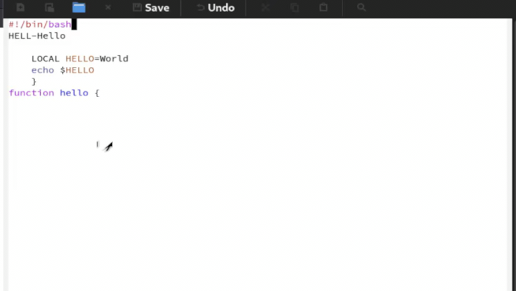{#fig:001 width=70%}

## Выполнение работы

Выделить область текста (C-space)

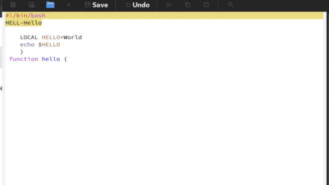{#fig:001 width=70%}

## Выполнение работы

Cкопировать область в буфер обмена (M-w)

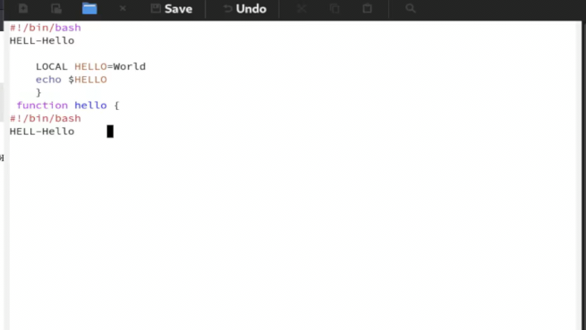{#fig:001 width=70%}

## Выполнение работы

Вставить область в конец файла

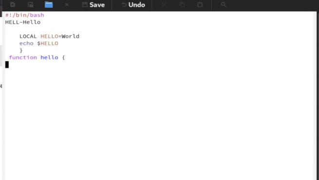{#fig:001 width=70%}

## Выполнение работы

Вновь выделить эту область и на этот раз вырезать её (C-w)

{#fig:001 width=70%}

## Выполнение работы

Отмените последнее действие (C-/)

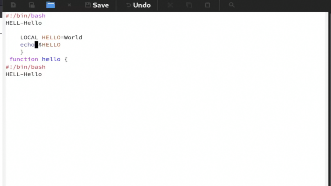{#fig:001 width=70%}

## Выполнение работы

Изучаем команды по перемещению курсора

{#fig:001 width=70%}

## Выполнение работы

Управление буферами

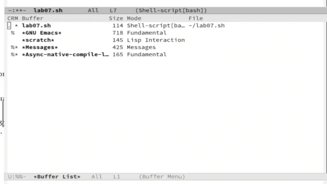{#fig:001 width=70%}

## Выполнение работы

Перемещение в новое окно и переключение на другой буфер

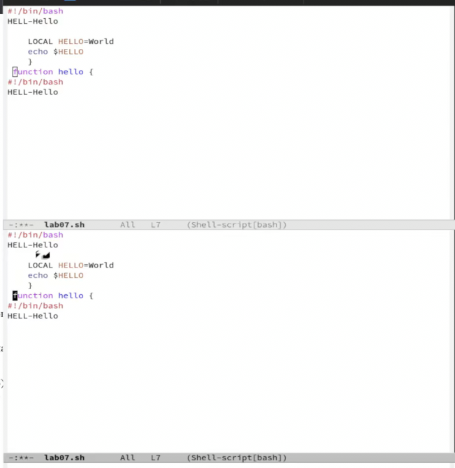{#fig:001 width=70%}

## Выполнение работы

Переключение между буферами без вывода списка

{#fig:001 width=70%}

## Выполнение работы

Управление окнами 

## Выполнение работы

Разделение фрейма на четыре части

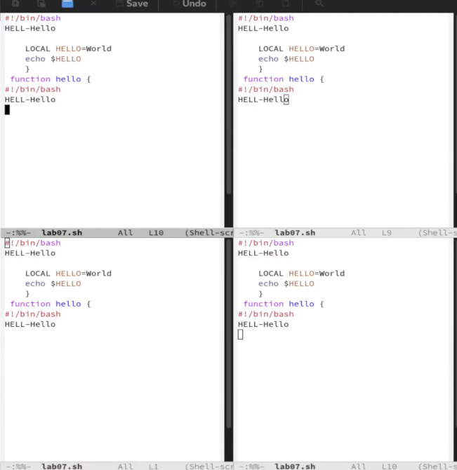{#fig:001 width=70%}

## Выполнение работы

Открытие нового буфера в каждом из четырех окон

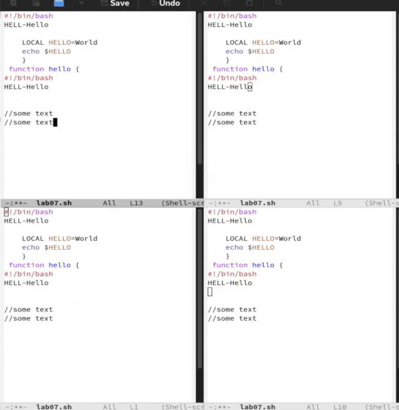{#fig:001 width=70%}

## Выполнение работы

Режим поиска 

## Выполнение работы

Поиск и нахождение слов в тексте

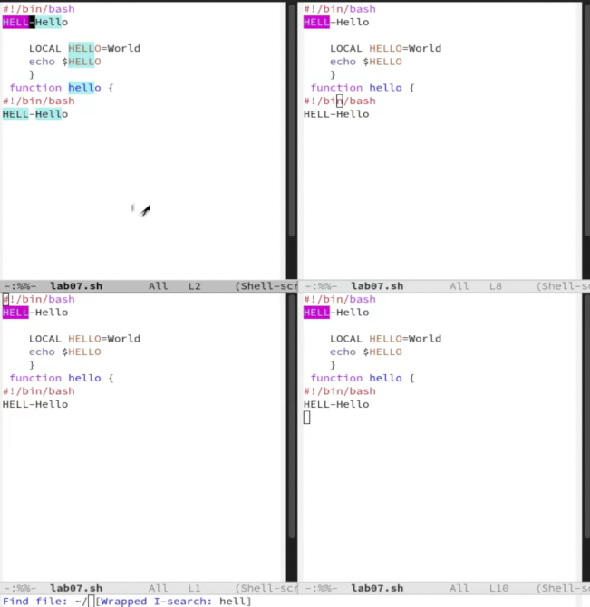{#fig:001 width=70%}

## Выполнение работы

Режим поиска и замены

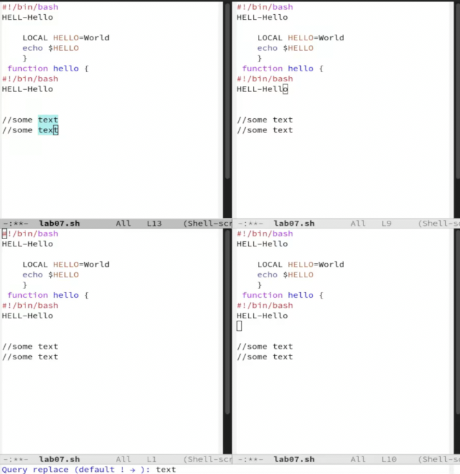{#fig:001 width=70%}

## Выполнение работы

Использование другого режима поиска

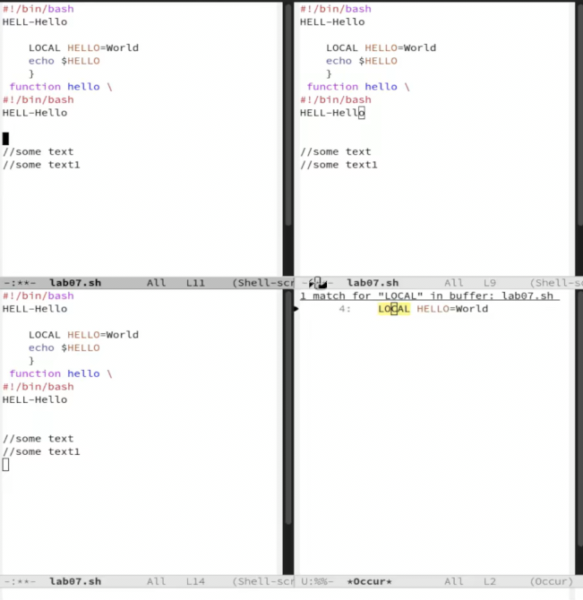{#fig:001 width=70%}

## Вывод

В ходе выполнения работы я получил практические навыки по работе с редактором emacs.
