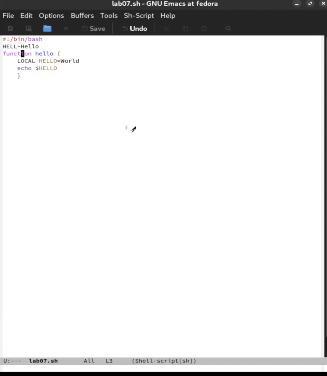

---
## Front matter
title: "Лабораторная работа №11"
subtitle: "Текстовый редактор emacs"
author: "Мухин Тимофей Владимирович"

## Generic otions
lang: ru-RU
toc-title: "Содержание"

## Bibliography
bibliography: bib/cite.bib
csl: pandoc/csl/gost-r-7-0-5-2008-numeric.csl

## Pdf output format
toc: true
toc-depth: 2
fontsize: 12pt
linestretch: 1.5
papersize: a4
documentclass: scrreprt

## I18n polyglossia
polyglossia-lang:
  name: russian
  options:
    - spelling=modern
    - babelshorthands=true
polyglossia-otherlangs:
  name: english

## I18n babel
babel-lang: russian
babel-otherlangs: english

## Fonts
mainfont: PT Serif
romanfont: PT Serif
sansfont: PT Sans
monofont: PT Mono
mainfontoptions: Ligatures=TeX
romanfontoptions: Ligatures=TeX
sansfontoptions: Ligatures=TeX,Scale=MatchLowercase
monofontoptions: Scale=MatchLowercase,Scale=0.9

## Biblatex
biblatex: true
biblio-style: "gost-numeric"
biblatexoptions:
  - parentracker=true
  - backend=biber
  - hyperref=auto
  - language=auto
  - autolang=other*
  - citestyle=gost-numeric
figureTitle: "Рис."
tableTitle: "Таблица"
listingTitle: "Листинг"
lolTitle: "Листинги"

## Pandoc-crossref LaTeX customization
indent: true
header-includes:
  - \usepackage{indentfirst}
  - \usepackage{float}
  - \floatplacement{figure}{H}
---

# Цель работы

Познакомиться с операционной системой Linux. Получить практические навыки работы с редактором Emacs.

# Выполнение лабораторной работы

1. Открываем emacs

{#fig:001 width=70%}

2. Создаем файл lab07.sh с помощью комбинации (C-x C-f).

{#fig:002 width=70%} 

3. Набираем текст

{#fig:003 width=70%} 

4. Сохраняем файл

{#fig:004 width=70%} 

5. Проделать с текстом стандартные процедуры редактирования, каждое действие должно осуществляться комбинацией клавиш:

{#fig:005 width=70%}

{#fig:006 width=70%} 

{#fig:007 width=70%} 

{#fig:008 width=70%} 

{#fig:009 width=70%} 

{#fig:010 width=70%} 

{#fig:011 width=70%} 

6. Изучаем команды по перемещению курсора

{#fig:012 width=70%} 

7. Управление буферами:

{#fig:013 width=70%} 

{#fig:014 width=70%} 

{#fig:015 width=70%} 

8. Управление окнами 

{#fig:016 width=70%} 

{#fig:017 width=70%} 

9. Режим поиска 

{#fig:018 width=70%} 

{#fig:019 width=70%} 

{#fig:020 width=70%} 

# Контрольные вопросы

1. **Emacs** - это мощный и расширяемый редактор текста с широким спектром функций, которые выходят за рамки простого редактирования текста. Он поддерживает множество режимов и позволяет выполнять различные задачи, такие как редактирование кода, просмотр файлов, работу с электронной почтой и многое другое.

2. **Особенности, делающие Emacs сложным для новичков:**
   - Обилие команд и комбинаций клавиш, которые могут быть неочевидными.
   - Необходимость настройки и освоения специфической концепции буферов, окон и режимов.
   - Emacs имеет крутой крутой старт для новичка.

3. **Буфер и окно в терминологии Emacs:**
   - **Буфер** - это временное хранилище для текста. В Emacs текстовые данные хранятся в буферах, которые могут содержать как открытые файлы, так и другие типы данных.
   - **Окно** - область экрана, в которой отображается содержимое буфера.

4. **Можно ли открыть больше 10 буферов в одном окне?**
   - Да, в Emacs можно открыть любое количество буферов в одном окне.

5. **Буферы, создаваемые по умолчанию при запуске Emacs:**
   - Обычно при запуске Emacs открывается один буфер, который может использоваться для ввода текста.

6. **Для ввода команды `C-c |` и `C-c C-|` в Emacs вы нажмете следующие комбинации клавиш:**
   - `C-c |`: удерживаете клавишу "Ctrl", нажимаете "c", затем "|" (вертикальная черта).
   - `C-c C-|`: удерживаете клавишу "Ctrl", нажимаете "c", затем удерживаете "Ctrl", и нажимаете "|" (вертикальная черта).

7. **Для разделения текущего окна на две части в Emacs:**
   - `C-x 3`: разделит текущее окно горизонтально на две части.
   - `C-x 2`: разделит текущее окно вертикально на две части.

8. **Настройки редактора Emacs хранятся в файле:** 
   - Обычно настройки Emacs хранятся в файле `.emacs`.

9. **Функция клавиши `C-c` и возможность переназначения:**
   - Клавиша `C-c` используется в Emacs для обозначения комбинаций клавиш, которые предназначены для пользовательских команд или привязки к определенным функциям. Эту клавишу можно переназначить для выполнения других функций в соответствии с предпочтениями пользователя.

10. **Предпочтения по редакторам Vi vs Emacs:**
    - Emacs, так как позволяет работать с несколькими файлами одновременно, а также, имеет графический интерфейс.

# Выводы

В ходе выполнения работы я получил практические навыки по работе с редактором emacs.

