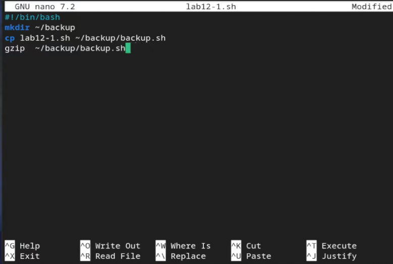
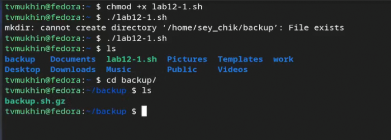
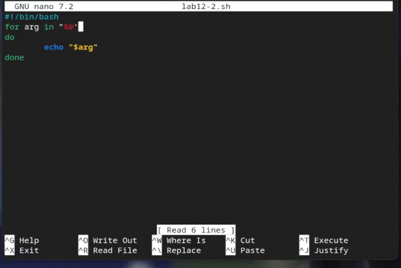
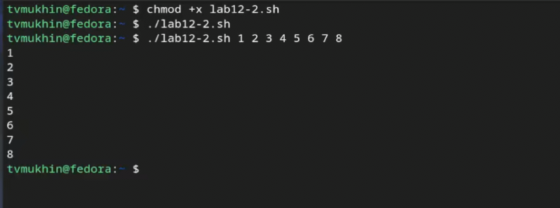
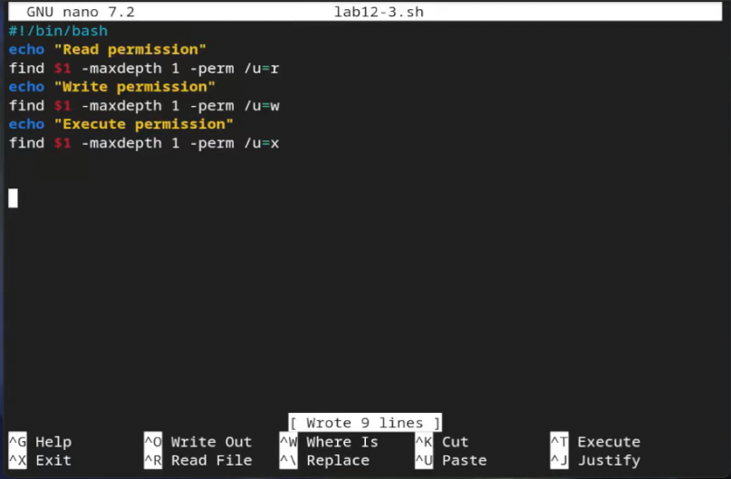
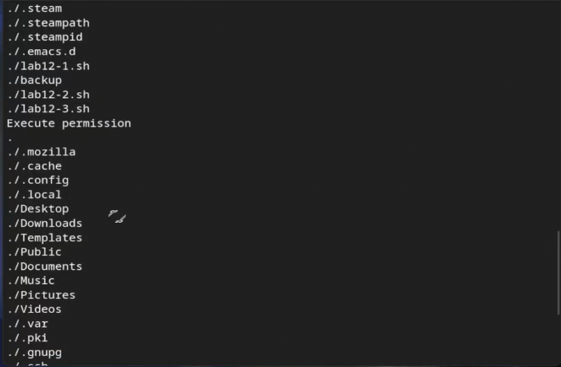
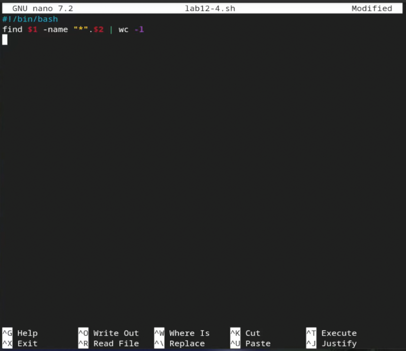
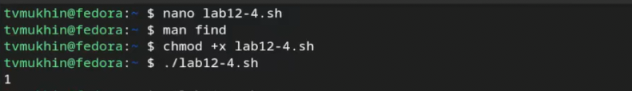

---
## Front matter
lang: ru-RU
title: 'Лабораторная работа №12'
subtitle: 'Программирование в командном
процессоре ОС UNIX. Командные файлы'
author:
  - Мухин Тимофей Владимирович, НБИбд-03-23
institute:
  - Российский университет дружбы народов, Москва, Россия
date: 26.04.2024

## i18n babel
babel-lang: russian
babel-otherlangs: english

## Formatting pdf
toc: false
toc-title: Содержание
slide_level: 2
aspectratio: 169
section-titles: true
theme: metropolis
header-includes:
 - \metroset{progressbar=frametitle,sectionpage=progressbar,numbering=fraction}
 - '\makeatletter'
 - '\beamer@ignorenonframefalse'
 - '\makeatother'
---

# Цель работы

## Цель работы

Изучить основы программирования в оболочке ОС UNIX/Linux. Научиться писать
небольшие командные файлы.

# Выполнение работы. 

## Выполнение работы

Напишем скрипт, который при запуске будет делать резервную копию самого себя (то
есть файла, в котором содержится его исходный код) в другую директорию backup
в домашнем каталоге

{#fig:001 width=70% height=70%}

## Выполнение работы

Запустим

{#fig:001 width=70%}

## Выполнение работы

Напишем пример командного файла, обрабатывающего любое произвольное число
аргументов командной строки, в том числе превышающее десять. Например, скрипт
может последовательно распечатывать значения всех переданных аргументов.

{#fig:001 width=70%}

## Выполнение работы

Запустим 

{#fig:001 width=70%}

## Выполнение работы

Напишем командный файл — аналог команды ls (без использования самой этой ко-
манды и команды dir). Требуется, чтобы он выдавал информацию о нужном каталоге
и выводил информацию о возможностях доступа к файлам этого каталога.

{#fig:001 width=70%}

## Выполнение работы 

Запустим

{#fig:001 width=70%}

## Выполнение работы

Напишем командный файл, который получает в качестве аргумента командной строки
формат файла (.txt, .doc, .jpg, .pdf и т.д.) и вычисляет количество таких файлов
в указанной директории. Путь к директории также передаётся в виде аргумента ко-
мандной строки

{#fig:001 width=70%}

## Выполнение работы

Запустим

{#fig:001 width=70%}

## Вывод

В ходе выполнения работы я изучил основы программирования в ос Linux и научился писать простые командные файлы.
