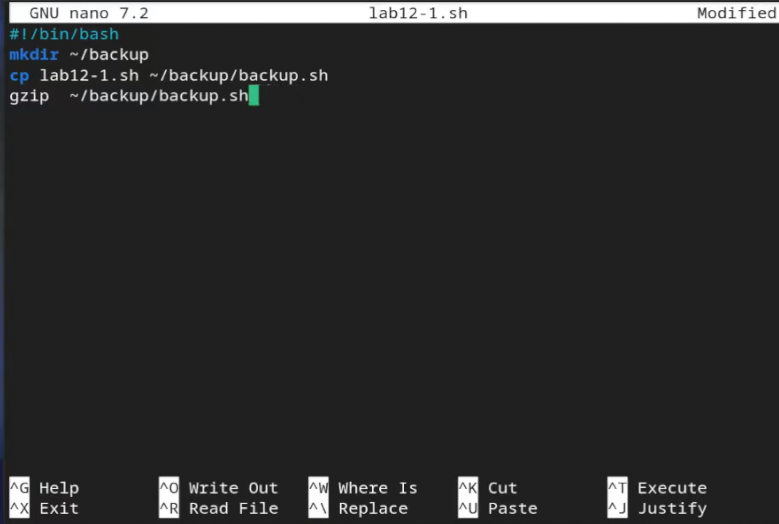
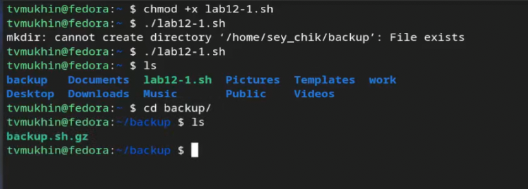
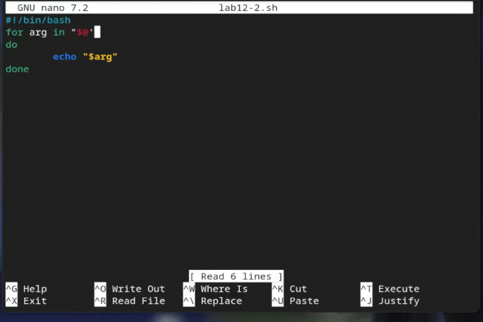
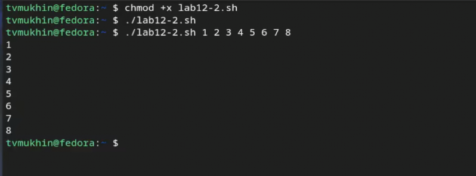
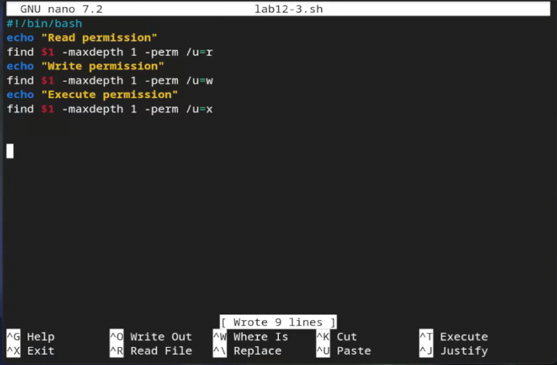
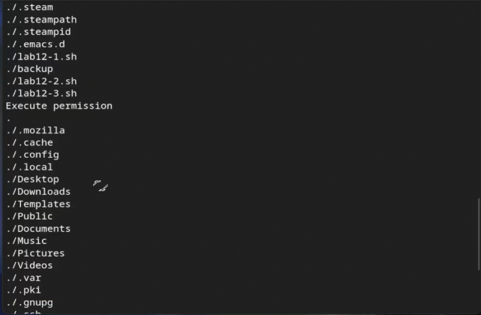
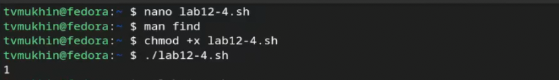

---
## Front matter
title: "Лабораторная работа №12"
subtitle: "Программирование в командном
процессоре ОС UNIX. Командные файлы"
author: "Мухин Тимофей Владимирович"

## Generic otions
lang: ru-RU
toc-title: "Содержание"

## Bibliography
bibliography: bib/cite.bib
csl: pandoc/csl/gost-r-7-0-5-2008-numeric.csl

## Pdf output format
toc: true
toc-depth: 2
fontsize: 12pt
linestretch: 1.5
papersize: a4
documentclass: scrreprt

## I18n polyglossia
polyglossia-lang:
  name: russian
  options:
    - spelling=modern
    - babelshorthands=true
polyglossia-otherlangs:
  name: english

## I18n babel
babel-lang: russian
babel-otherlangs: english

## Fonts
mainfont: PT Serif
romanfont: PT Serif
sansfont: PT Sans
monofont: PT Mono
mainfontoptions: Ligatures=TeX
romanfontoptions: Ligatures=TeX
sansfontoptions: Ligatures=TeX,Scale=MatchLowercase
monofontoptions: Scale=MatchLowercase,Scale=0.9

## Biblatex
biblatex: true
biblio-style: "gost-numeric"
biblatexoptions:
  - parentracker=true
  - backend=biber
  - hyperref=auto
  - language=auto
  - autolang=other*
  - citestyle=gost-numeric
figureTitle: "Рис."
tableTitle: "Таблица"
listingTitle: "Листинг"
lolTitle: "Листинги"

## Pandoc-crossref LaTeX customization
indent: true
header-includes:
  - \usepackage{indentfirst}
  - \usepackage{float}
  - \floatplacement{figure}{H}
---

# Цель работы

Изучить основы программирования в оболочке ОС UNIX/Linux. Научиться писать
небольшие командные файлы.

# Выполнение лабораторной работы

1. Напишем скрипт, который при запуске будет делать резервную копию самого себя (то
есть файла, в котором содержится его исходный код) в другую директорию backup
в домашнем каталоге

{#fig:001 width=70%}

2. Запустим

{#fig:002 width=70%} 

3. Напишем пример командного файла, обрабатывающего любое произвольное число
аргументов командной строки, в том числе превышающее десять. Например, скрипт
может последовательно распечатывать значения всех переданных аргументов.

{#fig:003 width=70%} 

4. Запустим 

{#fig:004 width=70%} 

5. Напишем командный файл — аналог команды ls (без использования самой этой ко-
манды и команды dir). Требуется, чтобы он выдавал информацию о нужном каталоге
и выводил информацию о возможностях доступа к файлам этого каталога.

{#fig:005 width=70%}

6. Запустим

{#fig:006 width=70%} 

7. Напишем командный файл, который получает в качестве аргумента командной строки
формат файла (.txt, .doc, .jpg, .pdf и т.д.) и вычисляет количество таких файлов
в указанной директории. Путь к директории также передаётся в виде аргумента ко-
мандной строки

{#fig:007 width=70%} 

8. Запустим

{#fig:008 width=70%} 

# Контрольные вопросы

1. **Командная оболочка** - это программа в операционной системе, которая предоставляет пользователю интерфейс для взаимодействия с операционной системой через команды. Примеры командных оболочек: bash, sh (Bourne Shell), csh (C Shell), zsh, и другие. Они отличаются синтаксисом, возможностями и набором встроенных функций.

2. **POSIX** (Portable Operating System Interface) - это стандарт, определяющий интерфейс между операционной системой и прикладными программами. POSIX обеспечивает совместимость между различными операционными системами.

3. **Переменные и массивы в bash** определяются следующим образом:
   - Переменные: `variable=value`
   - Массивы: `array_name=([index1]=value1 [index2]=value2 ...)`

4. **Операторы `let` и `read`**:
   - `let` используется для выполнения арифметических операций в bash.
   - `read` используется для считывания ввода пользователя в переменные.

5. **Арифметические операции** в bash включают операции сложения, вычитания, умножения, деления, остатка от деления и другие арифметические операции.

6. **Оператор (( ))** используется для выполнения арифметических вычислений в bash.

7. **Стандартные имена переменных** включают `HOME`, `PATH`, `USER`, `SHELL`, `PWD` и другие.

8. **Метасимволы** - это символы, которые имеют специальное значение в командной оболочке, например, `*`, `?`, `[]`, `|`.

9. **Экранирование метасимволов** выполняется путем добавления обратного слэша `\` перед метасимволом.

10. **Создание и запуск командных файлов** - создается текстовый файл с командами, предоставляются права на выполнение (`chmod +x filename`) и запускаются через `./filename` или полным путем к файлу.

11. **Определение функций в bash** осуществляется с использованием ключевого слова `function` или просто указанием имени функции и блока кода.

12. **Проверка файла** на то, является ли он каталогом или обычным файлом, осуществляется с помощью команды `test -d filename` для каталога и `test -f filename` для обычного файла.

13. **`set`, `typeset` и `unset`** предназначены для управления переменными: установка значений, определение типа переменной и удаление переменной соответственно.

14. **Передача параметров в командные файлы** осуществляется через `$1`, `$2`, `$3`, и т.д. для первого, второго, третьего параметра и так далее.

15. **Специальные переменные bash** включают `$0` (имя скрипта), `$#` (количество переданных аргументов), `$*` (все параметры в виде одной строки), `$@` (все параметры в виде списка), `$$` (PID текущего процесса) и другие.

# Выводы

В ходе выполнения работы я изучил основы программирования в ос Linux и научился писать простые командные файлы.

