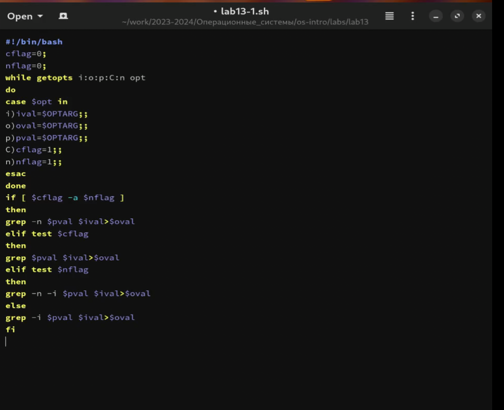
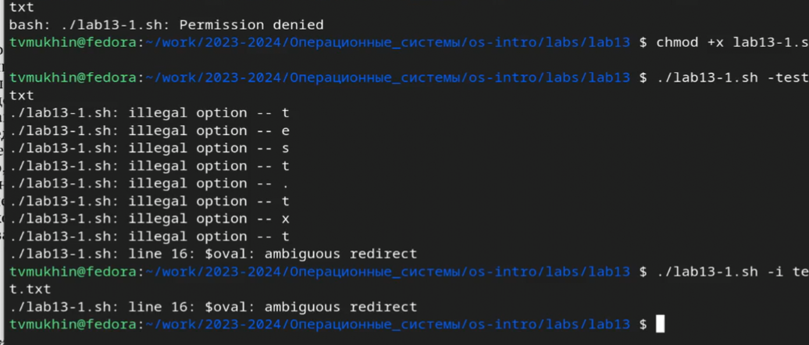
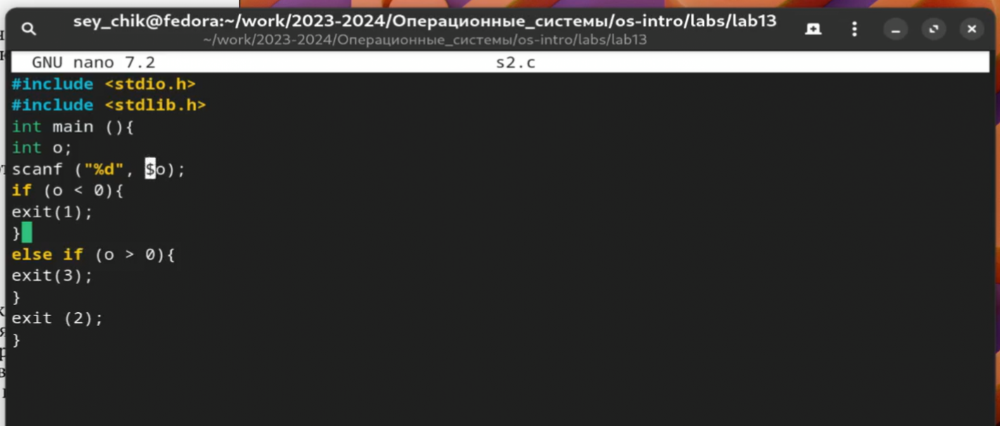
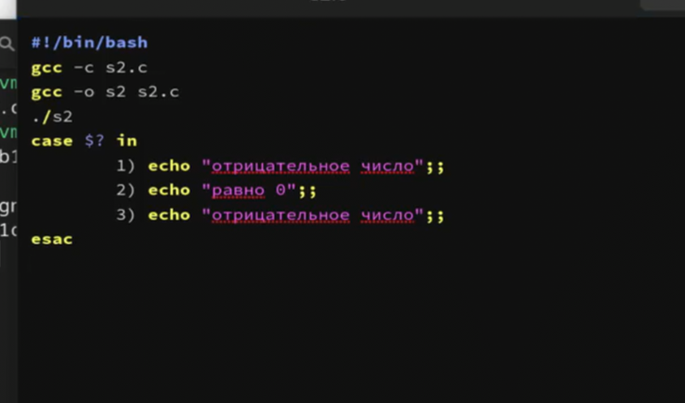
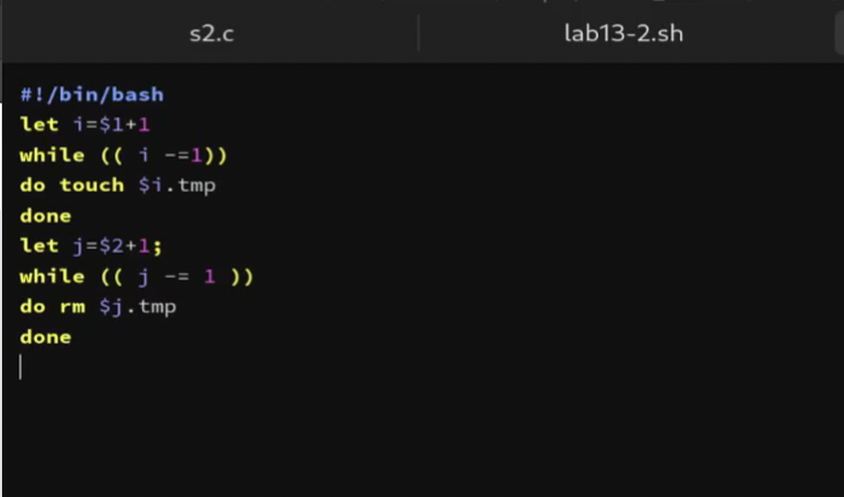
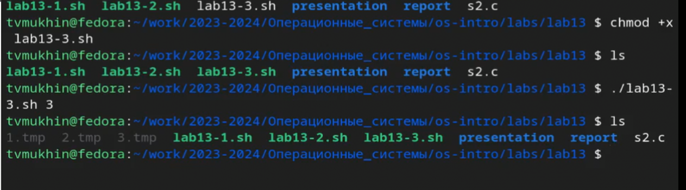
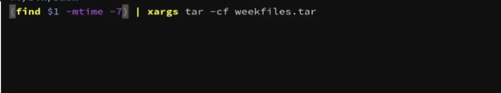
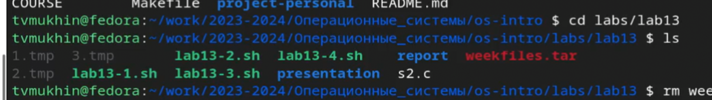

---
## Front matter
lang: ru-RU
title: 'Лабораторная работа №13'
subtitle: 'Программирование в командном
процессоре ОС UNIX. Ветвления и циклы'
author:
  - Мухин Тимофей Владимирович, НБИбд-03-23
institute:
  - Российский университет дружбы народов, Москва, Россия
date: 03.05.2024

## i18n babel
babel-lang: russian
babel-otherlangs: english

## Formatting pdf
toc: false
toc-title: Содержание
slide_level: 2
aspectratio: 169
section-titles: true
theme: metropolis
header-includes:
 - \metroset{progressbar=frametitle,sectionpage=progressbar,numbering=fraction}
 - '\makeatletter'
 - '\beamer@ignorenonframefalse'
 - '\makeatother'
---

# Цель работы

## Цель работы

Изучить основы программирования в оболочке ОС UNIX. Научится писать более
сложные командные файлы с использованием логических управляющих конструкций
и циклов

# Выполнение работы. 

## Выполнение работы

 Используя команды getopts grep, написали командный файл, который анализирует
командную строку с ключами:
– -iinputfile — прочитать данные из указанного файла;
– -ooutputfile — вывести данные в указанный файл;
– -pшаблон — указать шаблон для поиска;
– -C — различать большие и малые буквы;
– -n — выдавать номера строк.
а затем ищет в указанном файле нужные строки, определяемые ключом -p.

{#fig:001 width=70% height=70%}

## Выполнение работы

Запустим

{#fig:001 width=70%}

## Выполнение работы

 Напишем на языке Си программу, которая вводит число и определяет, является ли оно
больше нуля, меньше нуля или равно нулю. Затем программа завершается с помощью
функции exit(n), передавая информацию в о коде завершения в оболочку. Команд-
ный файл должен вызывать эту программу и, проанализировав с помощью команды
$?, выдать сообщение о том, какое число было введено.

{#fig:001 width=70%}

## Выполнение работы

Напишем командный файл, запускающий эту программу.

{#fig:001 width=70%}

## Выполнение работы

 Напишем командный файл, создающий указанное число файлов, пронумерованных
последовательно от 1 до N (например 1.tmp, 2.tmp, 3.tmp,4.tmp и т.д.). Число файлов,
которые необходимо создать, передаётся в аргументы командной строки. Этот же ко-
мандный файл должен уметь удалять все созданные им файлы (если они существуют)

{#fig:001 width=70%}

## Выполнение работы

Запустим

{#fig:001 width=70%}

## Выполнение работы

Написать командный файл, который с помощью команды tar запаковывает в архив
все файлы в указанной директории. Модифицировать его так, чтобы запаковывались
только те файлы, которые были изменены менее недели тому назад (использовать
команду find).

{#fig:001 width=70%}

## Выполнение работы 

Запустим

{#fig:001 width=70%}

## Вывод

В ходе выполнения работы я изучил основы программирования в ос Linux и научился писать более сложные командные файлы с ветвлениями и циклами.

