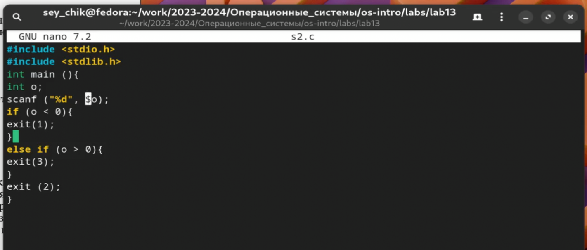
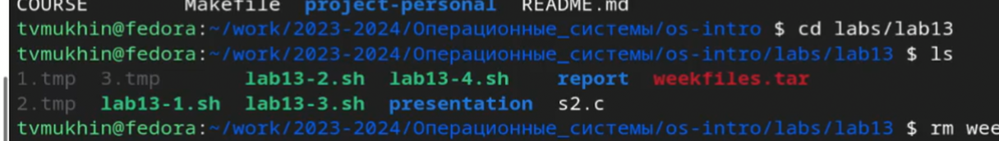

---
## Front matter
title: "Лабораторная работа №13"
subtitle: "Программирование в командном
процессоре ОС UNIX. Ветвления и циклы"
author: "Мухин Тимофей Владимирович"

## Generic otions
lang: ru-RU
toc-title: "Содержание"

## Bibliography
bibliography: bib/cite.bib
csl: pandoc/csl/gost-r-7-0-5-2008-numeric.csl

## Pdf output format
toc: true
toc-depth: 2
fontsize: 12pt
linestretch: 1.5
papersize: a4
documentclass: scrreprt

## I18n polyglossia
polyglossia-lang:
  name: russian
  options:
    - spelling=modern
    - babelshorthands=true
polyglossia-otherlangs:
  name: english

## I18n babel
babel-lang: russian
babel-otherlangs: english

## Fonts
mainfont: PT Serif
romanfont: PT Serif
sansfont: PT Sans
monofont: PT Mono
mainfontoptions: Ligatures=TeX
romanfontoptions: Ligatures=TeX
sansfontoptions: Ligatures=TeX,Scale=MatchLowercase
monofontoptions: Scale=MatchLowercase,Scale=0.9

## Biblatex
biblatex: true
biblio-style: "gost-numeric"
biblatexoptions:
  - parentracker=true
  - backend=biber
  - hyperref=auto
  - language=auto
  - autolang=other*
  - citestyle=gost-numeric
figureTitle: "Рис."
tableTitle: "Таблица"
listingTitle: "Листинг"
lolTitle: "Листинги"

## Pandoc-crossref LaTeX customization
indent: true
header-includes:
  - \usepackage{indentfirst}
  - \usepackage{float}
  - \floatplacement{figure}{H}
---

# Цель работы

Изучить основы программирования в оболочке ОС UNIX. Научится писать более
сложные командные файлы с использованием логических управляющих конструкций
и циклов

# Выполнение лабораторной работы

1. Используя команды getopts grep, написали командный файл, который анализирует
командную строку с ключами:
– -iinputfile — прочитать данные из указанного файла;
– -ooutputfile — вывести данные в указанный файл;
– -pшаблон — указать шаблон для поиска;
– -C — различать большие и малые буквы;
– -n — выдавать номера строк.
а затем ищет в указанном файле нужные строки, определяемые ключом -p.

{#fig:001 width=70%}

2. Запустим

{#fig:002 width=70%} 

3. Написать на языке Си программу, которая вводит число и определяет, является ли оно
больше нуля, меньше нуля или равно нулю. Затем программа завершается с помощью
функции exit(n), передавая информацию в о коде завершения в оболочку. Команд-
ный файл должен вызывать эту программу и, проанализировав с помощью команды
$?, выдать сообщение о том, какое число было введено.

{#fig:003 width=70%} 

{#fig:004 width=70%} 

4. Напишем командный файл, создающий указанное число файлов, пронумерованных
последовательно от 1 до N (например 1.tmp, 2.tmp, 3.tmp,4.tmp и т.д.). Число файлов,
которые необходимо создать, передаётся в аргументы командной строки. Этот же ко-
мандный файл должен уметь удалять все созданные им файлы (если они существуют)

{#fig:005 width=70%}

5. Запустим

{#fig:006 width=70%} 

6. Написать командный файл, который с помощью команды tar запаковывает в архив
все файлы в указанной директории. Модифицировать его так, чтобы запаковывались
только те файлы, которые были изменены менее недели тому назад (использовать
команду find).

{#fig:007 width=70%} 

7. Запустим

{#fig:008 width=70%} 

# Контрольные вопросы

1. Команда `getopts` в bash используется для обработки параметров командной строки. Она облегчает разбор и извлечение значений из аргументов, переданных скрипту.

2. Метасимволы (wildcards) в shell-командах используются для соответствия шаблонам и генерации имен файлов. Например, символ `*` соответствует нулю или более символам, а `?` соответствует одному символу.

3. Операторы управления действиями в bash включают в себя условные операторы (if-else), циклы (for, while, until), операторы сравнения, операторы проверки файлов и директорий, операторы выхода из программы (exit), операторы переадресации вывода и ввода (>, <), операторы pipe (|), и многие другие.

4. Для прерывания цикла можно использовать оператор `break`. Он прерывает выполнение цикла и переводит выполнение программы за пределы цикла.

5. Команда `false` всегда возвращает ложное значение (код возврата 1), а `true` всегда возвращает истинное значение (код возврата 0). Они могут использоваться в скриптах для управления потоком выполнения.

6. Строка `if test -f man$s/$i.$s` в командном файле проверяет наличие файла с именем `man$s/$i.$s`. Здесь команда `test -f` проверяет, является ли файл существующим и обычным файлом.

7. Различия между конструкциями `while` и `until` в bash следующие:
   - `while` выполняет блок кода, пока условие истинно (true).
   - `until` выполняет блок кода, пока условие ложно (false), то есть продолжает выполнение, пока условие не станет истинным.

# Выводы

В ходе выполнения работы я изучил основы программирования в ос Linux и научился писать более сложные командные файлы с ветвлениями и циклами.

