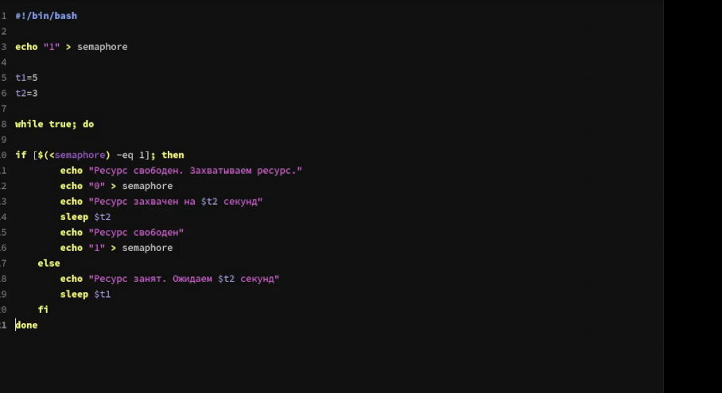
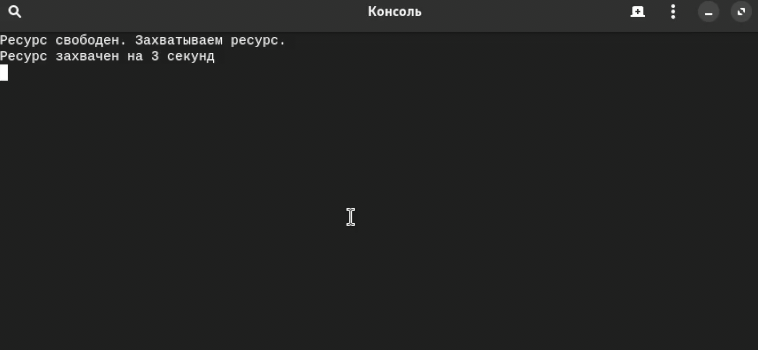
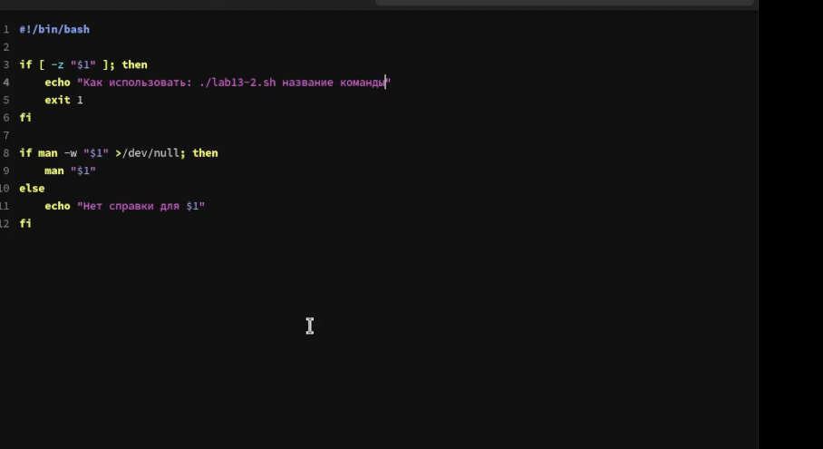
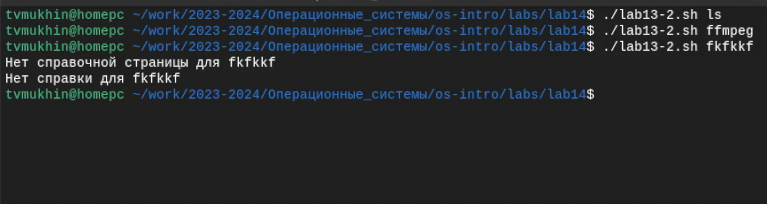
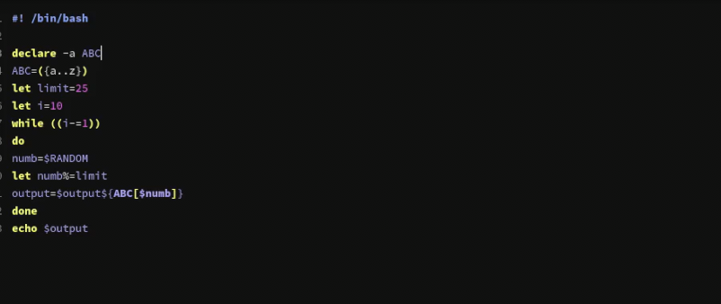
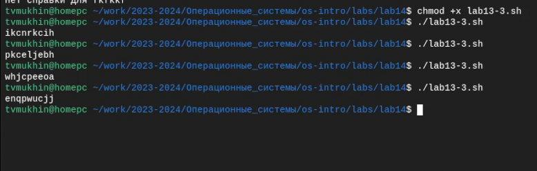

---
## Front matter
title: "Лабораторная работа №14"
subtitle: "Программирование в командном
процессоре ОС UNIX. Расширенное программирование"
author: "Мухин Тимофей Владимирович"

## Generic otions
lang: ru-RU
toc-title: "Содержание"

## Bibliography
bibliography: bib/cite.bib
csl: pandoc/csl/gost-r-7-0-5-2008-numeric.csl

## Pdf output format
toc: true
toc-depth: 2
fontsize: 12pt
linestretch: 1.5
papersize: a4
documentclass: scrreprt

## I18n polyglossia
polyglossia-lang:
  name: russian
  options:
    - spelling=modern
    - babelshorthands=true
polyglossia-otherlangs:
  name: english

## I18n babel
babel-lang: russian
babel-otherlangs: english

## Fonts
mainfont: PT Serif
romanfont: PT Serif
sansfont: PT Sans
monofont: PT Mono
mainfontoptions: Ligatures=TeX
romanfontoptions: Ligatures=TeX
sansfontoptions: Ligatures=TeX,Scale=MatchLowercase
monofontoptions: Scale=MatchLowercase,Scale=0.9

## Biblatex
biblatex: true
biblio-style: "gost-numeric"
biblatexoptions:
  - parentracker=true
  - backend=biber
  - hyperref=auto
  - language=auto
  - autolang=other*
  - citestyle=gost-numeric
figureTitle: "Рис."
tableTitle: "Таблица"
listingTitle: "Листинг"
lolTitle: "Листинги"

## Pandoc-crossref LaTeX customization
indent: true
header-includes:
  - \usepackage{indentfirst}
  - \usepackage{float}
  - \floatplacement{figure}{H}
---

# Цель работы

Изучить основы программирования в оболочке ОС UNIX. Научиться писать более
сложные командные файлы с использованием логических управляющих конструкций
и циклов.

# Выполнение лабораторной работы

1. Напишем командный файл, реализующий упрощённый механизм семафоров. Ко-
мандный файл должен в течение некоторого времени t1 дожидаться освобождения
ресурса, выдавая об этом сообщение, а дождавшись его освобождения, использовать
его в течение некоторого времени t2<>t1, также выдавая информацию о том, что
ресурс используется соответствующим командным файлом (процессом). Запустить
командный файл в одном виртуальном терминале в фоновом режиме, перенаправив
его вывод в другой (> /dev/tty#, где # — номер терминала куда перенаправляется
вывод), в котором также запущен этот файл, но не фоновом, а в привилегированном
режиме. Доработать программу так, чтобы имелась возможность взаимодействия трёх
и более процессов.

{#fig:001 width=50%}

2. Запустим

{#fig:002 width=70%} 

3. Реализовать команду man с помощью командного файла. Изучите содержимое ката-
лога /usr/share/man/man1. В нем находятся архивы текстовых файлов, содержащих
справку по большинству установленных в системе программ и команд. Каждый архив
можно открыть командой less сразу же просмотрев содержимое справки. Командный
файл должен получать в виде аргумента командной строки название команды и в виде
результата выдавать справку об этой команде или сообщение об отсутствии справки,
если соответствующего файла нет в каталоге man1

{#fig:004 width=70%} 


4. Запустим

{#fig:005 width=70%}


5. Используя встроенную переменную $RANDOM, напишите командный файл, генерирую-
щий случайную последовательность букв латинского алфавита. Учтите, что $RANDOM
выдаёт псевдослучайные числа в диапазоне от 0 до 32767

{#fig:007 width=70%} 


6. Запустим

{#fig:008 width=70%} 


# Контрольные вопросы

1. Синтаксическая ошибка в строке `while [$1 != "exit"]`: пробелы обязательны перед и после квадратных скобок. Правильный вариант: `while [ "$1" != "exit" ]`.

2. Для объединения (конкатенации) строк в bash можно использовать оператор `+=`. Например:
```bash
str1="Hello"
str2="World"
result="$str1 $str2"
echo $result  # Результат: Hello World
```

3. Утилита `seq` используется для генерации последовательностей чисел. Ее функционал можно реализовать через циклы или операторы `for` в bash. Например:
```bash
# С использованием цикла for
for i in {1..5}; do
    echo $i
done

# С использованием оператора for
for ((i=1; i<=5; i++)); do
    echo $i
done
```

4. Выражение $((10/3)) даст результат целочисленного деления чисел 10 на 3, то есть 3.

5. Основные отличия командной оболочки `zsh` от `bash`:
   - `zsh` имеет более продвинутый автодополнитель и расширенную возможность конфигурации.
   - `zsh` поддерживает расширенный синтаксис, включая различные улучшения по сравнению с `bash`.
   - `zsh` предоставляет более продуманный механизм работы с командами и плагины.

6. Правильный синтаксис конструкции for в bash:
```bash
for ((a=1; a <= LIMIT; a++))
```

7. Сравнение bash с другими языками программирования:
   - Преимущества `bash`:
      - Простота и удобство для написания скриптов командной оболочки.
      - Встроенная обработка командной строки, файлов, директорий.
      - Широкие возможности работы с системными службами.
   - Недостатки `bash`:
      - Ограниченные возможности по сравнению с полноценными языками программирования.
      - Низкая производительность и эффективность выполнения сложных операций.
      - Ограниченная масштабируемость для крупных проектов.


# Выводы

В ходе выполнения работы я изучил основы программирования в ос Linux и научился писать более
сложные командные файлы с использованием логических управляющих конструкций
и циклов.

