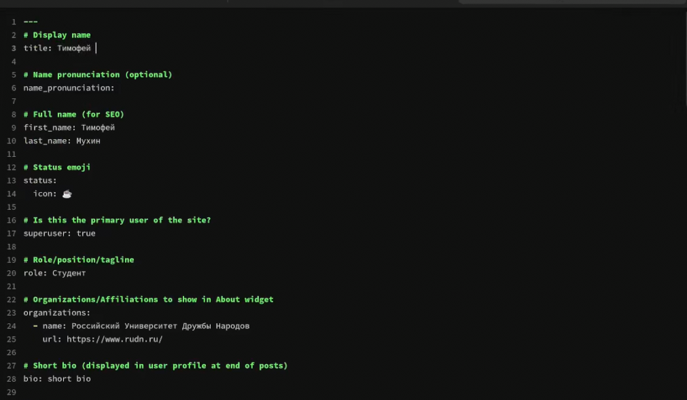
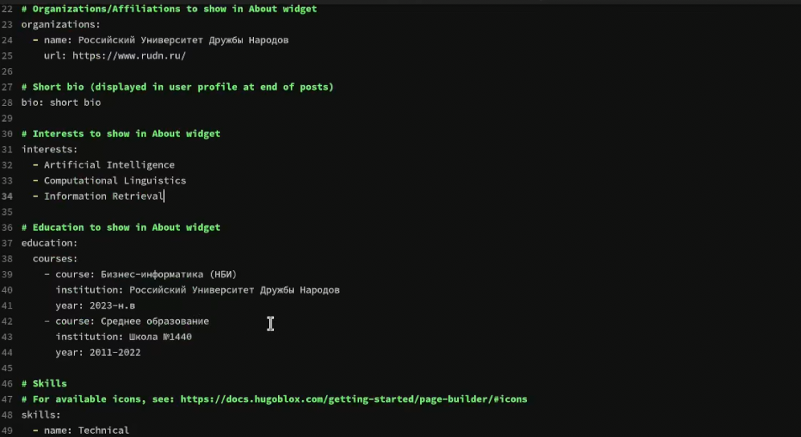
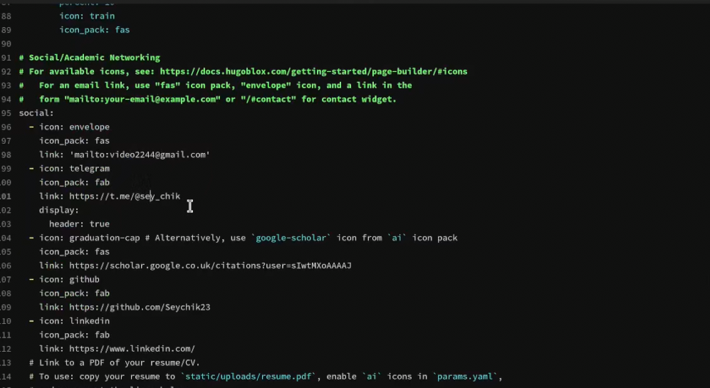
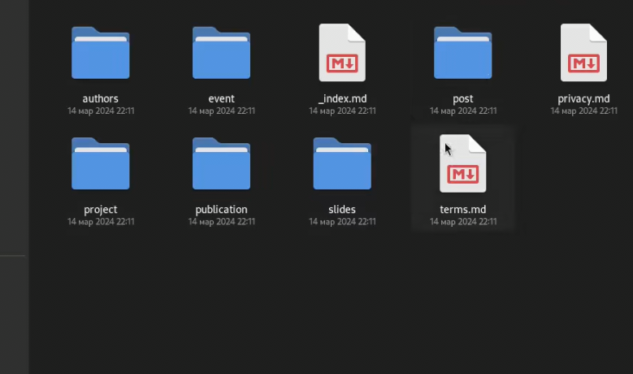
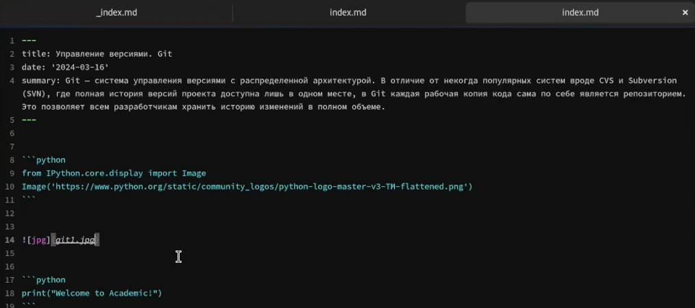
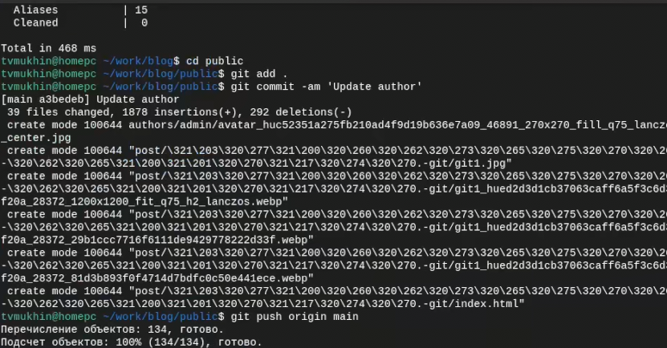

---
## Front matter
lang: ru-RU
title: Индивидуальный проект
subtitle: Этап 2
author:
  - Мухин Тимофей
institute:
  - Российский университет дружбы народов, Москва, Россия
date: 16.03.2024

## i18n babel
babel-lang: russian
babel-otherlangs: english

## Formatting pdf
toc: false
toc-title: Содержание
slide_level: 2
aspectratio: 169
section-titles: true
theme: metropolis
header-includes:
 - \metroset{progressbar=frametitle,sectionpage=progressbar,numbering=fraction}
 - '\makeatletter'
 - '\beamer@ignorenonframefalse'
 - '\makeatother'
---

# Цель работы

## Цель работы

Добавить к сайту данные о себе.
        Разместить фотографию владельца сайта.
        Разместить краткое описание владельца сайта (Biography).
        Добавить информацию об интересах (Interests).
        Добавить информацию от образовании (Education).
    Сделать пост по прошедшей неделе.
    Добавить пост на тему по выбору:
        Управление версиями. Git.
        Непрерывная интеграция и непрерывное развертывание (CI/CD).

# Выполнение работы

## Выполнение работы

Добавляем информацию о владельце сайта

{#fig:001 width=70%}

## Выполнение работы

Добавляем информацию об образовании и интересах

{#fig:001 width=70%}
 
## Выполнение работы

Обновляем контактную информацию и соцсети

{#fig:001 width=70%}

## Выполнение работы

Создание поста на тему "Управление версиями. Git."

{#fig:001 width=70%}

## Выполнение работы

Создание поста на тему "Управление версиями. Git."

{#fig:001 width=70%}

## Выполнение работы

Генерируем сайт через hugo и делаем коммит

{#fig:001 width=70%}

# Вывод

## Вывод

В ходе выполнения этапа 2 была добавлена основная информация о владельце сайта

