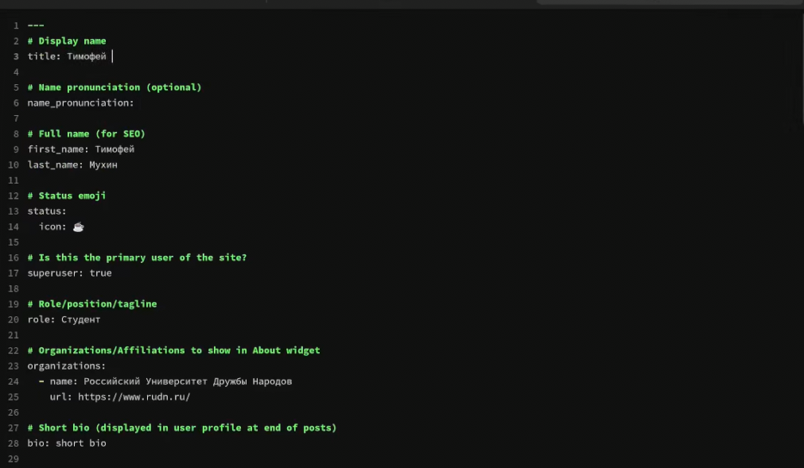
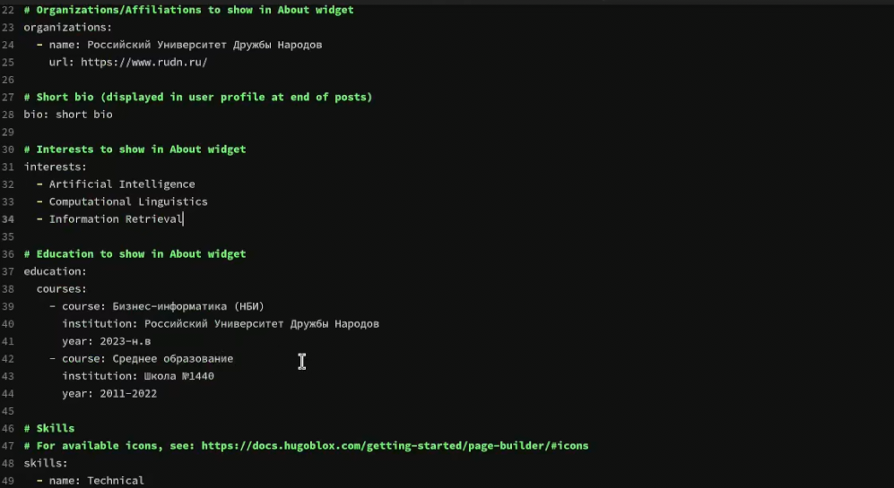
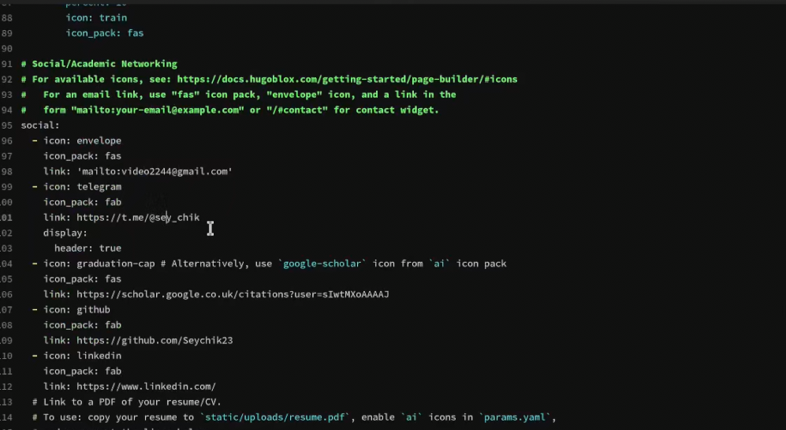
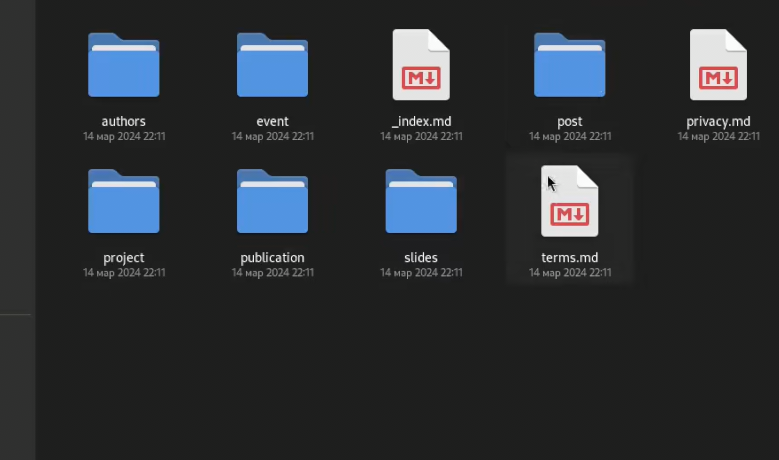
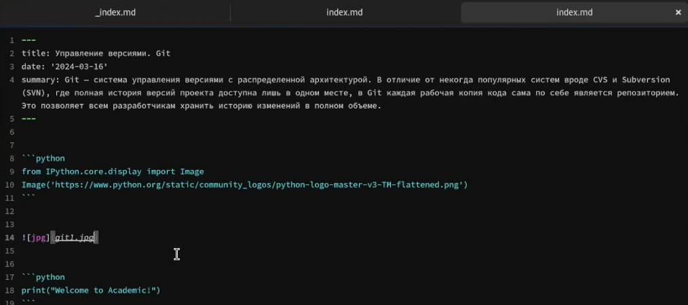
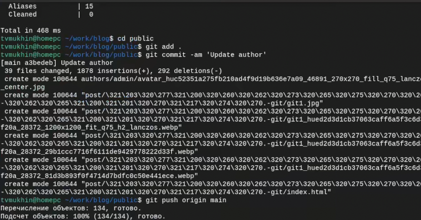

---
## Front matter
title: "Индивидуальный проект"
subtitle: "Этап 2. Отчет"
author: "Мухин Тимофей Владимирович"

## Generic otions
lang: ru-RU
toc-title: "Содержание"

## Bibliography
bibliography: bib/cite.bib
csl: pandoc/csl/gost-r-7-0-5-2008-numeric.csl

## Pdf output format
toc: true # Table of contents
toc-depth: 2
fontsize: 12pt
linestretch: 1.5
papersize: a4
documentclass: scrreprt
## I18n polyglossia
polyglossia-lang:
  name: russian
  options:
	- spelling=modern
	- babelshorthands=true
polyglossia-otherlangs:
  name: english
## I18n babel
babel-lang: russian
babel-otherlangs: english
## Fonts
mainfont: PT Serif
romanfont: PT Serif
sansfont: PT Sans
monofont: PT Mono
mainfontoptions: Ligatures=TeX
romanfontoptions: Ligatures=TeX
sansfontoptions: Ligatures=TeX,Scale=MatchLowercase
monofontoptions: Scale=MatchLowercase,Scale=0.9
## Biblatex
biblatex: true
biblio-style: "gost-numeric"
biblatexoptions:
  - parentracker=true
  - backend=biber
  - hyperref=auto
  - language=auto
  - autolang=other*
  - citestyle=gost-numeric
## Pandoc-crossref LaTeX customization
figureTitle: "Рис."
tableTitle: "Таблица"
listingTitle: "Листинг"
lolTitle: "Листинги"
## Misc options
indent: true
header-includes:
  - \usepackage{indentfirst}
  - \usepackage{float} # keep figures where there are in the text
  - \floatplacement{figure}{H} # keep figures where there are in the text
---

# Цель работы

Добавить к сайту данные о себе.

    Список добавляемых данных.
        Разместить фотографию владельца сайта.
        Разместить краткое описание владельца сайта (Biography).
        Добавить информацию об интересах (Interests).
        Добавить информацию от образовании (Education).
    Сделать пост по прошедшей неделе.
    Добавить пост на тему по выбору:
        Управление версиями. Git.
        Непрерывная интеграция и непрерывное развертывание (CI/CD).

# Выполнение лабораторной работы

1. Добавляем информацию о владельце сайта

{#fig:001 width=70%}

2. Добавляем информацию об образовании и интересах

{#fig:001 width=70%}

3. Обновляем контактную информацию и соцсети

{#fig:001 width=70%}

4. Создание поста на тему "Управление версиями. Git."

{#fig:001 width=70%}

{#fig:001 width=70%}

6. Генерируем сайт через hugo и делаем коммит

{#fig:001 width=70%}

# Выводы

В ходе выполнения этапа 2 была добавлена основная информация о владельце сайта

