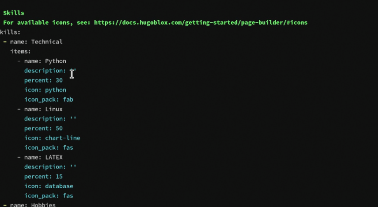
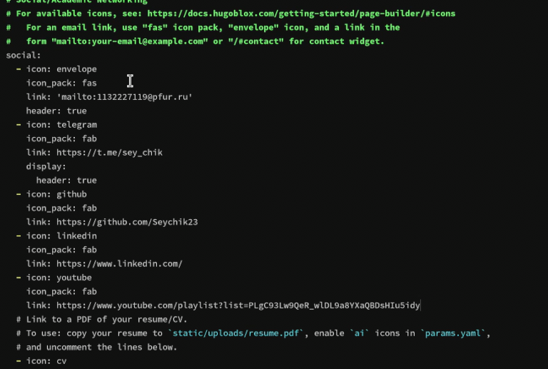
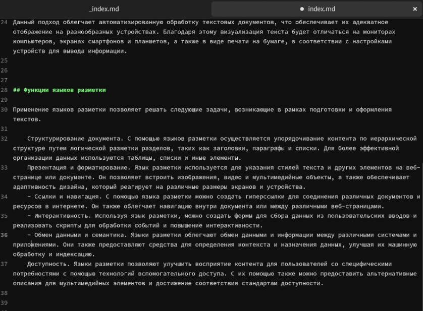
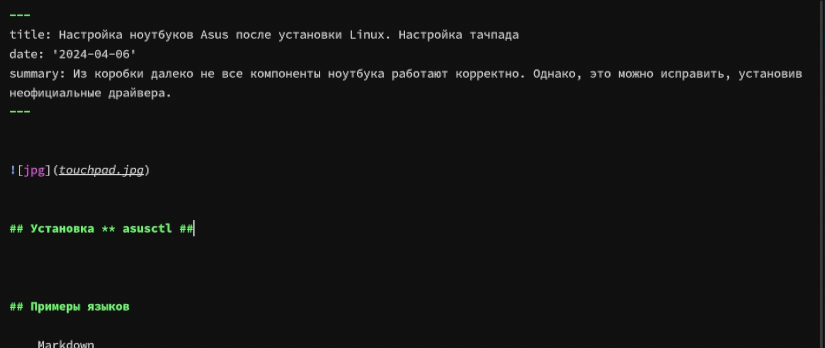
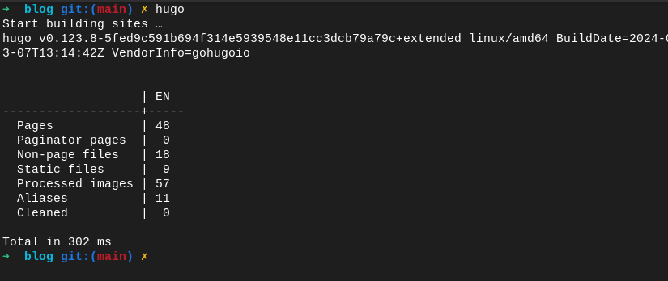

---
## Front matter
lang: ru-RU
title: Индивидуальный проект
subtitle: Этап 3
author:
  - Мухин Тимофей Владимирович
institute:
  - Российский университет дружбы народов, Москва, Россия
date: 06.06.2024

## i18n babel
babel-lang: russian
babel-otherlangs: english

## Formatting pdf
toc: false
toc-title: Содержание
slide_level: 2
aspectratio: 169
section-titles: true
theme: metropolis
header-includes:
 - \metroset{progressbar=frametitle,sectionpage=progressbar,numbering=fraction}
 - '\makeatletter'
 - '\beamer@ignorenonframefalse'
 - '\makeatother'
---

# Цель работы

## Цель работы

Добавить к сайту достижения.

    Список достижений.
        Добавить информацию о навыках (Skills).
        Добавить информацию об опыте (Experience).
        Добавить информацию о достижениях (Accomplishments).
    Сделать пост по прошедшей неделе.
    Добавить пост на тему по выбору:
        Легковесные языки разметки.
        Языки разметки. LaTeX.
        Язык разметки Markdown.

# Выполнение работы

## Выполнение работы

Добавляем информацию о навыках 

{#fig:001 width=70%}

## Выполнение работы

Добавляем информацию об опыте

{#fig:001 width=70%}
 
## Выполнение работы

Создаем пост на тему легковесные языки разметки 

{#fig:001 width=70%}

## Выполнение работы

Создаем пост по прошедшей неделе 

{#fig:001 width=70%}

## Выполнение работы

Генерируем сайт через hugo и делаем коммит

{#fig:001 width=70%}

# Вывод

## Вывод

В ходе выполнения этапа 3 была добавлена информация о навыках, а также опубликованы новые посты.
