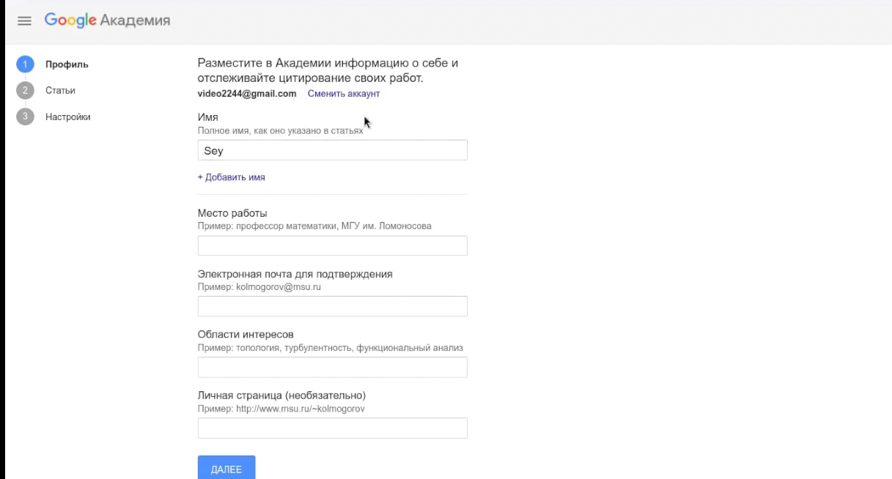
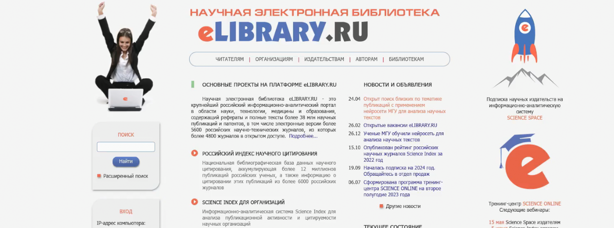
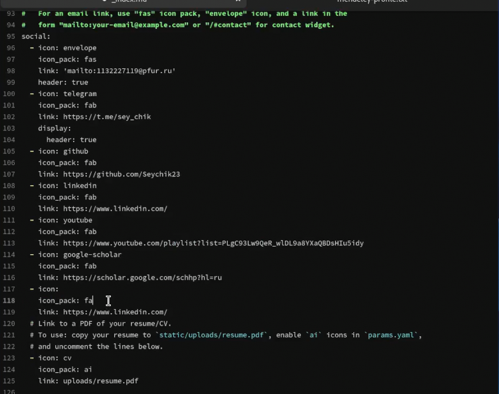
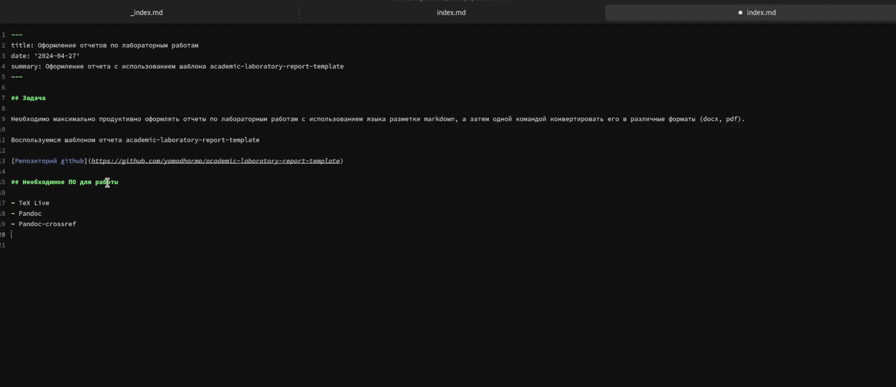

---
## Front matter
lang: ru-RU
title: Индивидуальный проект
subtitle: Этап 4
author:
  - Мухин Тимофей Владимирович
institute:
  - Российский университет дружбы народов, Москва, Россия
date: 27.04.2024

## i18n babel
babel-lang: russian
babel-otherlangs: english

## Formatting pdf
toc: false
toc-title: Содержание
slide_level: 2
aspectratio: 169
section-titles: true
theme: metropolis
header-includes:
 - \metroset{progressbar=frametitle,sectionpage=progressbar,numbering=fraction}
 - '\makeatletter'
 - '\beamer@ignorenonframefalse'
 - '\makeatother'
---

# Цель работы

## Цель работы

Добавить к сайту ссылки на научные и библиометрические ресурсы.

    Зарегистрироваться на соответствующих ресурсах и разместить на них ссылки на сайте:
        eLibrary : https://elibrary.ru/;
        Google Scholar : https://scholar.google.com/;
        ORCID : https://orcid.org/;
        Mendeley : https://www.mendeley.com/;
        ResearchGate : https://www.researchgate.net/;
        Academia.edu : https://www.academia.edu/;
        arXiv : https://arxiv.org/;
        github : https://github.com/.
    Сделать пост по прошедшей неделе.
    Добавить пост на тему по выбору:
        Оформление отчёта.
        Создание презентаций.
        Работа с библиографией.

# Выполнение работы

## Выполнение работы

Регистрируемся на ресурсах 

{#fig:001 width=70%}

## Выполнение работы

Регистрируемся на ресурсах 

{#fig:001 width=70%}
 
## Выполнение работы

Добавляем ссылки на них на сайте

{#fig:001 width=70%}

## Выполнение работы

Создаем пост на тему Оформление отчёта.

{#fig:001 width=70%}

## Выполнение работы

Генерируем сайт через hugo и делаем коммит

{#fig:001 width=70%}

# Вывод

## Вывод

В ходе выполнения этапа 4 были добавлены ссылки на ресурсы , а также опубликован новый пост.
