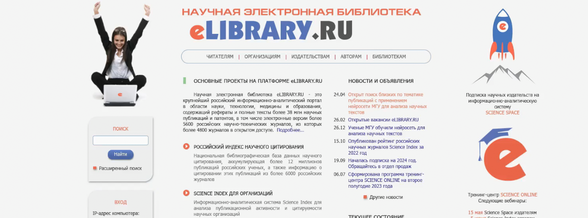

---
## Front matter
title: "Индивидуальный проект"
subtitle: "Этап 4. Отчет"
author: "Мухин Тимофей Владимирович"

## Generic otions
lang: ru-RU
toc-title: "Содержание"

## Bibliography
bibliography: bib/cite.bib
csl: pandoc/csl/gost-r-7-0-5-2008-numeric.csl

## Pdf output format
toc: true # Table of contents
toc-depth: 2
fontsize: 12pt
linestretch: 1.5
papersize: a4
documentclass: scrreprt
## I18n polyglossia
polyglossia-lang:
  name: russian
  options:
	- spelling=modern
	- babelshorthands=true
polyglossia-otherlangs:
  name: english
## I18n babel
babel-lang: russian
babel-otherlangs: english
## Fonts
mainfont: PT Serif
romanfont: PT Serif
sansfont: PT Sans
monofont: PT Mono
mainfontoptions: Ligatures=TeX
romanfontoptions: Ligatures=TeX
sansfontoptions: Ligatures=TeX,Scale=MatchLowercase
monofontoptions: Scale=MatchLowercase,Scale=0.9
## Biblatex
biblatex: true
biblio-style: "gost-numeric"
biblatexoptions:
  - parentracker=true
  - backend=biber
  - hyperref=auto
  - language=auto
  - autolang=other*
  - citestyle=gost-numeric
## Pandoc-crossref LaTeX customization
figureTitle: "Рис."
tableTitle: "Таблица"
listingTitle: "Листинг"
lolTitle: "Листинги"
## Misc options
indent: true
header-includes:
  - \usepackage{indentfirst}
  - \usepackage{float} # keep figures where there are in the text
  - \floatplacement{figure}{H} # keep figures where there are in the text
---

# Цель работы
Добавить к сайту ссылки на научные и библиометрические ресурсы.

    Зарегистрироваться на соответствующих ресурсах и разместить на них ссылки на сайте:
        eLibrary : https://elibrary.ru/;
        Google Scholar : https://scholar.google.com/;
        ORCID : https://orcid.org/;
        Mendeley : https://www.mendeley.com/;
        ResearchGate : https://www.researchgate.net/;
        Academia.edu : https://www.academia.edu/;
        arXiv : https://arxiv.org/;
        github : https://github.com/.
    Сделать пост по прошедшей неделе.
    Добавить пост на тему по выбору:
        Оформление отчёта.
        Создание презентаций.
        Работа с библиографией.

# Выполнение проекта

1. Регистрируемся на ресурсах 

{#fig:001 width=70%}

{#fig:001 width=70%}

2. Добавляем ссылки на них на сайте

{#fig:001 width=70%}

3. Создаем пост на тему Оформление отчёта.

{#fig:001 width=70%}

4. Генерируем сайт через hugo и делаем коммит

# Выводы

В ходе выполнения этапа 4 были добавлены ссылки на ресурсы , а также опубликован новый пост.

